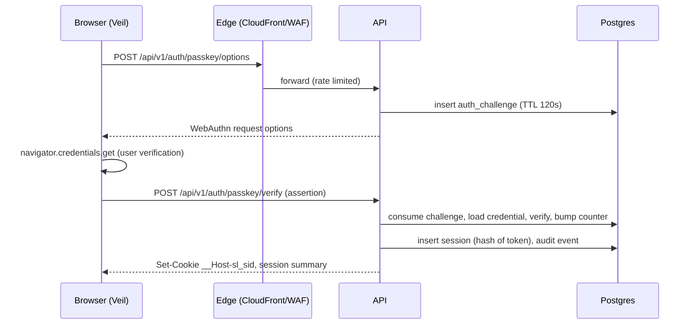
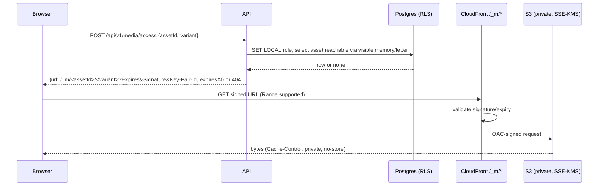
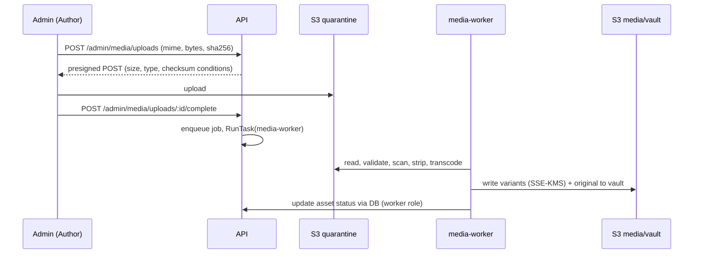
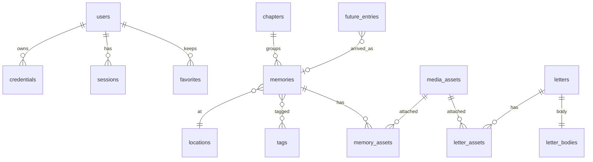
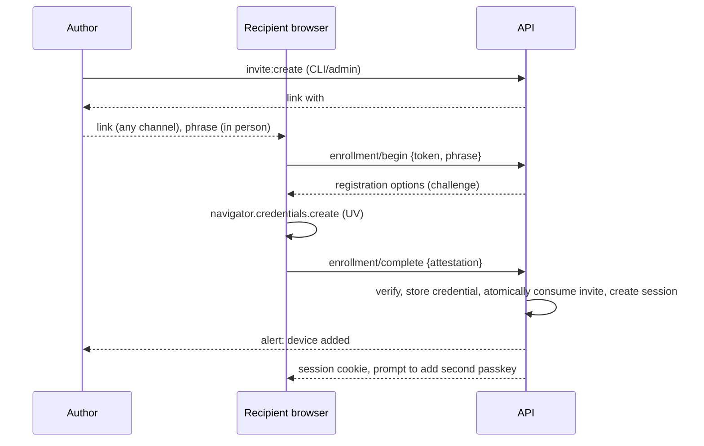
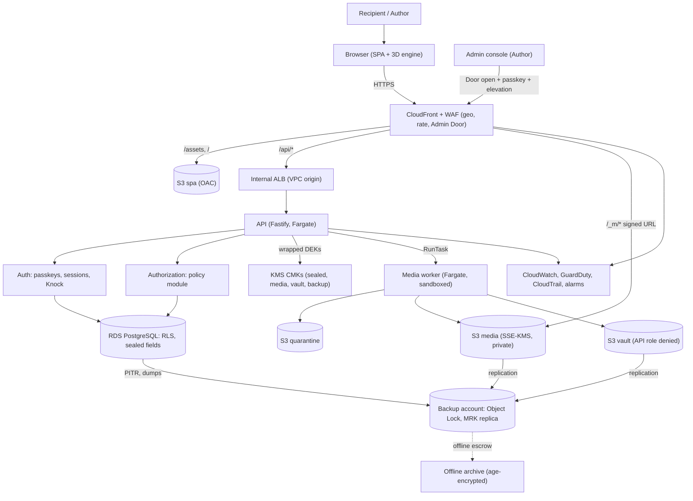
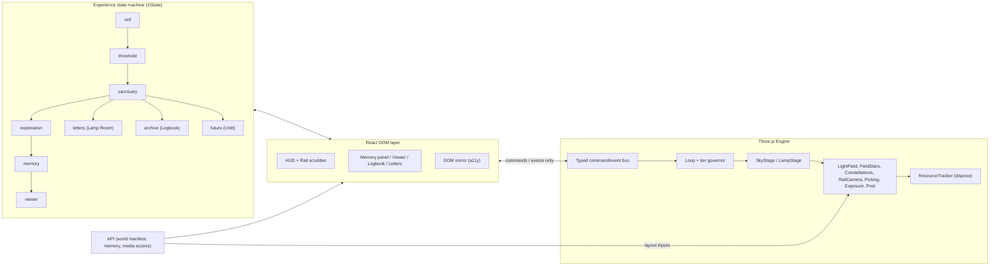

# SLOW LIGHT — Master Specification & Engineering Blueprint

**Version 1.0 · 2026-09-20 · Status: implementation-ready. Assumptions are flagged in §A.**
Codename `slow-light`. User-facing name is configuration (`site.name`), never hard-coded.

> A private digital sanctuary built around one relationship: an interactive cinematic love letter, a private memory museum, and an encrypted digital sanctuary. Technology disappears behind the emotion.

## How to use this document

| Reader | Read first | Then |
|---|---|---|
| Designer | 02, 03, 05, 22 | 04, 07, 34 |
| Frontend / 3D engineer | 04, 05, 06, 07, 18 | 22, 21, 28 |
| Backend engineer | 09, 13, 15, 16, 17 | 10, 14, 21 |
| Security engineer | 10, 11, 32 | 16, 17, 27, 33 |
| DevOps | 29, 30, 31 | 09, 10, 20 |
| Antigravity (coding agent) | 23, 24, then 25 phase by phase | every doc a phase references |
| The Author (you) | §A assumptions, 02, 20, 31 | 34 |

Blocks tagged `<!-- extract: path -->` are machine-extractable into repo files (see the bundle zip). JSON, SQL and TypeScript in them were validated when this spec was produced.

## Locked decisions (details and alternatives in Doc 08)

| ID | Decision | One-line reason |
|---|---|---|
| D-01 | Vite + React SPA (static) + Fastify API; no Next.js/RSC | Smallest server attack surface; 2025 Next.js middleware-bypass and RSC RCE advisories show the cost of framework magic |
| D-02 | Vanilla Three.js engine, not React Three Fiber | Explicit resource ownership, testable, 3D state separate from React |
| D-03 | Photos/videos live in the DOM, never in WebGL textures | Halves GPU memory, removes taint issues, keeps content accessible |
| D-04 | Recipient auth is passkey-only (WebAuthn, UV required); recovery is Author-mediated | No password database, phishing-resistant, low friction |
| D-05 | Server-side authorization + Postgres Row-Level Security (defense in depth) | A coding bug must not leak drafts or sealed letters |
| D-06 | Sealed fields: AES-256-GCM envelope encryption, KMS-wrapped keys, for stories/letters/captions/locations | Protects DB dumps and backups; honest about app-compromise limits |
| D-07 | Media: private S3 + SSE-KMS, same-origin CloudFront signed URLs (`/_m/*`), no CDN caching | No bearer URLs on foreign origins; edge validates signature |
| D-08 | Originals never served by the web app (CLI break-glass only) | API compromise cannot exfiltrate GPS-bearing originals |
| D-09 | AWS reference deployment: CloudFront+WAF → internal ALB → ECS Fargate → RDS PostgreSQL | One control plane, KMS/CloudTrail audit, Object Lock backups |
| D-10 | Admin reachable only through the "Admin Door" (WAF IP allow-list) + passkey + step-up | Admin is unreachable from the internet by default |
| D-11 | Zero analytics, zero third-party requests, self-hosted fonts | Privacy first |
| D-12 | No end-to-end encryption in v1; upgrade path specified (Doc 10 §10.9) | Complexity/recovery cost outweighs benefit at this threat level |

## §A Assumptions register (safest default; change deliberately)

| ID | Assumption | If wrong |
|---|---|---|
| A-01 | Exactly two humans: one **Author** (admin) and one **Recipient** (viewer) | Multi-recipient needs Doc 17 changes and per-recipient visibility |
| A-02 | Scale ≤ 2,000 memories, ≤ 200 letters, ≤ 20,000 assets, ≤ 200 GB | Search and layout need revisiting above this |
| A-03 | Content language is Latin-script English | Add self-hosted Noto subsets and `lang` attributes |
| A-04 | AWS, one primary region + one backup region, separate backup account | Provider mapping in Doc 29 §29.12 |
| A-05 | Author owns a neutral domain (no romantic words) with WHOIS privacy | Choose one before Phase 11 |
| A-06 | Recipient has a device with passkey support | Author issues a fresh enrollment; hybrid (QR) login for other computers |
| A-07 | Author or Antigravity can run CLI scripts (invites, Admin Door, restore drills) | Provide a thin admin UI later |
| A-08 | No analytics, ads, social sharing, comments | — |
| A-09 | Budget: low tens of USD per month (Doc 29 §29.11) | Cost-reduced profile listed |
| A-10 | Non-commercial personal use; Author responsible for consent of people appearing in media and for music licensing | — |
| A-11 | Recipient cannot post content in v1 (only "keep" favorites) | Replies are Phase 12 |
| A-12 | Target browsers: last 2 versions of Chrome, Edge, Firefox, Safari; iOS/iPadOS 17+ | Lower tiers fall back to the flat experience |
| A-13 | WCAG 2.2 AA is the accessibility floor | — |
| A-14 | A human (the Author) reviews every change to auth, crypto, authz, media pipeline, IAM | Non-negotiable |
| A-15 | Sound is off by default | — |

## Glossary (ubiquitous language — use these names in code, UI copy and docs)

| Term | Meaning |
|---|---|
| **Light** | A memory rendered in the sky |
| **Chapter** | A constellation: lights the Author chose to connect |
| **Rail** | The time axis the camera travels along |
| **Frontier** | The newest edge of arrived light — "now" of the story |
| **Unlit** | Region of hollow lights: future entries |
| **Unfold** | The transition where a focused light becomes its memory panel |
| **Veil / Threshold** | Pre-authentication scene / arrival sequence after it |
| **Lamp Room** | The warm interior where letters live |
| **Logbook** | The searchable archive (also the accessible full-content view) |
| **Sealed field** | Application-level encrypted column |
| **Knock** | Risk-based login step-up approved by the Author |
| **Admin Door** | WAF gate that hides admin endpoints unless opened |
| **Vault** | Restricted store of original media files |

## Coverage map (master-prompt § → document)

| Prompt § | Doc | Prompt § | Doc | Prompt § | Doc |
|---|---|---|---|---|---|
| 0–3 | 01, 02 | 22 | 18 | 44 | 25 |
| 4 | 03 | 23, 24 | 07 | 45, 46 | 23 |
| 5 | 02 | 25 | 04, 21 | 47, 48 | 24 |
| 6 | 05, 22 | 26 | 04, 15 | 49 | 22 |
| 7 | 06 | 27 | 10 | 50 | 20 |
| 8 | 07 | 28, 29 | 28 | 51 | 25 (Part B) |
| 9 | 04 | 30 | 04 | 52 | 31 |
| 10, 12, 16 | 10 | 31 | 12 | 53 | 32 |
| 11, 43 | 11 | 32 | 10 | 54 | 33, 12 |
| 13 | 16 | 33 | 30 | 55 | 28 |
| 14 | 17 | 34 | 04 | 56 | 34 |
| 15, 18 | 14 | 35 | 10 | 59, 60 | 10, 11 |
| 17 | 13 | 36, 37 | 20 | 61 | Appendix A |
| 19 | 08, 09 | 38 | 21 | | |
| 20 | 19 | 39, 40 | 15 | | |
| 21 | 18 | 41, 42 | 26, 27 | | |

## Contents

- **01** — PRODUCT VISION
- **02** — CREATIVE CONCEPT
- **03** — EXPERIENCE STORYBOARD
- **04** — UX ARCHITECTURE
- **05** — VISUAL DESIGN SYSTEM
- **06** — 3D WORLD SPECIFICATION
- **07** — INTERACTION SYSTEM
- **08** — TECH STACK DECISION
- **09** — SYSTEM ARCHITECTURE
- **10** — SECURITY ARCHITECTURE
- **11** — THREAT MODEL
- **12** — PRIVACY MODEL
- **13** — DATABASE ARCHITECTURE
- **14** — MEDIA STORAGE ARCHITECTURE
- **15** — API SPECIFICATION
- **16** — AUTHENTICATION SPECIFICATION
- **17** — AUTHORIZATION SPECIFICATION
- **18** — STATE MACHINE
- **19** — REPOSITORY STRUCTURE
- **20** — CONFIGURATION
- **21** — JSON SCHEMAS
- **22** — DESIGN TOKENS
- **23** — ANTIGRAVITY ENGINEERING RULES
- **24** — ANTIGRAVITY MASTER BUILD PROMPT
- **25** — IMPLEMENTATION ROADMAP
- **26** — TESTING STRATEGY
- **27** — SECURITY TEST MATRIX
- **28** — PERFORMANCE STRATEGY
- **29** — DEPLOYMENT ARCHITECTURE
- **30** — BACKUP & DISASTER RECOVERY
- **31** — PRODUCTION CHECKLIST
- **32** — SECURITY AUDIT
- **33** — PRIVACY AUDIT
- **34** — FINAL EXPERIENCE REVIEW
- **Appendix A** — Final diagrams

---

# 01 — PRODUCT VISION

## 1.1 Purpose
Slow Light is a private world made for one person. It holds relationship memories — dates, letters, photographs, videos, voice recordings, milestones, promises — and lets her explore them as a place rather than a feed. Two people use it: the **Author** who curates, and the **Recipient** who visits.

## 1.2 The dual quality bar

| Emotional quality | Engineering quality | Measurable proxy |
|---|---|---|
| Intimate, personal | Private | Zero third-party requests; no analytics; sealed text at rest |
| Cinematic, peaceful | Performant | Veil interactive < 2 s on mid-tier Android over Fast 4G; world ≥ 45 fps on Medium tier |
| Alive, dreamlike | Resilient | Graceful degradation across 6 quality tiers incl. no-WebGL |
| Timeless, sophisticated | Maintainable, auditable | One auth module, one policy module, one crypto module; audit trail |
| Remembered | Recoverable | RPO ≤ 5 min (DB), ≤ 1 h (media); quarterly restore drills |

## 1.3 Primary user stories
- **Recipient:** enter with one touch; explore lights in time order; open a memory and its media; read a letter; search the Logbook; "keep" a memory; see her own sign-in history and devices; leave calmly ("Rest").
- **Author:** draft, schedule and publish memories; upload media; seal or time-lock letters; draw chapters; add unlit future entries; invite and revoke devices; open the Admin Door; restore from backup.

## 1.4 Non-goals
No public pages, sharing, comments, SEO, monetization, social features, gamification, streaks, read receipts, or "you haven't visited" nudges. No multi-couple SaaS. No DRM or screenshot blocking (impossible; see Doc 10 §10.10).

## 1.5 Design principles (binding)
1. Emotion before information. 2. Mystery before explanation. 3. Interaction has meaning — no decoration for its own sake. 4. Restraint: no hearts, neon, glassmorphism, particle storms. 5. Cinematic pacing: silence, empty space, memories that breathe. 6. She should feel remembered: handcrafted, never templated. 7. Respect: nothing she does inside is observed by the Author.


---

# 02 — CREATIVE CONCEPT

## 2.1 The concept
- **Name:** Slow Light
- **Tagline:** *Everything we were is still arriving.*
- **One sentence:** A private night sky in which every shared moment is a point of light that left long ago and has only now reached her — warm where it is old, cool where it is still ahead — and the darkest part of the sky is what we have not lived yet.
- **Emotional objective:** She should feel *witnessed across time*: the past is not lost but in transit, the present is where the light lands, the future is real but unlit.

## 2.2 Concept directions evaluated

| Criterion | A. Night Garden | B. House of Rooms | C. The Long Shore | D. Constellation map (naive) | **E. Slow Light** |
|---|---|---|---|---|---|
| Emotional fit | Growth, seasons; leans sweet | Strongest tangibility (objects, rooms) | Time smooths things (sea glass); poignant | Romantic but generic | Time made spatial; restraint by construction |
| Originality | Common | Moderate | High | Very common | High: a physics-derived grammar |
| Mobile/GPU cost | Heavy (foliage, instancing) | Heavy (authored 3D interiors) | Heavy (water shader) | Very light | Very light (instanced quads, additive) |
| Growth as memories are added | Good | Poor (every memory needs a place) | Good | Good | Excellent: new lights arrive at the Frontier |
| DOM/a11y equivalent | Moderate | Moderate | Weak | Strong | Strong (Logbook mirrors the sky exactly) |
| Authoring cost (solo + agent) | High | Very high | High | Low | Low |
| Cliché risk | Medium | Low | Low | High | Low if rules in §2.3 are enforced |

**Trade-offs, honestly.** B offers the most tactile intimacy but is unaffordable in assets and layout logic and does not scale with new memories. C has the best metaphor for time and loss but pays for it in shader cost, and has no natural "enclosure" for a private sanctuary. A is pleasant but drifts toward sentimentality. D is technically ideal and emotionally hollow: dots on black with no meaning. **E keeps D's technical frugality and gives it meaning** by borrowing real optics, and steals one idea from B (a single warm room for letters) and one from A (a world that keeps growing).

## 2.3 The physics of Slow Light (design grammar — every visual rule must trace to one of these)

| # | Rule | Visual consequence |
|---|---|---|
| R1 | Distance is time | Timeline is the depth axis (the Rail) |
| R2 | Doppler: receding light reddens, approaching light blues | Past = amber, present = candle white, future = pale steel blue |
| R3 | Brightness is significance, not recency | Author sets `significance` 1–5; nothing dims because it is old |
| R4 | Constellations are chosen, not found | Lines exist only where the Author drew a Chapter |
| R5 | Dark adaptation | After ~6 s of stillness exposure rises and faint lights appear; movement resets gently |
| R6 | Parallax is honest | Near lights move more than far ones |
| R7 | Only one place is warm | The Lamp Room (letters) is the sole interior and the sole amber-lit space |
| R8 | The frontier moves | New memories appear at the Frontier; a future entry can "arrive" |

## 2.4 What it feels like
- **Entry (Veil → Threshold):** hush; near-black; one faint light breathing. "Let your eyes adjust." Touch to enter; the world recognizes her.
- **Exploration:** slow flight through amber and white lights; nothing shouts; stillness reveals more.
- **Ending (the Unlit):** the rail runs out. Hollow rings ahead. *"This is as far as the light has come."* Then silence. She returns later and the frontier has moved.

## 2.5 What makes it unique
A rule-based visual language (R1–R8) instead of decoration; a Logbook that is a complete equivalent of the sky; a sky that changes between visits; time-locked letters enforced by the server; no metrics or read-receipts on her.

## 2.6 Voice
Two registers, never mixed. **World voice** (narrative moments): sparse, physical, declarative, sentence case, no exclamation marks. **Interface voice** (controls, errors): plain verbs, specific, no apology, no cutesy. Example errors: "The connection dropped. Your place is saved; we will reconnect." Never "Oops".

Placeholder microcopy (stored as sealed site texts, editable by the Author, never in code — RULE-010):
- `veil.hint` "Let your eyes adjust."
- `threshold.greeting` "[GREETING — you write this]"
- `unlit.closing` "This is as far as the light has come."
- `rest.confirm` "Leave the sky for now."

## 2.7 Anti-goals
Hearts, rose petals, glassmorphism everywhere, gradient washes, confetti, "love counter" widgets, autoplaying music, generic card grids, a starfield with no rules.


---

# 03 — EXPERIENCE STORYBOARD

Session arc: Veil (≈5 s) → Threshold (≤ 8 s, skippable, first visit of a session only) → World (open-ended) → optional Lamp Room / Logbook / Unlit → Rest. Exactly **one** orchestrated non-interactive sequence exists per session: the Threshold. Ambient life (twinkle, drift) is imperceptible and stops under reduced motion.

| Act | Machine state | Purpose |
|---|---|---|
| I The Veil | `veil` | Identity, atmosphere, privacy, anticipation |
| II The Threshold | `threshold` | The world recognizes her |
| III The World | `sanctuary.exploration` | Spatial exploration |
| IV The Constellations | `…chapterFocus`, `…memory`, `…viewer` | Milestones and media |
| V The Letters | `sanctuary.letters` | Intimate writing |
| VI The Archive | `sanctuary.archive` | Practical vault |
| VII The Future | `sanctuary.future` | What is unwritten |

## Act I — The Veil
- **See:** black; one light at center, breathing (period 6 s, amplitude 8%). No logo, no name, no personal data.
- **Hear:** nothing (audio context not yet created).
- **Do:** press/tap anywhere or Enter. Line appears: *"Let your eyes adjust."* while the passkey prompt opens (authentication doubles as the ritual).
- **Rules:** loads < 120 KB gz JS; no calls except `GET /api/v1/session`. Toggle "This isn't my device" → ephemeral session (Doc 16).
- **Variants:** reduced motion = light static; no WebGL = CSS radial light; failure = calm text, retry (Doc 04 §4.9).

## Act II — The Threshold
| t | Visual | Audio | Copy |
|---|---|---|---|
| 0–1.5 s | Field stars fade in as dark adaptation begins | Sound choice: "Enter with sound / in silence" (first gesture creates AudioContext) | — |
| 1.5–4 s | Camera drifts back from the first light; amber lights emerge along the Rail | Ambient bed fades in (−30 → −18 LUFS over 3 s) if sound chosen | `threshold.greeting` |
| 4–7 s | Camera settles at "First light" (earliest memory); HUD fades in last | — | — |
| ≥ 7 s | Skippable at any time (tap/Esc) | | |
Returning visit with a valid session: 2 s version, no greeting. If the Author lit something since her last visit (`user_state.last_seen_world_at`), that one light pulses once.

## Act III — The World
Travel forward through time by scrolling/dragging/arrow keys; look around ±28° yaw, ±16° pitch. Past recedes behind (redder), future approaches (bluer). Chapter names fade in only on proximity and out again; they never persist. After 6 s idle, exposure rises: faint (significance 1) lights appear. Any input eases exposure back down over 1.5 s.

## Act IV — The Constellations
1. Approach a Chapter cluster: its lines *draw* (600 ms) and the title appears (DOM, aria-live polite).
2. Tap/click a light: camera eases to a focus pose (900 ms); the light **unfolds** (FLIP animation) into the Memory Panel: title, "This light left 3 years 7 months ago", story, assets, place label. The scene behind dims 35% and slows.
3. Open media: Media Viewer (Doc 07 §7.6). Closing reverses the Unfold and returns the camera.
- Panel layout: measure ≤ 62 ch; text left-aligned; assets in a horizontal strip, not a card grid.

## Act V — The Letters (Lamp Room)
Reached from the HUD. Transition: exposure lifts to warm; the sky recedes into a window. A desk lit by one lamp; dust motes (Medium+ tiers). Letters list as paper: **open**, **sealed** (requires breaking the seal — a deliberate press-and-hold of 800 ms), **timed** (shows date; server refuses body until then), **held** (Author-released; shown only as "not yet"). Reading is DOM text (selectable, 19 px, 1.75 line-height, ≤ 62 ch). Leaving the room reverses the exposure.

## Act VI — The Archive (Logbook)
Flat, calm, warm-on-dark reading page: filter by chapter, tag, kind, year, kept; search text. Rows are memories; opening one goes to the same Memory Panel content. It is the complete accessible equivalent of the sky.

## Act VII — The Future (Unlit)
The Rail ends past the Frontier. Hollow rings in steel-blue: promises, places, plans, dreams, blank chapters (`future_entries`). Approaching a ring shows its title and target date; nothing pulses. At the end of the Rail the ambient bed thins to a single sustained tone; after 4 s the line `unlit.closing` appears; after 8 s more, the newest light dims 5% and the nearest ring brightens 3% — no text. No "I love you", no call to action. Ending state persists until she moves or presses Rest.

## Cross-cutting
- **Rest:** HUD control "Rest" → 2 s fade to black, session kept, audio released, GPU context disposed. Reopening lands at the last position.
- **Two silences:** Threshold hold (t 4–7 s) and the Unlit ending. No sound cue or UI is permitted in them.
- **Shot list format** for the Designer: Time | Visual | Audio | Interaction | Copy (as above).


---

# 04 — UX ARCHITECTURE

## 4.1 Information architecture
Layers, outermost first: **Sky** (spatial world) → **Chapter** → **Memory (Unfold)** → **Media Viewer**; parallel rooms: **Lamp Room**, **Logbook**, **Unlit**, **Security page**. **Admin** is a separate application (§4.10).

## 4.2 Three equivalent navigation systems (all always available)
1. **Spatial:** travel/look/tap lights.
2. **Rail scrubber:** a thin horizontal time line at the bottom with chapter ticks and a "you are here" mark; drag/tap/arrow to jump. It is a real `<input type="range">` with `aria-valuetext` "March 2021, chapter [NAME]".
3. **Logbook & keyboard:** DOM list mirrored from the same data; focusing an item flies the camera there.

## 4.3 Routes (SPA; every route `noindex`)
| Route | Auth | Machine state |
|---|---|---|
| `/` | none (renders Veil or resumes) | `veil`/`threshold` |
| `/enroll#t=<token>` | invite (fragment never sent to server/logs) | `veil.enrolling` |
| `/world`, `/world/c/:slug`, `/world/m/:id` | recipient/author | `sanctuary.*` |
| `/letters`, `/letters/:id` | same | `sanctuary.letters` |
| `/logbook` | same | `sanctuary.archive` |
| `/unlit` | same | `sanctuary.future` |
| `/settings/security` | same (step-up for changes) | overlay |
| Admin host `/` … | author + elevation | separate app |

## 4.4 HUD (desktop)
```
┌──────────────────────────────────────────────────────────────┐
│ Rest                                              Sound  Menu │
│                                                                │
│                       (the sky)                                │
│                                                                │
│         ─────●────────|───────────|──────  now  ···           │
│   rail scrubber (bottom center; ticks = chapters)             │
└──────────────────────────────────────────────────────────────┘
Memory Panel (right, 420–520 px, tall column; sky stays visible left)
```
Mobile (guided): full-height sky; rail scrubber pinned at bottom (safe-area aware); Memory Panel is a bottom sheet (peek 30%, expanded 92% `dvh`), drag handle, swipe-down to close. Menu opens a sheet with Logbook, Letters, Unlit, Security, Sound, Rest.

## 4.5 Responsive modes (chosen by capability, not only width)
| Mode | When | Behavior |
|---|---|---|
| `spatial-desktop` | fine pointer, ≥ 1024 px, WebGL2 | Free look + travel; panel docks right |
| `spatial-touch` | coarse pointer, ≥ 768 px | Vertical drag = travel, horizontal = look; panel docks right or bottom by orientation |
| `guided-mobile` | coarse pointer, < 768 px | Travel by vertical swipe and scrubber; no free look (optional gyro parallax, permission-gated, off by default); tap lights with 44 px hit radius |
| `flat` | no WebGL2, Low-memory, or user choice | Pre-rendered CSS sky backdrop; Rail as horizontal timeline; everything else identical |
Use `100dvh`, `env(safe-area-inset-*)`, `touch-action: none` on canvas and `pan-y` on panels, `viewport-fit=cover`; handle orientation change by re-fitting camera FOV (Doc 06 §6.4). Audio and autoplay obey Doc 07 §7.5.

## 4.6 Memory presentation
Fields shown: title, subtitle, "left X ago" + full date (precision-aware), story (sealed-text renderer), assets, place label (no map in v1), chapter name. Tags and `emotion` are **not** displayed; `emotion` selects the ambience bed only. Prev/next (chronological) at panel foot.
Story text format ("SL-text"): paragraphs, line breaks, `*italic*`, and `---` scene break. **No HTML, no links, no inline images.** Rendered by a first-party parser to React elements.

## 4.7 Empty and edge states
No memories yet (Author preview): the Unlit only, copy "Nothing has arrived yet." · Locked letter: date/“not yet” (never a countdown timer). · No search results: "Nothing matches. Try fewer words." · Session ended: fade to Veil, no data retained.

## 4.8 Accessibility architecture (§30)
- The 3D canvas is `aria-hidden`; a real DOM mirror (`<nav aria-label="Memories">`, chapters as `<section>` headings) exists at all times and is reachable via skip link "Skip to memories".
- Keyboard: full operation (Doc 07 §7.7). Focus is trapped in dialogs, returned to the invoking element on close.
- `prefers-reduced-motion`: no drift/twinkle/exposure ramp; camera moves become 200 ms cross-fades; Threshold becomes a 1 s fade. `prefers-reduced-transparency` and `prefers-contrast: more` swap tokens (Doc 22).
- Contrast ≥ 4.5:1 text, 3:1 UI; focus ring 2 px, offset 2 px, ≥ 3:1. Touch targets ≥ 44 px. Captions (WebVTT) for spoken audio/video; `alt` for every image (Author-required at publish).
- Screen readers: live region announces chapter entry and Unfold ("Opened: [title], [date]"). Motion never auto-plays media.

## 4.9 Failure experience (§34)
| Failure | Behavior |
|---|---|
| Offline | State `offline`; HUD dims; "The connection dropped. We will reconnect." Retries with backoff; loaded content stays |
| Video/image fails | Poster/blur placeholder + "This didn't load. Try again." with retry; never a raw error or URL |
| Auth expired | Fade to Veil; unsaved favorite toggles retried after login |
| API down (5xx) | Calm full-screen "The sky is resting. Try again in a few minutes." |
| Storage unavailable | Text loads, media shows placeholder; retry with fresh signed URL |
| No WebGL / context lost | Switch to `flat` without reload; preserve position |
| Autoplay blocked | Sound toggle shows "Sound is off"; play only on gesture |
| Low memory | Drop one quality tier; if still failing, `flat` |

## 4.10 Admin console (§26)
Separate SPA entry, separate host, plain and efficient (no cinematic chrome). Features: memory editor (title, dates with precision, story, chapter, kind, significance, emotion, tags, place, assets ordered with captions/alt, status draft/scheduled/published/archived), chapter editor with drag-ordering, letter editor (unlock mode/date/seal ceremony), future entries, media uploader with processing status, site texts, invites/devices/sessions, audit viewer, **Preview as Recipient** (audited). Destructive actions: type-to-confirm + step-up + 30-day trash. Optimistic concurrency via `version` (If-Match). Security in Doc 10 §10.8.


---

# 05 — VISUAL DESIGN SYSTEM

Tokens live in Doc 22; this document explains the choices and the rules for using them.

## 5.1 Design plan and review log
**Plan (first pass):** near-black background with amber accent; high-contrast display serif; monospace uppercase labels for dates and coordinates ("observatory log"); cards for memories; fade-and-slide entrances.
**Review against the brief — revised because each item was a default, not a choice:**
| First pass | Why rejected | Revision |
|---|---|---|
| Monospace ALL-CAPS date labels, "eyebrow" labels | Generic template chrome, not derived from this world | Dates are plain sentence-case text in the interface face with tabular figures: "14 February 2021"; relative time in the world voice: "left 3 years 7 months ago" |
| Card grid of memories | Identical rounded cards flatten the hierarchy | No cards. A single tall panel; assets in one horizontal strip; lights in the sky are the "objects" |
| Single amber accent on black | The "dark + one bright accent" default | Color is **information**: a three-stop Doppler ramp (amber → candle white → steel blue). The UI itself is almost colorless |
| Fade-slide-up on everything | Decorative motion | Motion only answers input, plus **one** orchestrated sequence (Threshold) |
| Display serif with one italic word | Headline tell | Titles are set whole, light weight, no accented word |

**Boldness is spent in one place: the light.** Everything else is quiet.

## 5.2 Color
Semantic tokens (Doc 22 `color.themes`): `background, surface, surfaceElevated, primary, secondary, accent, textPrimary, textSecondary, textMuted, border, borderStrong, focus, success, warning, danger`. Themes: **night** (sky, panels, Logbook) and **lamp** (Lamp Room only). Named base palette: Midnight `#050814`, Panel `#0C1120`, Paper-light `#ECE6D8`, Amber `#E4B07A`, Steel `#8CB0D8`, Candle `#F4EBD9`.

Verified contrast (WCAG 2.x, computed): night — textPrimary 16.1, textSecondary 9.8, textMuted 6.7, primary 10.3, secondary 8.9, danger 6.9 (on background); borderStrong 3.7 (UI boundary ≥ 3). Lamp — textPrimary 15.4, textMuted 6.3, primary 10.7. All text tokens ≥ 6:1.

Usage: `primary` = actionable/selected; `secondary` = future/unlit only; `accent` = focus and the single Threshold recognition glow; status colors only for status. Scene colors come from `timeRamp` (a light's color = ramp(t) where t is its normalized date; entries in the Unlit use `future`).

## 5.3 Typography
Two families, clearly distinct, both OFL and **self-hosted** (no font CDN):
- **Newsreader** (variable, optical size axis) — *voice*: display, titles, stories, letters. Optical sizing gives fine strokes at display sizes and sturdy ones at reading sizes. Weight 300 only at ≥ 48 px.
- **Atkinson Hyperlegible Next** — *interface*: controls, metadata, errors. Chosen for a reason: small text on dark backgrounds must stay legible for low-vision readers.
No monospace in the product (admin IDs may use `code`).
Scale: display `clamp(3rem,9vw,7.5rem)`; title `clamp(2rem,4.2vw,3rem)`; heading 1.625 rem; reading 1.1875 rem / 1.75; body 1.0625 rem / 1.65; ui 0.9375 rem; meta 0.8125 rem. Serif gets more leading than sans. Measure ≤ 62 ch for reading. Left-aligned; never justified; no all-caps labels.
Loading: WOFF2 subsets (Latin + Latin-ext), `font-display: swap`, preload only the two variable files, size-adjust fallback metrics to avoid layout shift.

## 5.4 Layout concept
Asymmetric, left-weighted: the sky fills the viewport; UI hugs edges and disappears when idle (HUD fades to 25% after 4 s without input, returns on move/focus). Panels are single columns. Alignment: left. Spacing scale Doc 22 `spacing` (4 px base). No dividers unless they encode structure (e.g., scene break `---` in stories).

## 5.5 Radii, shadows, blur, z-index
Radius is semantic: `control` 0.5 rem, `panel` 1 rem, `sheet` 1.5 rem, `media` 0.25 rem (photographs are barely rounded — they are records, not chips). Shadows: `subtle`, `elevated` (panel over sky), `cinematic` (viewer), `glow` (only around a focused light's DOM anchor). Blur (`soft|medium|heavy`) is used **only** behind the Memory Panel over the sky and disabled under `prefers-reduced-transparency`. z-index layers named in tokens; raw numbers forbidden.

## 5.6 Motion (§6)
| Category | Tokens | Rule |
|---|---|---|
| Response to input | `quick` 160 ms / `base` 280 ms, easing `standard` | Every user action shows what changed |
| State change (panel, sheet) | `slow` 480 ms, `emerge` / `settle` | Enter with `emerge`, exit with `exit` at 70% duration |
| Camera | `camera` 900 ms focus, 700 ms return; critically damped, 0.35 s | Never a linear tween |
| Orchestrated | Threshold ≤ 8 s (`cinematic`) | The only non-interactive sequence |
| Ambient | twinkle ≤ 4% intensity, drift ≤ 0.02 units/s | Off under reduced motion and when hidden |
Hover: color/opacity only (no lift, no scale). Scroll: never scroll-jacks the page; inside the world it maps to travel with inertia 0.92; panels scroll natively. Reduced motion: durations → 1 ms, camera moves → 200 ms cross-fade, no ambient, no exposure ramp.

## 5.7 Components
Buttons: text-first, `primary` fill only for the one main action per view; secondary = text with underline offset. Focus ring: 2 px `focus` color, 2 px offset, never removed. Inputs: `borderStrong` outline. Toasts: bottom-left, 6 s, `aria-live=polite`. Icons: ≤ 12 custom stroke SVGs (Close, Sound on/off, Menu, Rest, Prev, Next, Zoom in/out, Keep, Lock); no icon fonts, no emoji, no "→" appended to labels.

## 5.8 Imagery
Photographs are shown unfiltered at their aspect ratio (`object-fit: contain`), on `backgroundDeep`, with a 1 px `border`. No vignettes, frames, tilt or "polaroid" effects. Letter "paper" is a solid `surface` tone with generous padding — no textures.

## 5.9 Banned patterns (enforced by lint and review)
Eyebrow/ALL-CAPS tracked labels; middle-dot meta strings; "→" on buttons; identical rounded-card grids; gradient washes; glassmorphism outside §5.5; one-word italic/bold accents in headings; fade-slide-up on every section; hover lift/scale; emoji as UI; hearts/roses/confetti; counters ("days together").

## 5.10 CSS architecture
CSS Modules + tokens as custom properties. Cascade layers in fixed order `@layer reset, tokens, base, components, utilities;` so selector specificity never fights. No Tailwind, no CSS-in-JS runtime (CSP `style-src 'self'`), no inline `<style>`; dynamic values via `element.style.setProperty` (CSSOM is CSP-safe).


---

# 06 — 3D WORLD SPECIFICATION

## 6.1 Architecture
A framework-agnostic **Engine** (`apps/web/src/three/`) owns the renderer, loop, scene, GPU resources and quality tier. React mounts a `<canvas>` and talks to the Engine only through a typed **command/event bus** — no React state is read inside the frame loop, no Three.js objects leak into React.

```
Engine
├── Renderer (WebGLRenderer, DPR cap, context-loss handling)
├── Loop (rAF, adaptive quality, visibility pause, idle throttle)
├── Stages: SkyStage (World, Unlit)  |  LampStage (Letters)
├── Systems: LightField · FieldStars · Constellations · RailCamera · Picking
│            Exposure (dark adaptation) · Atmosphere (fog, dust) · Post · AudioBridge
├── ResourceTracker (owns every geometry/material/texture/target; dispose())
└── Commands in: init, setWorld, focusMemory, focusChapter, travelTo(u), setTier,
                 setReducedMotion, enterLamp, exitLamp, rest, dispose
    Events out: ready, tierChanged, hover(id|null), select(id), chapterEnter(id), chapterLeave,
                railPosition(u), contextLost, contextRestored, frameStats(dev)
```

## 6.2 Scene graph
```
Scene (fog: exp2, color = scene.fog, density by tier)
├── FieldStars           Points + ShaderMaterial (3 depth shells for parallax)
├── LightField           InstancedMesh(quad) + instanced attributes
├── ConstellationLines   LineSegments (custom shader, uProgress per chapter)
├── UnlitRings           InstancedMesh(ring quad), steel-blue, hollow
├── Atmosphere           low-density dust Points (Medium+), tinted by ramp(t at camera)
└── Camera rig (PerspectiveCamera on Rail; child of a Group for parallax offsets)
LampStage (separate Scene, same renderer): glow quad, dust Points, camera fixed
```
No photographs or videos are ever textures in the scene (D-03). There are no lit PBR materials, no shadows, no reflections (deliberate: cost and meaning).

## 6.3 Layout: Rail, lights, chapters
Time becomes depth (R1). Determinism matters: the same data must always give the same sky ("the world remembers"). Reference implementation (validated in strict TypeScript; property tests in Doc 26):

<!-- extract: packages/shared/src/layout.ts -->
```ts
export interface LightInput {
  id: string;
  chapterIndex: number; // -1 when the memory has no chapter
  occurredAt: number; // epoch ms
  significance: 1 | 2 | 3 | 4 | 5;
}
export interface LightPlacement {
  id: string;
  x: number;
  y: number;
  z: number; // Rail axis; travel direction is -z (forward in time)
  t: number; // 0 oldest .. 1 newest, drives Doppler color
  size: number;
}

export const LAYOUT = {
  unitsPerOrdinal: 1.6,
  unitsPerYear: 6,
  maxGapUnits: 10,
  chapterRadius: 9,
  scatter: 2.2,
  minSeparation: 0.9,
  relaxNeighbours: 12,
} as const;

const YEAR_MS = 365.25 * 24 * 3600 * 1000;

/** FNV-1a 32-bit hash. Stable across runtimes. */
export function hash32(s: string): number {
  let h = 0x811c9dc5;
  for (let i = 0; i < s.length; i++) {
    h ^= s.charCodeAt(i);
    h = Math.imul(h, 0x01000193);
  }
  return h >>> 0;
}

/** mulberry32 PRNG returning floats in [0,1). */
export function mulberry32(seed: number): () => number {
  let a = seed >>> 0;
  return () => {
    a = (a + 0x6d2b79f5) >>> 0;
    let t = a;
    t = Math.imul(t ^ (t >>> 15), t | 1);
    t ^= t + Math.imul(t ^ (t >>> 7), t | 61);
    return ((t ^ (t >>> 14)) >>> 0) / 4294967296;
  };
}

function gaussian(rand: () => number): number {
  const u = Math.max(rand(), 1e-9);
  return Math.sqrt(-2 * Math.log(u)) * Math.cos(2 * Math.PI * rand());
}

/** Deterministic layout: same inputs and worldSeed always produce the same sky. */
export function layoutLights(
  inputs: readonly LightInput[],
  chapterCount: number,
  worldSeed: string,
): LightPlacement[] {
  const sorted = [...inputs].sort((a, b) => a.occurredAt - b.occurredAt || (a.id < b.id ? -1 : 1));
  if (sorted.length === 0) return [];
  const t0 = sorted[0]!.occurredAt;
  const span = sorted[sorted.length - 1]!.occurredAt - t0;
  const out: LightPlacement[] = [];
  let z = 0;
  sorted.forEach((m, i) => {
    if (i > 0) {
      const gapYears = (m.occurredAt - sorted[i - 1]!.occurredAt) / YEAR_MS;
      z -= LAYOUT.unitsPerOrdinal + Math.min(gapYears * LAYOUT.unitsPerYear, LAYOUT.maxGapUnits);
    }
    const rand = mulberry32(hash32(worldSeed + m.id));
    let cx = 0;
    let cy = 0;
    if (m.chapterIndex >= 0) {
      const cRand = mulberry32(hash32(worldSeed + "chapter" + m.chapterIndex));
      const angle = (2 * Math.PI * m.chapterIndex) / Math.max(chapterCount, 1) + cRand() * 0.6;
      const radius = LAYOUT.chapterRadius * (0.35 + 0.65 * cRand());
      cx = Math.cos(angle) * radius;
      cy = Math.sin(angle) * radius * 0.6;
    }
    let x = cx + gaussian(rand) * LAYOUT.scatter;
    let y = cy + gaussian(rand) * LAYOUT.scatter * 0.7;
    for (let k = out.length - 1; k >= Math.max(0, out.length - LAYOUT.relaxNeighbours); k--) {
      const p = out[k]!;
      if (Math.abs(p.z - z) > LAYOUT.minSeparation) break;
      const dx = x - p.x;
      const dy = y - p.y;
      const d = Math.hypot(dx, dy, p.z - z);
      if (d < LAYOUT.minSeparation) {
        const ang = rand() * 2 * Math.PI;
        x += Math.cos(ang) * (LAYOUT.minSeparation - d);
        y += Math.sin(ang) * (LAYOUT.minSeparation - d);
      }
    }
    out.push({
      id: m.id, x, y, z,
      t: span === 0 ? 0.5 : (m.occurredAt - t0) / span,
      size: 0.5 + 0.35 * (m.significance - 1),
    });
  });
  return out;
}

const RAMP: ReadonlyArray<readonly [number, [number, number, number]]> = [
  [0, [0xe3, 0x9a, 0x55]],
  [0.5, [0xf0, 0xd3, 0xa6]],
  [1, [0xf7, 0xf2, 0xe8]],
];
/** Doppler color ramp: amber (old) to candle white (frontier). Returns 0..255 RGB. */
export function rampColor(t: number): [number, number, number] {
  const c = Math.min(1, Math.max(0, t));
  for (let i = 1; i < RAMP.length; i++) {
    const [t1, c1] = RAMP[i]!;
    const [t0_, c0] = RAMP[i - 1]!;
    if (c <= t1) {
      const f = (c - t0_) / (t1 - t0_);
      return [0, 1, 2].map((k) => Math.round(c0[k]! + (c1[k]! - c0[k]!) * f)) as [number, number, number];
    }
  }
  return [...RAMP[RAMP.length - 1]![1]] as [number, number, number];
}
```

Rules: memories sorted by `occurredAt`; long gaps are compressed (`maxGapUnits`); chapters occupy angular sectors around the Rail (x/y clusters) so that constellations are spatially coherent; `worldSeed` is a stored site constant (`site_texts.world_seed`, generated once) so layout is stable across devices. Author overrides: `layout_hint {dx,dy}` per memory (clamped ±3 units). Unlit entries continue past the Frontier at `z = zFrontier − k·4` with a steel-blue tint. The **Frontier** is the z of the newest published memory.

## 6.4 Camera
- `PerspectiveCamera`, near 0.1, far 400. Vertical FOV computed from a target **horizontal** FOV of 70° (landscape) so portrait phones are not zoomed in: `vfov = 2·atan(tan(hfov/2)/aspect)`, clamped 50–75°.
- **RailCamera** position = `rail(u)` (Catmull-Rom through per-chapter waypoints, centripetal) + look offset + breath (±0.03 units, 7 s). Look limits: yaw ±28°, pitch ±16°. Travel speed cap: 14 units/s. All input feeds a target `(u, yaw, pitch)`; the camera follows through a critically damped spring (`motion.camera.dampingSeconds`).
- **Focus pose:** stop 3.0 units before the light on the Rail axis, offset 0.9 units left (panel side), looking at it; 900 ms. Return: 700 ms to the stored pre-focus pose.
- Touch: vertical drag = travel (`Δy · 0.02 · unitsPerPx`), horizontal = look (spatial-touch only); momentum inertia 0.92/frame-normalized.

## 6.5 Materials and shaders
| Material | Vertex | Fragment |
|---|---|---|
| **Light** (instanced quad, billboard) | position from `aPosition`; size = `aSize · uScale · attenuate(distance)`; twinkle = `1 + 0.04·sin(uTime·aSeed…)` unless reduced motion | core `pow(1 − r, 2.2)` soft disc; milestone (significance ≥ 4) adds a faint 4-point diffraction cross; hover/focus ring from `aState`; color = ramp(`aT`) in-shader (3 constants); alpha × `uExposure` × distance fade |
| **Field star** | points, size 1–2.2 px × DPR, 3 shells with depth-scaled parallax | round, alpha 0.15–0.6 |
| **Constellation line** | per-vertex `aArc` 0..1 | alpha `smoothstep` on `aArc < uProgress`, base alpha 0.22, color `scene.constellationLine` |
| **Unlit ring** | billboard | ring `abs(r − 0.7) < 0.04`, alpha 0.35, `future` color; never animated |
Additive blending, `depthWrite=false`, `transparent`, sorted by construction (z order). Output linear→sRGB in shader; `renderer.toneMapping = NoToneMapping`.
**Exposure (R5):** `uExposure` ∈ [0.55, 1.0]; after 6 s without input it eases to 1.0 over 8 s; any input eases toward 0.75 over 1.5 s. Significance-1 lights have base alpha × `smoothstep(0.7, 1.0, uExposure)`, i.e. they appear only in stillness. They remain reachable via keyboard/Logbook at all times.

## 6.6 Post-processing (pmndrs `postprocessing`, merged into one `EffectPass`)
Bloom (luminance threshold 0.35, intensity 0.6, radius 0.7, mipmap blur), Vignette (offset 0.3, darkness 0.5), Noise/grain (opacity 0.025, `Medium+` only). **Low tier: no composer**; bloom is faked with a second, larger, dimmer additive sprite per light.

## 6.7 Quality tiers
| Tier | DPR cap | Field stars | Max lights drawn | Post | AA | Frame target | Notes |
|---|---|---|---|---|---|---|---|
| Ultra | 2.0 | 4,000 | all | Bloom+Vignette+Grain | MSAA 4 (WebGL2) | 60 | dust 600 |
| High | 1.75 | 2,500 | all | Bloom+Vignette+Grain | MSAA 2 | 60 | dust 300 |
| Medium | 1.5 | 1,200 | all (significance ≥ 2 beyond 60 units) | Bloom+Vignette | none | 45+ | dust 120 |
| Low | 1.0 | 500 | significance ≥ 2 beyond 40 units | none (fake bloom) | none | 30 | no dust; loop throttled to 30 fps |
| Reduced motion | tier by device | as tier | as tier | as tier minus grain | as tier | static frames | no drift/twinkle/exposure ramp; camera cross-fades |
| Flat (no WebGL2 / lost) | — | pre-rendered AVIF backdrop | — | — | — | CSS | Rail is a DOM timeline |
**Tier selection:** initial guess from `hardwareConcurrency`, `deviceMemory` (where exposed), coarse-pointer, screen size, WebGL2 max texture size and renderer string (local only, never transmitted). Then a **runtime governor**: sample frame time over 2 s windows; if p75 > 1.25× target for two windows step down one tier; step up at most once per session and only after 20 s stable. Choice cached in `localStorage` (non-sensitive). No third-party GPU database.

## 6.8 Interaction zones and picking
- **Picking:** screen-space nearest-neighbor over projected light positions (spatial hash, cell = 32 px), hit radius `max(24 px, projectedSize)`, 44 px on coarse pointers. No GPU picking pass; no raycast against geometry. Hover changes `aState` on a single instance.
- **Chapter zones:** axis-aligned volumes along the Rail; entering (distance < 10 units to the chapter's cluster centroid, with 2-unit hysteresis) emits `chapterEnter` (lines draw over 600 ms, DOM title appears). Leaving reverses.
- **Dwell:** 1.5 s of hover on a light shows its title as a DOM tooltip (no scene text rendering, so text is accessible and crisp).

## 6.9 Resource management (§28)
- **ResourceTracker:** every `BufferGeometry`, `Material`, `Texture`, `WebGLRenderTarget`, composer pass registers on creation; `dispose()` walks and disposes; unit test asserts `renderer.info.memory` returns to baseline after `dispose()` and after 50 open/close cycles of a memory.
- **Pooling:** constellation line buffers (fixed 64 chapters × 128 segments), DOM tooltip nodes, tween objects. Zero allocations in the frame loop (checked with a dev-only allocation counter in tests).
- **Lifecycle:** pause on `visibilitychange`; idle throttle to 15 fps for ambient-only frames after 20 s without input (R5 silence also saves battery); `webglcontextlost` → prevent default, emit `contextLost`, machine goes `flat`; `webglcontextrestored` → rebuild from stored world data.
- **Budgets:** ≤ 40 draw calls (desktop), ≤ 20 (mobile); ≤ 96 MB GPU (Ultra) / ≤ 32 MB (Low); ≤ 4 ms CPU/frame scene work on mid-tier mobile.

## 6.10 Lamp Room and Unlit stage details
**LampStage:** static camera; one warm point-glow quad (`lampGlow`), dust motes (Medium+), a very slow 0.5% intensity breath. Letters are DOM. Transition SkyStage → LampStage: exposure ramps to 1.0 and the world's `uWarmth` uniform lerps the ramp toward amber over 900 ms; audio bed crossfades (Doc 07). **Unlit:** the Rail spline extends 40 units past the Frontier; ending sequence timings in Doc 03 Act VII are driven by the machine, not by the engine.

## 6.11 Testing hooks
`?seed=` and `?freeze=<ms>` are honored **only** in development builds (stripped in production) to make visual tests deterministic. The engine exposes `getStats()` (draw calls, triangles, memory, frame p50/p95).


---

# 07 — INTERACTION SYSTEM

## 7.1 Interaction matrix (trigger → response → state → alternatives)
| # | Interaction | Trigger (desktop / mobile) | Visual response | Audio | State change | Accessibility alternative | Mobile alternative |
|---|---|---|---|---|---|---|---|
| 1 | Hover/focus a light | pointer near / — ; Tab in Logbook list | Ring appears, title tooltip after 1.5 s | soft tick (−30 dB) if sound on | `hover(id)` event only | Focusing the DOM list item does the same | Long-dwell not used; tap selects |
| 2 | Select a light | click / tap | Camera focus (900 ms), Unfold to panel, scene dims 35% | low "arrival" tone | `memory` (id) | Enter on list item | Tap |
| 3 | Look | drag / horizontal drag (spatial-touch) | Yaw/pitch with damping | — | none | Arrow keys ←→↑↓ | Disabled in `guided-mobile` |
| 4 | Travel | wheel, arrow ↑↓, PageUp/Down / vertical swipe | Rail motion with inertia | ambience crossfades by chapter | `railPosition` | Rail scrubber (range input), Logbook | Scrubber + swipe |
| 5 | Chapter proximity | camera distance | Lines draw, title appears (aria-live) | bed crossfade 2 s | `chapterEnter` | Chapter headings in DOM mirror | same |
| 6 | Scrub the Rail | drag/click scrubber | Fast travel (≤ 1.2 s, eased) | none | `railPosition` | Arrow keys on focused range | Touch drag |
| 7 | Close memory | Esc / close / click sky | Reverse Unfold, camera returns 700 ms | — | back to `exploration` | Esc; focus returns to the light's DOM anchor | swipe-down sheet |
| 8 | Open media | click asset | Viewer opens (§7.6) | — | `viewer` | Enter; focus trap | tap |
| 9 | Break a seal | press-and-hold 800 ms (or Enter held) | Seal fills, opens | paper sound | `POST /letters/:id/open` | Button with `aria-describedby`; alternative single activation after confirm dialog | hold |
| 10 | Keep (favorite) | K / tap Keep | Icon fills, toast "Kept" | — | `PUT /favorites` | Button `aria-pressed` | same |
| 11 | Search | `/` or Logbook field | Instant results (debounce 250 ms) | — | none | Native input, `role=search`, results `aria-live` | same |
| 12 | Sound | S / toggle | icon state | fade 400 ms | `audio.enabled` | Button `aria-pressed` | same |
| 13 | Rest | R / Rest | 2 s fade to black, GPU released | fade out | `rest` | Button | same |
| 14 | Quality change | Menu → Quality | Tier switch, no reload | — | `tier` | Select | same |
| 15 | Leave (log out) | Menu → Sign out | Fade to Veil, caches purged | — | `loggingOut` | Button | same |

**Gesture thresholds:** tap ≤ 10 px movement and ≤ 250 ms; drag begins > 6 px; no long-press gestures; pinch-zoom is allowed only inside the Media Viewer (`touch-action: none` on canvas, `pan-y` on panels). Pointer Events only (no separate mouse/touch code paths).

## 7.2 Camera input mapping
Wheel `deltaY` normalized (line/page → px), scaled 0.012 units/px; trackpad inertia is detected and not double-applied. Keyboard: ↑/↓ = travel 2 units (Shift = 8); ←/→ = look 4°; Home/End = first light/Frontier.

## 7.3 Feedback principles
Every interaction has a visible response ≤ 100 ms (hover ring, pressed state); heavy work (network) shows calm placeholders, never spinners on the sky.

## 7.4 Memory timeline model (§25)
The API returns `MemorySummary` for the whole world in one call (no sealed text) and `Memory` on demand. Shapes in Doc 21. Content is never compiled into the frontend; the client only holds what the current session was authorized to read, in memory (TanStack Query cache with `gcTime` 10 min), never persisted.

## 7.5 Audio system (§23)
| Aspect | Spec |
|---|---|
| Creation | `AudioContext` is created only on the first user gesture (Veil press) — never before. Default off (`audio.enabledByDefault=false`); Threshold offers "Enter with sound / in silence" |
| Buses | `master → music (bed) · ambience (per chapter) · sfx · voice (memory audio)`; a single compressor on master |
| Loudness | Bed −18 LUFS, ambience −24, sfx peak −12 dBFS; ducking of music/ambience by −12 dB while a voice clip plays (attack 200 ms, release 900 ms) |
| Crossfades | `GainNode.setTargetAtTime`, τ = 0.7 s between chapter beds; 2 s on Lamp Room entry |
| Assets | Long beds streamed via `<audio>` → `MediaElementAudioSourceNode`; SFX ≤ 200 KB decoded once. Formats: AAC-LC `.m4a` (universal) plus Opus/WebM where supported. Generic beds are static assets; **personal songs are private media assets** (signed URL, recipient-only) and must be licensed/original (A-10) |
| Mobile | Resume on gesture after interruption; on `visibilitychange` fade out over 400 ms and `suspend()`; honor iOS silent-switch quirks by using the media element path for beds |
| Accessibility | Sound never carries information; spoken audio always has a transcript/captions; toggle reachable by keyboard |
| Failure | Autoplay/blocked or decode error → stay silent, no error UI beyond the toggle state |

## 7.6 Media Viewer (§24)
Full-screen `<dialog>`-style overlay (`role="dialog"`, `aria-modal`, focus trap, focus returns on close). Zoom 1–5× (wheel, pinch, double-tap, `+`/`−`), pan when zoomed, swipe/←→ between assets, `Esc` closes. Header: date (precision-aware) and caption; footer: position "3 of 12". Video: native `<video controls playsinline preload="metadata">` with poster and `<track kind="captions">` when present; audio: native controls. Loading: blur placeholder (LQIP) → `display` variant; **zoom loads the `zoom` variant on demand**. Signed URLs are requested per variant via `POST /api/v1/media/access` and auto-refreshed on 403/expiry (resume at `currentTime`). Failure: placeholder with retry. Raw storage paths and object keys are never rendered or logged. Reduced motion: no zoom animation, instant swap.

## 7.7 Keyboard map
`Tab` order: skip link → Rest/Sound/Menu → scrubber → panel. `Space/Enter` activate; `Esc` closes topmost layer; `/` search; `K` keep; `S` sound; `R` rest; `?` shortcut list. All shortcuts are ignored while typing in inputs.


---

# 08 — TECH STACK DECISION

## 8.1 Method
Criteria (weighted): attack surface (25%), simplicity/auditability (20%), privacy (15%), buildability by a coding agent (15%), performance (15%), cost (10%). Every choice below names what was rejected and why.

## 8.2 Evaluations
| Layer | Options considered | Decision | Why / trade-off |
|---|---|---|---|
| Frontend framework | Next.js (App Router/RSC), Remix/React Router, SvelteKit, Astro, **Vite + React SPA** | **Vite + React 19 SPA** | Nothing needs SSR (no SEO, private). 2025 brought a Next.js middleware auth bypass (CVE-2025-29927) and a critical RSC RCE (CVE-2025-55182): a smaller server surface is a security feature. Trade-off: no SSR/streaming; irrelevant here |
| 3D | React Three Fiber + drei; **vanilla Three.js**; Babylon; raw WebGL | **Vanilla Three.js engine** | Explicit disposal, headless-testable layout/camera, no React re-render coupling, smaller bundle. Cost: more imperative code, mitigated by ResourceTracker |
| Post-processing | three examples EffectComposer; **pmndrs `postprocessing`** | pmndrs | Merges effects into one pass |
| Client state | Redux; Zustand; **XState v5 + TanStack Query + tiny stores** | XState for the experience machine, TanStack Query for server state, Zustand only for UI prefs | Machine = Doc 18 verbatim; server state never copied into stores |
| Styling | Tailwind; CSS-in-JS; **CSS Modules + tokens + `@layer`** | CSS Modules | CSP-friendly, no runtime, avoids utility-class "template look" |
| Animation | Framer Motion, GSAP; **CSS + Web Animations API + custom spring** | none | ≤ 8 DOM transitions in the product; saves ~40–100 KB; FLIP via WAAPI for Unfold |
| Backend | Next API routes, NestJS, Express, Hono; **Fastify 5** | **Fastify** (Node 24 LTS or current Active LTS) | Mature, schema-first, first-party security plugins (`helmet`, `rate-limit`, `cookie`); Hono would also work — chosen for auditability over portability |
| Validation | Ajv; **zod** shared with the client | zod in `packages/shared` | One schema → types, runtime validation, OpenAPI |
| Database | **PostgreSQL**; Aurora Serverless; DynamoDB; SQLite/Turso | **RDS PostgreSQL** (latest major RDS supports) | Row-Level Security, FTS not needed, mature PITR. Aurora scale-to-zero adds resume latency; DynamoDB lacks RLS/relational integrity |
| ORM / migrations | Prisma, Kysely, **Drizzle + reviewed SQL migrations** | Drizzle | Thin, SQL-visible, works with per-transaction `SET LOCAL` for RLS |
| Job queue | SQS, Redis/BullMQ, **pg-boss** | pg-boss | Same datastore, `SKIP LOCKED`, no new service |
| Authentication | Auth0/Clerk, Cognito, Auth.js, Better Auth, **first-party module on SimpleWebAuthn** | First-party, ≤ 1,500 LOC in one module | Two accounts, no third party may see logins, we need exact session semantics and RLS integration. Risk (custom auth) mitigated by library-verified ceremonies, 100% branch coverage, human review (A-14) |
| Object storage | **S3**, R2, B2, MinIO | S3 (MinIO for local dev) | SSE-KMS with separate key policies, Object Lock, replication |
| Media processing | **sharp (libvips)**, **ffmpeg**, `heif-convert`, ClamAV | as listed | Re-encode-everything is the main sanitizer (Doc 14) |
| CDN/WAF | **CloudFront + WAFv2**, Cloudflare | CloudFront | Same-origin `/_m/*` signed URLs, OAC to private S3, one IAM plane |
| Compute | **ECS Fargate**, Lambda, EC2, Vercel | Fargate (`api` service; on-demand `media-worker` task) | No host to patch; long-lived process for key ring cache |
| IaC | **Terraform/OpenTofu**, CDK | Terraform | Widest agent familiarity, plan review |
| CI/CD | **GitHub Actions + OIDC**, CodePipeline | GitHub Actions | No long-lived cloud keys |
| Observability | Datadog/Sentry vs **CloudWatch + pino** | CloudWatch | No third party sees telemetry |
| Testing | **Vitest, Testing Library, Playwright (+CDP virtual authenticator), axe-core, Testcontainers, fast-check, Lighthouse CI** | as listed | Doc 26 |

## 8.3 Locked stack (final)
TypeScript strict everywhere · pnpm workspaces · Vite 7+/React 19 · Three.js (latest stable, pinned) + `postprocessing` · XState 5 · TanStack Query · CSS Modules · Fastify 5 · zod · Drizzle · `pg` · pg-boss · `@simplewebauthn/server|browser` · `@aws-sdk/*` v3 (S3, KMS, CloudFront signer, RDS signer, SES) · pino · sharp · ffmpeg · Vitest · Playwright · Terraform · AWS. **Pin exact versions at project creation and verify current advisories; do not trust this document's version hints.**

## 8.4 Dependency policy
Lockfile committed; `pnpm install --frozen-lockfile`; install scripts disabled by default with an explicit allow-list; new package versions must be ≥ 3 days old (pnpm `minimumReleaseAge` or Renovate); OSV/`pnpm audit` in CI; license allow-list (MIT/Apache-2.0/BSD/ISC/OFL); web production dependencies ≤ 25 direct; any new dependency requires a note on security posture and bundle impact (RULE-007).

## 8.5 Deliberately not built (simple + auditable over impressive + fragile)
End-to-end encryption (v1), mTLS, WAF Bot Control, HSM, ML anomaly detection, image watermarking, DRM, screenshot/right-click blocking, service-worker offline cache of private content, GraphQL, microservices, Redis, Kubernetes.

## 8.6 ADR index
ADR-001 SPA over Next.js · 002 vanilla Three · 003 photos in DOM · 004 passkey-only · 005 RLS · 006 sealed text via KMS envelope · 007 same-origin signed media · 008 originals CLI-only · 009 AWS reference · 010 Admin Door · 011 no analytics · 012 no E2EE v1. Store as `docs/adr/NNN-*.md`; any change to a locked decision requires a new ADR plus human approval.


---

# 09 — SYSTEM ARCHITECTURE

## 9.1 Components
| Component | Runtime | Responsibility |
|---|---|---|
| `web` | Static SPA on S3 via CloudFront | Veil, world engine, panels, Logbook, letters, settings |
| `admin` | Second SPA entry on a separate hostname | Authoring console |
| `api` | Fastify on ECS Fargate (1–2 tasks) | Auth, authorization, content, media access, audit, cron |
| `media-worker` | Fargate task launched on demand by `api` (`ecs:RunTask`) | Validation, sanitization, transcoding, thumbnails |
| PostgreSQL | RDS, private subnets | Content, sessions, audit, job queue (pg-boss) |
| S3 buckets | `spa`, `quarantine`, `media`, `vault`, `backups` (other account), `logs` | See Doc 14 |
| KMS | CMKs: `sealed`, `media`, `vault`, `backup` | See Doc 10 §10.6 |
| CloudFront + WAF | Edge | TLS, geo allow-list, rate rules, signed-URL validation, headers |

## 9.2 Trust boundaries
TB1 Internet ↔ edge · TB2 edge ↔ internal ALB (CloudFront VPC origin only) · TB3 API ↔ DB (IAM-auth TLS, RLS) · TB4 API ↔ AWS APIs (task role) · TB5 worker ↔ untrusted files (sandboxed, own role) · TB6 browser ↔ everything (never trusted for authorization) · TB7 Author's device ↔ admin (Admin Door + passkey).

## 9.3 Key flows
**Login**

**Media access**

**Upload and processing**


## 9.4 State ownership (§21)
| State | Owner | Rule |
|---|---|---|
| Server state | TanStack Query cache | Never mirrored into stores; `gcTime` 10 min; never persisted |
| Authentication state | Server session; client holds only `authenticated` boolean from `GET /session` | No tokens in JS-readable storage |
| Experience/narrative state | XState machine (Doc 18) | Single source for "where she is" |
| 3D scene state | Engine internals | Read via events only |
| UI state | Component state / small Zustand store | Preferences (audio, tier) in `localStorage`, non-sensitive |
| Audio state | AudioBridge | Driven by machine events |
| Media state | Viewer component + object-URL LRU | URLs revoked on close/logout |

## 9.5 Module boundaries (enforced by dependency-cruiser in CI)
`shared` imports nothing app-specific. `web` may import `shared`, `tokens`. `api` may import `shared`. `web` **must not** import `api`. In `api`: `routes → services → repositories → db`; only `repositories` may touch SQL; only `crypto` may touch KMS/keys; only `authz` may decide permissions; only `media` may touch S3.

## 9.6 Environments
Local (Docker: Postgres, MinIO, `LocalKeyService` — production build refuses to start with it) · Staging (Terraform workspace, scaled-down, on demand) · Production. No production data ever in lower environments.

## 9.7 Failure domains
Edge outage → static "resting" page from S3 replica behavior not required; API task failure → ECS restarts, ALB health-checks; DB failure → PITR/Multi-AZ option; KMS unavailable → sealed reads return 503 `SEALED_UNAVAILABLE` (auth and non-sealed fields keep working); worker failure → jobs retry (max 3) then `failed` with Author notification; S3 issues → media placeholders, text still loads.


---

# 10 — SECURITY ARCHITECTURE

Goal: *minimize attack surface + enforce authorization server-side + encrypt sensitive data + protect credentials + reduce metadata exposure + detect abuse + recover safely.* Primary boundaries are never secret URLs, frontend passwords, Base64/obfuscation, hidden routes, client-side authorization or face recognition; those may exist only as UX.

## 10.1 Defense in depth
| Layer | Controls | Failure mode → containment | Detection |
|---|---|---|---|
| DNS | DNSSEC, CAA (issuer allow-list), neutral hostnames, wildcard cert (CT logs would otherwise publish `admin.` hostname) | Hijack → HSTS + CAA limit | Registrar alerts |
| CDN/WAF | Geo allow-list `[COUNTRY_CODES]`, AWS managed rules (Common, KnownBadInputs, IP reputation), rate rules, Admin Door block, body size limits | Rule bypass → app-level limits | WAF metrics/alarms |
| TLS | TLS ≥ 1.2 (1.3 preferred), security policy `TLSv1.2_2021`, HSTS 2 y + `includeSubDomains` (preload after stable), no mixed content | Downgrade → HSTS | Synthetic check |
| Application | Strict CSP, zod validation, output via React (no HTML injection), SL-text parser | XSS → CSP + HttpOnly cookie + no secrets in JS | CSP reports |
| Authentication | Passkeys (UV required), Knock, ephemeral sessions | Stolen device → revoke sessions/credentials | Audit + alerts |
| Authorization | Policy module + repository scoping + Postgres RLS | Bug → RLS still blocks | Authz-denied audit events |
| Session | Opaque token, hashed at rest, rotation, revocation | Theft → short idle, revoke, (DBSC when available) | Anomaly events |
| API | Rate limits, idempotency, ETag concurrency, uniform errors | Abuse → 429/WAF | Alarms |
| Database | Private subnets, IAM auth, TLS, least-privilege roles, RLS FORCE, sealed fields | Dump → ciphertext for intimate text | GuardDuty, CloudTrail |
| Object storage | Block Public Access, SSE-KMS, OAC only, no ACLs, versioning | Leak → ciphertext w/o KMS grant | Config rules |
| Backups | Cross-account, Object Lock, separate KMS, offline copy | Account compromise → immutable copies | Backup alarms |

## 10.2 Cookies, sessions, CSRF
- Cookie: `__Host-sl_sid=<256-bit random>; Path=/; Secure; HttpOnly; SameSite=Strict` (no Domain). Only SHA-256 of the token is stored. Session lifetimes in Doc 20 (`security.session`). Rotate token every 24 h of activity and on privilege elevation; revoke on logout, credential revoke, "sign out everywhere".
- SameSite=Strict means arriving via an external link shows the Veil first — intended.
- **CSRF (layered):** SameSite=Strict + reject non-`application/json` bodies + require header `X-SL-Client` + verify `Origin` equals the site origin + if `Sec-Fetch-Site` is present require `same-origin`. State changes never use GET. WebAuthn ceremonies are bound to server-issued challenges.
- CORS: disabled (same-origin only).

## 10.3 Security headers (§35)
Applied by CloudFront response-headers policies (static, media) and `@fastify/helmet` (API); tested in CI against the deployed preview.
<!-- extract: infra/security-headers.json -->
```json
{
  "csp": "default-src 'none'; script-src 'self'; style-src 'self'; img-src 'self' data: blob:; media-src 'self' blob:; font-src 'self'; connect-src 'self'; worker-src 'self' blob:; manifest-src 'self'; frame-ancestors 'none'; base-uri 'none'; form-action 'self'; object-src 'none'; upgrade-insecure-requests; report-uri /api/v1/telemetry/csp",
  "cspNotes": [
    "No inline scripts or styles; Vite build must not emit them. Dynamic styles use CSSOM (element.style), which CSP allows.",
    "If KTX2/Basis textures are ever adopted add 'wasm-unsafe-eval' to script-src; do not add 'unsafe-eval' or 'unsafe-inline'.",
    "Roll out Trusted Types as Report-Only first: require-trusted-types-for 'script'."
  ],
  "headers": {
    "Strict-Transport-Security": "max-age=63072000; includeSubDomains",
    "X-Content-Type-Options": "nosniff",
    "Referrer-Policy": "no-referrer",
    "Permissions-Policy": "accelerometer=(), ambient-light-sensor=(), autoplay=(self), camera=(), display-capture=(), geolocation=(), gyroscope=(self), microphone=(), payment=(), usb=(), xr-spatial-tracking=(), fullscreen=(self), publickey-credentials-get=(self), publickey-credentials-create=(self)",
    "Cross-Origin-Opener-Policy": "same-origin",
    "Cross-Origin-Resource-Policy": "same-origin",
    "X-Frame-Options": "DENY",
    "X-Robots-Tag": "noindex, nofollow, noarchive, nosnippet, noimageindex"
  },
  "cacheControl": {
    "api": "no-store",
    "indexHtml": "no-cache",
    "hashedAssets": "public, max-age=31536000, immutable",
    "media": "private, no-store"
  },
  "logoutHeader": "Clear-Site-Data: \"cache\", \"storage\""
}
```
`robots.txt` disallows all. Safari lacks `Clear-Site-Data`; the client also purges Cache Storage, IndexedDB and revokes object URLs on logout.

## 10.4 Input, output and content safety
zod at every boundary (`.strict()`, max lengths, Unicode NFC normalization); parameterized queries only (Drizzle); story/letter text is **plain text in SL-text**, rendered by our parser into React nodes — no `dangerouslySetInnerHTML`, no HTML sanitizer needed, links disallowed. Search returns plain snippets with match offsets, never HTML. Filenames are never trusted (S3 keys are random UUIDs).

## 10.5 Rate limiting and lockout
| Endpoint class | Limit (per IP unless noted) | On breach |
|---|---|---|
| WAF global | 2,000 req / 5 min | Block 10 min |
| `auth/passkey/options`, `verify` | 10/min, 60/h | 429 + Retry-After |
| 5 failed verifies in 10 min | — | 15-min IP cooldown; alert at ≥ 20/day |
| `auth/enrollment/*` | 5/h; 5 attempts per invite then invite dies | Invite invalidated, alert |
| `media/access` | 300/min per session | 429 |
| `archive/search` | 30/min per session | 429 |
| Admin writes | 120/min per session | 429 |
Counters live in Postgres (atomic upsert). There is **no account lockout** that a stranger could trigger against the Recipient; passkeys have no guessable secret, so throttling is per-IP and global. Under attack: WAF "challenge" mode via Terraform variable.

## 10.6 Encryption (§16)
| What | Where | By whom | Primitive | Keys | Rotation | If compromised | Metadata still visible |
|---|---|---|---|---|---|---|---|
| In transit | edge, ALB→task, task→RDS/S3 | TLS | TLS 1.2+/1.3 | ACM, RDS CA | ACM auto | Downgrade blocked by HSTS | Hostnames, volumes |
| DB at rest | RDS storage/snapshots | RDS | AES-256 via KMS CMK | `alias/sl-db` | CMK yearly | Disk theft → ciphertext | — |
| **Sealed fields** | `story, letter body, captions, alt text, locations, future notes, site texts` | API repository layer | AES-256-GCM, 96-bit random nonce, row-bound AAD | Per-purpose DEK wrapped by KMS CMK `alias/sl-sealed` (multi-Region), unwrapped at boot, memory only | New DEK yearly or on suspicion; old kids retained; optional `reseal` job | DB dump/backup leak → ciphertext; **API task compromise → plaintext (cannot be prevented)** | Titles, dates, chapters, tags, counts, kinds |
| Media at rest | S3 `media` | S3 | SSE-KMS (bucket keys) | `alias/sl-media` | yearly | Bucket-only leak → ciphertext | Object sizes/times |
| Vault | S3 `vault` | S3 | SSE-KMS | `alias/sl-vault`, **API role denied decrypt** | yearly | API compromise cannot read originals | — |
| Backups | cross-account | AWS Backup / S3 | KMS + Object Lock | `alias/sl-backup` (multi-Region) + offline `age` escrow | yearly | Source-account compromise cannot delete/read backups | — |
Reference envelope implementation (validated):

<!-- extract: apps/api/src/crypto/sealed.ts -->
```ts
import { createCipheriv, createDecipheriv, randomBytes } from "node:crypto";

export interface KeyRing {
  activeKid: string;
  /** Returns a 32-byte data key held only in process memory. Throws if unknown. */
  key(kid: string): Buffer;
}
export interface SealContext {
  table: string;
  column: string;
  rowId: string;
}

const VERSION = "v1";
const aad = (ctx: SealContext, kid: string) =>
  Buffer.from(`sl:${VERSION}|${ctx.table}|${ctx.column}|${ctx.rowId}|${kid}`, "utf8");

/** Format: v1.<kid>.<nonce b64url>.<ciphertext||tag b64url>. A row-bound AAD stops ciphertext swapping. */
export function seal(plain: string, ctx: SealContext, ring: KeyRing): string {
  const kid = ring.activeKid;
  const nonce = randomBytes(12);
  const c = createCipheriv("aes-256-gcm", ring.key(kid), nonce);
  c.setAAD(aad(ctx, kid));
  const ct = Buffer.concat([c.update(plain, "utf8"), c.final(), c.getAuthTag()]);
  return [VERSION, kid, nonce.toString("base64url"), ct.toString("base64url")].join(".");
}

export function unseal(sealed: string, ctx: SealContext, ring: KeyRing): string {
  const [v, kid, n, body] = sealed.split(".");
  if (v !== VERSION || !kid || !n || !body) throw new Error("SEALED_FORMAT");
  const raw = Buffer.from(body, "base64url");
  if (raw.length < 16) throw new Error("SEALED_FORMAT");
  const d = createDecipheriv("aes-256-gcm", ring.key(kid), Buffer.from(n, "base64url"));
  d.setAAD(aad(ctx, kid));
  d.setAuthTag(raw.subarray(raw.length - 16));
  return Buffer.concat([d.update(raw.subarray(0, raw.length - 16)), d.final()]).toString("utf8");
}
```

Key hierarchy: KMS CMK (KEK) → `key_registry` row (DEK wrapped with EncryptionContext `{purpose:"sealed",kid}`) → in-memory key ring → `seal()/unseal()`. Boot: unwrap active + retired DEKs; **fail readiness if the active DEK cannot be unwrapped**. KMS key deletion window 30 days; key policy denies `ScheduleKeyDeletion` to all but a break-glass role. Loss scenarios: KMS key deleted → restore from multi-Region replica; AWS account lost → restore from offline escrow (plaintext DEKs encrypted to an offline `age` recipient; optional Shamir 2-of-3 split) using logical DB backup. Search over sealed text is done in the API over an in-memory, short-TTL (5 min) decrypted index (fits A-02).

## 10.7 Secrets
Almost none by design: no DB password (RDS IAM auth via `@aws-sdk/rds-signer`, token refresh in the pool `password` callback); CloudFront signing private key in Secrets Manager (rotated by key-group swap yearly); GitHub deploys via OIDC. `.env.example` lists only non-secrets (Doc 20). Secret scanning (gitleaks) in CI and pre-commit; a test greps the built bundle for any server-only variable name.

## 10.8 Admin security (§27)
1. **Admin Door:** WAF blocks the admin hostname and `/api/v1/admin/*` unless the source IP is in an IP set; `scripts/admin-door open --hours 4` adds the caller's IP (needs MFA'd AWS credentials), `close` removes it. Default closed.
2. Separate hostname (wildcard cert), separate SPA entry, `role=author` required, **elevation**: fresh passkey assertion (≤ 15 min) stored as `elevated_until` on the session; ≥ 2 registered credentials required to leave setup mode (one may be a hardware key).
3. Idle 30 min / absolute 8 h; DBSC-bound session if the browser supports it (feature-detect; Chrome on Windows as of 2026; never required).
4. Upload restrictions (Doc 14): allow-listed types, size caps, quarantine, re-encoding, ffmpeg protocol allow-list, malware scan.
5. Destructive actions: type-to-confirm + step-up + 30-day trash + 5 s undo; hard purge only via scheduled job or CLI.
6. Everything audited; audit rows are append-only for the app role (INSERT-only grants), hash-chained (Phase 8), chain head anchored daily to an Object Lock bucket.
7. No impersonation; "Preview as Recipient" uses a read-only, clearly flagged, audited view.

## 10.9 Optional upgrade: end-to-end encryption ("Sealed Vault v2", not in v1)
Why deferred: it protects against server/cloud compromise but not against device compromise or phishing; it costs recovery complexity, encrypted streaming, and search. **If adopted:** Author client generates a per-memory content key; content keys are wrapped to each Recipient device public key derived from the WebAuthn **PRF** extension output (deterministic per passkey and salt) — no key is ever stored in JS; the Author's client re-wraps keys when the Recipient enrolls a new passkey; media use chunked AES-GCM (64 KiB segments, per-segment nonce) decrypted in a Service Worker or MSE; server search is lost (client-side index); a forgotten/lost passkey loses nothing because the Author holds keys and can re-wrap. Decision gate: choose only if threat model shifts to "cloud/provider compromise is the main risk". A hard-coded or JS-visible key is never acceptable.

## 10.10 What cannot be guaranteed (§59)
A legitimate viewer can screenshot or photograph the screen; a compromised personal device exposes everything on it; anyone holding valid credentials can view what they are authorized to view; a compromised API task can read sealed text; a compromised AWS account is a total loss except immutable backups; client JavaScript cannot hide a secret from someone who controls the browser. Therefore: **no DRM, no right-click blocking, no watermark theatre, no "unbreakable" claims.** Communicate to the Author: the goal is to make attacks costly, visible and recoverable.

## 10.11 Logging (§32)
pino with an **allow-list serializer** (only named fields are logged), redaction of `authorization`, `cookie`, `set-cookie`, request/response bodies never logged, query strings stripped on `/_m/*` and `/enroll`, request IDs random. Never log: passwords, tokens, cookies, story/letter text, captions, raw media URLs or keys, DEKs. Canary test: inject unique canary strings into content and credentials, run the e2e suite, grep all logs — the suite fails if any canary appears. Security events go to a separate log group with restricted access; app logs 30 days, security log group 400 days, audit table 2 years.

## 10.12 Supply chain
Pinned GitHub Actions by commit SHA; OIDC-only deploys; container images built with provenance and SBOM (CycloneDX), scanned (Trivy), tagged immutably in ECR; base images pinned by digest; dependency delay (≥ 3 days) and allow-listed install scripts; Dependabot/Renovate PRs need human approval for anything touching auth, crypto, media, or infra.

## 10.13 Security ↔ usability
Passkeys make strong auth one touch. Knock (Doc 16) only fires on genuinely new geography. Sessions are long enough for daily use (72 h idle) because re-login is one biometric touch and the Veil is part of the ritual.


---

# 11 — THREAT MODEL

Method: assets → actors → attack surfaces → STRIDE threats → mitigations → residual risk. Trust boundaries TB1–TB7 are defined in Doc 09 §9.2. Likelihood/impact use L/M/H.

## 11.1 What the application CAN protect vs CANNOT guarantee
| CAN | CANNOT |
|---|---|
| Stop unauthenticated access to any content or media | Prevent a legitimate viewer from screenshotting or photographing the screen |
| Make credential guessing/phishing ineffective (passkeys) | Protect a compromised phone/laptop that holds a live session or passkey |
| Enforce visibility, time locks and object-level authorization server-side (plus RLS) | Hide a secret from anyone who controls the browser |
| Render DB dumps, backups and bucket leaks unreadable for sealed text and media | Protect sealed text if the API task itself is compromised |
| Detect and alert on abuse; revoke sessions/devices quickly | Guarantee zero risk if a passkey-sync provider account (Apple/Google) is compromised |
| Recover from deletion, corruption, or account loss (immutable backups) | Make the AWS control plane trustworthy if root/admin credentials are stolen |

## 11.2 Threat register (summary; full data in JSON)
| ID | Threat | STRIDE | Impact | Key mitigations | Residual |
|---|---|---|---|---|---|
| T01 | Bot/credential attack on login | S | M | Passkeys; per-IP throttles; WAF | Low |
| T02 | Phishing lookalike site | S | H | WebAuthn origin binding; passkeys unusable off-origin | Low |
| T03 | Leaked link used by stranger | S/I | M | Links reveal only the Veil; enrollment fragment + phrase + single use | Low |
| T04 | Stolen session cookie | S | H | HttpOnly/Strict/`__Host-`; idle 72 h; rotation; revoke; DBSC where available; anomaly alert | Medium |
| T05 | Passkey-provider account takeover | S | H | Knock on new geography; device list; Author revoke | Medium |
| T06 | XSS | T/I | H | Strict CSP, no HTML rendering, React escaping, Trusted Types (report→enforce) | Low |
| T07 | CSRF | T | M | SameSite=Strict, Origin/Fetch-Metadata, custom header, JSON only | Low |
| T08 | IDOR / object manipulation | I | H | UUIDv4, policy module, repository scoping, RLS, 404-for-unauthorized | Low |
| T09 | SQL injection | T/I | H | Drizzle parameterization, least-privilege role, RLS | Low |
| T10 | Malicious upload (polyglot, decompression bomb, SSRF via ffmpeg) | T/E | H | Author-only, quarantine, re-encode, pixel/duration caps, `-protocol_whitelist`, sandboxed worker role | Low–Med |
| T11 | Media URL leak | I | M | 60–900 s signed URLs, same-origin, no-referrer, `no-store` | Low |
| T12 | Guessing media URLs | I | M | 128-bit random keys + signature | Negligible |
| T13 | Storage bucket exposure | I | H | Block Public Access, OAC, SSE-KMS, config rules | Low |
| T14 | DB compromise / dump | I | H | Sealed fields, IAM auth, private subnet, RLS | Medium (metadata) |
| T15 | Insider / stolen cloud credentials | E/I | H | MFA, SCPs, least privilege, CloudTrail, Object Lock backups | Medium |
| T16 | Secrets in code/logs | I | H | No secrets by design, gitleaks, allow-list logging, canary test | Low |
| T17 | Cache exposure on shared device | I | M | `no-store`, ephemeral sessions, Clear-Site-Data + client purge | Low |
| T18 | Admin takeover | E | H | Admin Door, passkey+elevation, separate host, step-up | Low |
| T19 | Supply-chain compromise | T/E | H | Pinning, delay, no install scripts, SBOM, OIDC, review | Medium |
| T20 | DoS on origin | D | M | CloudFront/WAF, rate limits, small footprint | Low |
| T21 | Ransomware/deletion of data | D | H | Versioning, cross-account Object Lock backups, offline copy | Low |
| T22 | Time-lock bypass (client-side) | E | M | Server never sends sealed letter body before `unlock` | Low |
| T23 | Log leakage of intimate content | I | M | Allow-list logging + canary tests | Low |
| T24 | Race conditions (invite reuse, double publish) | T | M | Single-use with `UPDATE … WHERE consumed_at IS NULL RETURNING`; transactions | Low |
| T25 | Certificate-transparency / DNS metadata | I | L | Wildcard cert, neutral names | Low |
| T26 | Coerced or curious Author (privacy of Recipient) | I | M | Recipient activity not exposed to admin; transparency page for her | Policy-level |

## 11.3 Machine-readable model (§43)
<!-- extract: security/threat-model.json -->
```json
{
  "assets": [
    {"id":"A1","name":"Intimate text (stories, letters, captions, future notes)","class":"S3","where":"Postgres sealed fields, backups"},
    {"id":"A2","name":"Photos, videos, audio derivatives","class":"S3","where":"S3 media"},
    {"id":"A3","name":"Original media files (with metadata)","class":"S3","where":"S3 vault, offline archive"},
    {"id":"A4","name":"Location labels and coordinates","class":"S3","where":"Postgres sealed"},
    {"id":"A5","name":"Passkey public credentials and sessions","class":"S1","where":"Postgres"},
    {"id":"A6","name":"KMS keys, DEKs, CloudFront signing key","class":"S3","where":"KMS, Secrets Manager, process memory"},
    {"id":"A7","name":"Audit and security logs","class":"S1","where":"Postgres, CloudWatch"},
    {"id":"A8","name":"Titles, dates, chapters, tags (unsealed metadata)","class":"S2","where":"Postgres"},
    {"id":"A9","name":"Backups and escrow","class":"S3","where":"Backup account, offline"},
    {"id":"A10","name":"Source code, IaC, CI credentials","class":"S1","where":"GitHub, AWS"},
    {"id":"A11","name":"The Recipient's trust and privacy","class":"S3","where":"Design and policy"}
  ],
  "threatActors": [
    {"id":"TA1","name":"Random internet visitor","capability":"low","motivation":"curiosity"},
    {"id":"TA2","name":"Automated bot","capability":"low-medium","motivation":"opportunistic"},
    {"id":"TA3","name":"Credential attacker","capability":"medium","motivation":"account takeover"},
    {"id":"TA4","name":"Leaked-link holder","capability":"low","motivation":"curiosity or malice"},
    {"id":"TA5","name":"Attacker with compromised browser or device","capability":"high on that device","motivation":"data theft"},
    {"id":"TA6","name":"Malicious insider or Author-side compromise","capability":"high","motivation":"varied"},
    {"id":"TA7","name":"Compromised cloud account holder","capability":"very high","motivation":"data theft or destruction"},
    {"id":"TA8","name":"Stolen-session holder","capability":"medium","motivation":"data theft"},
    {"id":"TA9","name":"Database or storage compromiser","capability":"high","motivation":"data theft"},
    {"id":"TA10","name":"API abuser","capability":"medium","motivation":"enumeration, DoS"},
    {"id":"TA11","name":"XSS attacker","capability":"medium","motivation":"session/data theft"},
    {"id":"TA12","name":"CSRF attacker","capability":"low-medium","motivation":"forced actions"},
    {"id":"TA13","name":"Injection attacker","capability":"medium-high","motivation":"data theft"},
    {"id":"TA14","name":"Media URL leaker or scraper","capability":"low","motivation":"content access"},
    {"id":"TA15","name":"Supply-chain attacker","capability":"high","motivation":"broad compromise"},
    {"id":"TA16","name":"Someone with brief physical access to the Recipient's unlocked device","capability":"low","motivation":"curiosity"}
  ],
  "attackSurfaces": [
    {"id":"AS1","name":"Veil and auth endpoints","boundary":"TB1"},
    {"id":"AS2","name":"Enrollment ceremony","boundary":"TB1"},
    {"id":"AS3","name":"Content and search API","boundary":"TB1/TB3"},
    {"id":"AS4","name":"Media access endpoint and /_m/*","boundary":"TB1/TB4"},
    {"id":"AS5","name":"Admin API and console","boundary":"TB7"},
    {"id":"AS6","name":"Upload path and media worker","boundary":"TB5"},
    {"id":"AS7","name":"Static SPA and CSP","boundary":"TB1/TB6"},
    {"id":"AS8","name":"Database and RLS","boundary":"TB3"},
    {"id":"AS9","name":"AWS control plane and IAM","boundary":"TB4"},
    {"id":"AS10","name":"CI/CD and dependencies","boundary":"outside"},
    {"id":"AS11","name":"Logs and telemetry","boundary":"TB4"},
    {"id":"AS12","name":"Browser storage and caches on client devices","boundary":"TB6"}
  ],
  "threats": [
    {"id":"T01","actor":"TA2","surface":"AS1","stride":"S","asset":"A5","likelihood":"H","impact":"M","mitigations":["M01","M02","M03"]},
    {"id":"T02","actor":"TA3","surface":"AS1","stride":"S","asset":"A5","likelihood":"M","impact":"H","mitigations":["M01"]},
    {"id":"T03","actor":"TA4","surface":"AS2","stride":"S","asset":"A5","likelihood":"M","impact":"H","mitigations":["M04","M02"]},
    {"id":"T04","actor":"TA8","surface":"AS12","stride":"S","asset":"A1","likelihood":"M","impact":"H","mitigations":["M05","M06","M07"]},
    {"id":"T05","actor":"TA3","surface":"AS1","stride":"S","asset":"A1","likelihood":"L","impact":"H","mitigations":["M08","M06"]},
    {"id":"T06","actor":"TA11","surface":"AS7","stride":"T","asset":"A1","likelihood":"L","impact":"H","mitigations":["M09","M10"]},
    {"id":"T07","actor":"TA12","surface":"AS3","stride":"T","asset":"A11","likelihood":"L","impact":"M","mitigations":["M11"]},
    {"id":"T08","actor":"TA10","surface":"AS3","stride":"I","asset":"A1","likelihood":"M","impact":"H","mitigations":["M12","M13"]},
    {"id":"T09","actor":"TA13","surface":"AS3","stride":"I","asset":"A1","likelihood":"L","impact":"H","mitigations":["M14","M13"]},
    {"id":"T10","actor":"TA6","surface":"AS6","stride":"E","asset":"A6","likelihood":"L","impact":"H","mitigations":["M15","M16"]},
    {"id":"T11","actor":"TA14","surface":"AS4","stride":"I","asset":"A2","likelihood":"L","impact":"M","mitigations":["M17"]},
    {"id":"T12","actor":"TA1","surface":"AS4","stride":"I","asset":"A2","likelihood":"L","impact":"M","mitigations":["M17"]},
    {"id":"T13","actor":"TA9","surface":"AS9","stride":"I","asset":"A2","likelihood":"L","impact":"H","mitigations":["M18","M19"]},
    {"id":"T14","actor":"TA9","surface":"AS8","stride":"I","asset":"A1","likelihood":"L","impact":"H","mitigations":["M20","M13"]},
    {"id":"T15","actor":"TA7","surface":"AS9","stride":"E","asset":"A9","likelihood":"L","impact":"H","mitigations":["M21","M22"]},
    {"id":"T16","actor":"TA15","surface":"AS10","stride":"I","asset":"A6","likelihood":"L","impact":"H","mitigations":["M23"]},
    {"id":"T17","actor":"TA16","surface":"AS12","stride":"I","asset":"A2","likelihood":"M","impact":"M","mitigations":["M24","M06"]},
    {"id":"T18","actor":"TA6","surface":"AS5","stride":"E","asset":"A1","likelihood":"L","impact":"H","mitigations":["M25","M26"]},
    {"id":"T19","actor":"TA15","surface":"AS10","stride":"T","asset":"A10","likelihood":"M","impact":"H","mitigations":["M23"]},
    {"id":"T20","actor":"TA10","surface":"AS1","stride":"D","asset":"A11","likelihood":"M","impact":"M","mitigations":["M02","M03"]},
    {"id":"T21","actor":"TA7","surface":"AS9","stride":"D","asset":"A9","likelihood":"L","impact":"H","mitigations":["M21","M27"]},
    {"id":"T22","actor":"TA5","surface":"AS3","stride":"E","asset":"A1","likelihood":"M","impact":"M","mitigations":["M28"]},
    {"id":"T23","actor":"TA9","surface":"AS11","stride":"I","asset":"A1","likelihood":"L","impact":"M","mitigations":["M29"]},
    {"id":"T24","actor":"TA10","surface":"AS2","stride":"T","asset":"A5","likelihood":"L","impact":"M","mitigations":["M04","M14"]},
    {"id":"T25","actor":"TA1","surface":"AS7","stride":"I","asset":"A11","likelihood":"M","impact":"L","mitigations":["M30"]}
  ],
  "mitigations": [
    {"id":"M01","control":"Passkeys with user verification; origin-bound WebAuthn"},
    {"id":"M02","control":"Per-IP and global rate limits; WAF rules"},
    {"id":"M03","control":"Geo allow-list and managed rule groups"},
    {"id":"M04","control":"Enrollment: fragment token + out-of-band phrase, single-use atomic consume, expiry, attempt cap, Author notification"},
    {"id":"M05","control":"HttpOnly, Secure, SameSite=Strict, __Host- cookie; token hashed at rest"},
    {"id":"M06","control":"Session revocation, device management, sign-out-everywhere, idle/absolute timeouts, rotation"},
    {"id":"M07","control":"DBSC binding when supported (optional)"},
    {"id":"M08","control":"Knock: Author-approved step-up on new geography"},
    {"id":"M09","control":"Strict CSP without unsafe-inline/eval; Trusted Types rollout"},
    {"id":"M10","control":"No HTML rendering pipeline; SL-text parser to React nodes"},
    {"id":"M11","control":"Origin/Fetch-Metadata checks, custom header, JSON-only, SameSite=Strict"},
    {"id":"M12","control":"Central policy module; deny by default; 404 for unauthorized objects"},
    {"id":"M13","control":"Postgres RLS (FORCE) with per-transaction role settings"},
    {"id":"M14","control":"Parameterized queries; zod validation; transactional single-use operations"},
    {"id":"M15","control":"Upload quarantine, re-encoding, size/pixel/duration caps, ffmpeg protocol allow-list, ClamAV"},
    {"id":"M16","control":"Separate worker task role with no access to sealed keys or signing key"},
    {"id":"M17","control":"Short-lived same-origin CloudFront signed URLs; random keys; no-referrer; no-store"},
    {"id":"M18","control":"S3 Block Public Access, OAC only, no ACLs, AWS Config rules"},
    {"id":"M19","control":"SSE-KMS with restrictive key policies; vault key denied to API role"},
    {"id":"M20","control":"Sealed-field envelope encryption with row-bound AAD"},
    {"id":"M21","control":"MFA everywhere, SCPs, least-privilege IAM, CloudTrail, separate backup account"},
    {"id":"M22","control":"Object Lock (compliance) backups and offline escrow"},
    {"id":"M23","control":"Pinned deps and actions, dependency delay, no install scripts, SBOM, OIDC deploy, human review of critical paths"},
    {"id":"M24","control":"Cache-Control no-store; ephemeral sessions; Clear-Site-Data and client purge"},
    {"id":"M25","control":"Admin Door WAF gate; separate host; role check"},
    {"id":"M26","control":"Elevation via fresh passkey assertion; type-to-confirm; audit"},
    {"id":"M27","control":"Versioning, replication, restore drills"},
    {"id":"M28","control":"Server withholds locked letter bodies; time checked in policy, never client"},
    {"id":"M29","control":"Allow-list logging; canary leak test"},
    {"id":"M30","control":"Wildcard certificate; neutral hostnames; robots and noindex headers"}
  ],
  "residualRisks": [
    {"id":"R1","risk":"Screenshots or photos of the screen by a legitimate viewer","accepted":true},
    {"id":"R2","risk":"Compromised Recipient or Author device with live session","accepted":true,"reduce":"short idle, revoke, DBSC"},
    {"id":"R3","risk":"Passkey-sync provider account compromise","accepted":true,"reduce":"Knock, device list"},
    {"id":"R4","risk":"API task compromise exposes sealed text and derivative media","accepted":true,"reduce":"minimal surface, patching, review"},
    {"id":"R5","risk":"Unsealed metadata (titles, dates, tags) visible on DB leak","accepted":true,"reduce":"author guidance: keep titles evocative"},
    {"id":"R6","risk":"AWS root/admin compromise","accepted":true,"reduce":"MFA, SCPs, immutable cross-account backups, offline copy"},
    {"id":"R7","risk":"Supply-chain zero-day in a dependency","accepted":true,"reduce":"dependency delay, minimal deps, fast patch"},
    {"id":"R8","risk":"Signed media URLs valid until expiry after session revocation","accepted":true,"reduce":"60-900 s lifetimes"},
    {"id":"R9","risk":"Social engineering of the Author (e.g., to open the Admin Door or approve a Knock)","accepted":true,"reduce":"runbook, out-of-band verification"},
    {"id":"R10","risk":"Backups retain deleted content until retention expires","accepted":true,"reduce":"documented retention"}
  ]
}
```


---

# 12 — PRIVACY MODEL

## 12.1 Principles
Collect the minimum; keep it the shortest time; never observe the Recipient. Personal, non-commercial use between consenting people; privacy-by-design still applies.

## 12.2 Data inventory and classification
| Class | Examples | Stored | Protection | Retention |
|---|---|---|---|---|
| S3 intimate | stories, letters, captions, alt text, locations, future notes, media, originals | Postgres sealed; S3 SSE-KMS; vault | Sealed/KMS, RLS, signed URLs | Until Author deletes (+30 d trash, + backup retention) |
| S2 personal | display names, Author email (alerts) | Postgres sealed | Sealed | Account life |
| S2 metadata | titles, dates, chapters, tags | Postgres plain | RLS, TLS, KMS at rest | With content |
| S1 security | sessions, credential public keys, IP prefix/country, UA family, audit | Postgres | RLS, hashed tokens | Sessions 30 d after expiry; audit 2 y |
| S1 edge logs | WAF logs (query strings redacted) | CloudWatch/S3 | Restricted | 14 days |
| S0 | Static assets, fonts | S3 | Public-safe | — |

## 12.3 Minimization decisions
No analytics; no third-party requests; fonts self-hosted; IP kept only as /24 (/48) + country; full IP appears only in edge logs (14 d). No email for the Recipient. EXIF/GPS stripped from all served media; originals in the Vault are never served. Locations default to city precision and are labels only (no map, no coordinates sent to client). No read receipts, no visit counters, no per-item "opened" tracking; the only recipient-state stored is `letters.opened_at` (needed for seal ceremony, visible to her) and `user_state.last_seen_world_at` (for "new since your last visit"); neither is exposed to Author endpoints (`privacy.recipientActivityVisibleToAuthor=false`). Audit `content.access` events are disabled by default.

## 12.4 Transparency for the Recipient
`/settings/security` shows her own devices (label, added, last used) and sessions (approximate place, browser, last active) with revoke buttons, and her recent sign-ins. Plain-language note: "The Author can see security events (sign-ins, new devices). The Author cannot see which memories you open."

## 12.5 Metadata leakage inventory
Certificate Transparency (wildcard cert), DNS names and TLS SNI (neutral domain, no romantic words), ISP-visible traffic volume (unavoidable), S3 object sizes and timing (residual), backups retain deleted data until retention expires (documented), passkey provider (Apple/Google) holds her private key material under her own account, `Referer` suppressed (`no-referrer`).

## 12.5b Third-party processors
AWS (hosting, KMS, SES for security alerts with no content), GitHub (code and CI, no data), passkey sync provider chosen by each user. Nothing else. Adding any processor requires an ADR and a privacy review.

## 12.6 Ethical guardrails
The Author must not use admin tools to monitor the Recipient; the product provides none. Photos of other people are the Author's responsibility (A-10). Copyrighted music is not embedded. A memory can be `archived` (hidden) or letters `held` so nothing painful is forced on her.


---

# 13 — DATABASE ARCHITECTURE

## 13.1 Decisions
PostgreSQL (RDS, latest major RDS supports; validated here on 16). One schema `app`. Roles: `sl_owner` (migrations only, never used at runtime), `sl_app` (API; non-owner, no `BYPASSRLS`), `sl_worker` (media worker; media rows + audit insert only). Runtime logins are IAM-authenticated users granted these roles (no passwords). TLS enforced (`rds.force_ssl=1`). Every table has RLS **enabled and forced**; deny-by-default; the API sets `SET LOCAL app.role` and `app.user_id` at the start of every transaction (`system` only inside the auth module and scheduler). Connection: `pg` pool max 10, statement timeout 5 s (30 s for admin/search), idle-in-transaction timeout 10 s.
Conventions: UUIDv4 primary keys (unguessable; authorization never relies on this), `timestamptz` everywhere, `version` integer for optimistic concurrency (`If-Match`), soft-delete via `deleted_at` (30-day trash, then purge job), CHECK constraints instead of enum types (cheap to evolve), columns ending `_sealed` hold `v1.<kid>.<nonce>.<ct>` strings (Doc 10 §10.6), no free-text fields in `audit_events.details` beyond an allow-list.
Migrations: SQL files reviewed by a human; expand → migrate → contract for zero-downtime; run as a one-off ECS task before service update; never auto-run destructive migrations.

## 13.2 Entity catalogue
| Entity (table) | Purpose | Notable constraints / indexes | Privacy notes |
|---|---|---|---|
| `users` | The two humans | Unique partial indexes: one author, one recipient (A-01) | Display name and email sealed; recipient has no email |
| `enrollment_invites` | Single-use device enrollment | `token_hash` unique; attempts ≤ 5; expiry | Token never stored raw; phrase hashed (Argon2id) |
| `credentials` (**Device**) | One passkey each | `credential_id` unique; partial index on active | Public key only; label user-chosen; no IP stored |
| `sessions` | Server-side sessions | `token_hash` unique; idle/absolute expiry; `elevated_until`; `knock_state` | IP stored only as /24 or /48 prefix + country |
| `knock_codes`, `auth_challenges`, `recovery_codes`, `rate_limits`, `idempotency_keys` | Auth and abuse support | TTL cleanup by scheduler | Short-lived |
| `key_registry` | Wrapped DEKs (sealed fields) | One active per purpose | KMS ciphertext only |
| `site_texts` | Personal strings (greeting, closing) | Key regex; sealed value | Never hard-coded in UI |
| `user_state` | `last_seen_world_at` for "new since last visit" | 1 row/user | Own-row RLS; never exposed to Author |
| `chapters` | Constellations | unique slug; status | Titles unsealed (metadata), intro sealed |
| `memories` (Light, milestone via `kind`) | Core content | timeline index; chapter index; visible index; `scheduled ⇒ publish_at` | Story sealed; title/date/tags visible on DB leak |
| `memory_tags`, `tags` | Filtering | PK pair | Tags are metadata |
| `locations` | Place labels | precision enum, default `city` | Label and coordinates sealed; no map by default |
| `media_assets` | Photo/video/audio records | status machine; `variants` jsonb; `vault_key` | `captured_at` admin-only; alt text sealed |
| `memory_assets` / `letter_assets` | Ordered attachments | unique position (deferrable); one cover | Captions sealed |
| `letters` + `letter_bodies` | Letters; **body split so RLS enforces the time lock** | `timed ⇒ unlock_at` | `opened_at` visible to recipient only |
| `future_entries` | The Unlit | kind/status enums; `arrived_memory_id` | Note sealed |
| `favorites` | "Kept" memories/letters | exactly one target; partial unique indexes | Own-row RLS |
| `audit_events` | Append-only audit | INSERT-only grant for app role; hash chain columns | Allow-listed details; 'content' rows unreadable via app |
A `Milestone` is a memory with `kind='milestone'` (and optional `recurrence='yearly'`); a `Message` is a letter or a memory story; `Emotion` and `Tag` are attributes, so no separate tables.

## 13.3 Authorization in the database (verified)
The schema below was executed on PostgreSQL 16 and tested as three principals: **no role** sees nothing; **recipient** sees only published (or past-scheduled) memories, sees a timed/held letter's row but **not its body** until unlocked, reaches only media attached to visible parents, cannot write content, cannot read audit; **author** sees everything, may INSERT audit, and `UPDATE audit_events` is denied at the privilege level.

## 13.4 SQL (source of truth)
<!-- extract: db/migrations/0001_init.sql -->
```sql
-- Slow Light schema v1 (PostgreSQL 16+). Run as the migration owner role.
CREATE SCHEMA IF NOT EXISTS app;
SET search_path = app, public;

DO $$ BEGIN
  IF NOT EXISTS (SELECT 1 FROM pg_roles WHERE rolname = 'sl_app') THEN CREATE ROLE sl_app NOLOGIN; END IF;
  IF NOT EXISTS (SELECT 1 FROM pg_roles WHERE rolname = 'sl_worker') THEN CREATE ROLE sl_worker NOLOGIN; END IF;
END $$;
-- In RDS: CREATE USER sl_api LOGIN; GRANT rds_iam TO sl_api; GRANT sl_app TO sl_api; (same for sl_worker)

CREATE FUNCTION app.actor_role() RETURNS text LANGUAGE sql STABLE AS $$ SELECT current_setting('app.role', true) $$;
CREATE FUNCTION app.actor_id() RETURNS uuid LANGUAGE sql STABLE AS
$$ SELECT NULLIF(current_setting('app.user_id', true), '')::uuid $$;

-- ===== Identity =====
CREATE TABLE users (
  id uuid PRIMARY KEY DEFAULT gen_random_uuid(),
  role text NOT NULL CHECK (role IN ('author','recipient')),
  display_name_sealed text NOT NULL,
  email_sealed text,                       -- author only, for alerts
  status text NOT NULL DEFAULT 'active' CHECK (status IN ('pending','active','disabled')),
  created_at timestamptz NOT NULL DEFAULT now(),
  disabled_at timestamptz
);
CREATE UNIQUE INDEX users_one_recipient ON users (role) WHERE role = 'recipient';  -- A-01
CREATE UNIQUE INDEX users_one_author ON users (role) WHERE role = 'author';

CREATE TABLE enrollment_invites (
  id uuid PRIMARY KEY DEFAULT gen_random_uuid(),
  user_id uuid NOT NULL REFERENCES users(id) ON DELETE CASCADE,
  token_hash bytea NOT NULL UNIQUE,        -- SHA-256 of 256-bit token
  phrase_hash text NOT NULL,               -- argon2id of out-of-band phrase
  expires_at timestamptz NOT NULL,
  consumed_at timestamptz,
  attempts smallint NOT NULL DEFAULT 0 CHECK (attempts BETWEEN 0 AND 5),
  created_by uuid REFERENCES users(id),
  created_at timestamptz NOT NULL DEFAULT now()
);

CREATE TABLE credentials (                 -- "Device": one row per passkey
  id uuid PRIMARY KEY DEFAULT gen_random_uuid(),
  user_id uuid NOT NULL REFERENCES users(id) ON DELETE CASCADE,
  credential_id bytea NOT NULL UNIQUE,
  public_key bytea NOT NULL,
  sign_count bigint NOT NULL DEFAULT 0,
  transports text[] NOT NULL DEFAULT '{}',
  aaguid uuid,
  backed_up boolean NOT NULL DEFAULT false,
  label text NOT NULL DEFAULT 'Passkey' CHECK (char_length(label) <= 60),
  created_at timestamptz NOT NULL DEFAULT now(),
  last_used_at timestamptz,
  revoked_at timestamptz,
  revoked_reason text
);
CREATE INDEX credentials_user_idx ON credentials (user_id) WHERE revoked_at IS NULL;

CREATE TABLE sessions (
  id uuid PRIMARY KEY DEFAULT gen_random_uuid(),
  user_id uuid NOT NULL REFERENCES users(id) ON DELETE CASCADE,
  credential_id uuid REFERENCES credentials(id) ON DELETE SET NULL,
  token_hash bytea NOT NULL UNIQUE,
  kind text NOT NULL DEFAULT 'standard' CHECK (kind IN ('standard','ephemeral')),
  created_at timestamptz NOT NULL DEFAULT now(),
  last_seen_at timestamptz NOT NULL DEFAULT now(),
  idle_expires_at timestamptz NOT NULL,
  absolute_expires_at timestamptz NOT NULL,
  rotated_at timestamptz NOT NULL DEFAULT now(),
  elevated_until timestamptz,
  knock_state text NOT NULL DEFAULT 'none' CHECK (knock_state IN ('none','pending','passed')),
  ua_summary text,                         -- e.g. "Safari 18 / iOS"
  ip_prefix text,                          -- /24 or /48 only, never a full address
  country char(2),
  revoked_at timestamptz,
  revoked_reason text
);
CREATE INDEX sessions_user_active_idx ON sessions (user_id) WHERE revoked_at IS NULL;

CREATE TABLE knock_codes (
  session_id uuid PRIMARY KEY REFERENCES sessions(id) ON DELETE CASCADE,
  code_hash bytea NOT NULL,
  expires_at timestamptz NOT NULL,
  attempts smallint NOT NULL DEFAULT 0 CHECK (attempts BETWEEN 0 AND 5)
);
CREATE TABLE auth_challenges (
  id uuid PRIMARY KEY DEFAULT gen_random_uuid(),
  purpose text NOT NULL CHECK (purpose IN ('login','enroll','add_credential','step_up')),
  user_id uuid REFERENCES users(id) ON DELETE CASCADE,
  challenge bytea NOT NULL UNIQUE,
  expires_at timestamptz NOT NULL,
  consumed_at timestamptz,
  created_at timestamptz NOT NULL DEFAULT now()
);
CREATE INDEX auth_challenges_expiry_idx ON auth_challenges (expires_at);
CREATE TABLE recovery_codes (
  id uuid PRIMARY KEY DEFAULT gen_random_uuid(),
  user_id uuid NOT NULL REFERENCES users(id) ON DELETE CASCADE,
  code_hash text NOT NULL,
  used_at timestamptz
);
CREATE TABLE rate_limits (
  key text NOT NULL,
  window_start timestamptz NOT NULL,
  count integer NOT NULL DEFAULT 0,
  PRIMARY KEY (key, window_start)
);
CREATE TABLE idempotency_keys (
  key text PRIMARY KEY,
  user_id uuid NOT NULL REFERENCES users(id) ON DELETE CASCADE,
  request_hash bytea NOT NULL,
  response jsonb,
  created_at timestamptz NOT NULL DEFAULT now()
);
CREATE TABLE key_registry (
  kid text PRIMARY KEY,
  purpose text NOT NULL DEFAULT 'sealed',
  wrapped_dek bytea NOT NULL,              -- KMS ciphertext blob
  kms_key_id text NOT NULL,
  status text NOT NULL DEFAULT 'active' CHECK (status IN ('active','retired')),
  created_at timestamptz NOT NULL DEFAULT now(),
  retired_at timestamptz
);
CREATE UNIQUE INDEX key_registry_one_active ON key_registry (purpose) WHERE status = 'active';
CREATE TABLE site_texts (
  key text PRIMARY KEY CHECK (key ~ '^[a-z0-9_.]+$'),
  value_sealed text NOT NULL,
  updated_at timestamptz NOT NULL DEFAULT now()
);
CREATE TABLE user_state (
  user_id uuid PRIMARY KEY REFERENCES users(id) ON DELETE CASCADE,
  last_seen_world_at timestamptz
);

-- ===== Content =====
CREATE TABLE chapters (
  id uuid PRIMARY KEY DEFAULT gen_random_uuid(),
  slug text NOT NULL UNIQUE CHECK (slug ~ '^[a-z0-9-]{1,60}$'),
  title text NOT NULL CHECK (char_length(title) BETWEEN 1 AND 120),
  subtitle text CHECK (char_length(subtitle) <= 200),
  intro_sealed text,
  ambience_key text,
  sort_order integer NOT NULL DEFAULT 0,
  status text NOT NULL DEFAULT 'draft' CHECK (status IN ('draft','published','archived')),
  version integer NOT NULL DEFAULT 1,
  created_at timestamptz NOT NULL DEFAULT now(),
  updated_at timestamptz NOT NULL DEFAULT now()
);
CREATE TABLE locations (
  id uuid PRIMARY KEY DEFAULT gen_random_uuid(),
  label_sealed text NOT NULL,
  coords_sealed text,                      -- JSON {lat,lng} rounded per precision, sealed
  precision text NOT NULL DEFAULT 'city' CHECK (precision IN ('exact','area','city','country','hidden')),
  created_at timestamptz NOT NULL DEFAULT now()
);
CREATE TABLE tags (
  id uuid PRIMARY KEY DEFAULT gen_random_uuid(),
  slug text NOT NULL UNIQUE CHECK (slug ~ '^[a-z0-9-]{1,40}$'),
  label text NOT NULL CHECK (char_length(label) <= 60)
);
CREATE TABLE memories (
  id uuid PRIMARY KEY DEFAULT gen_random_uuid(),
  chapter_id uuid REFERENCES chapters(id) ON DELETE RESTRICT,
  title text NOT NULL CHECK (char_length(title) BETWEEN 1 AND 160),
  subtitle text CHECK (char_length(subtitle) <= 240),
  story_sealed text,
  kind text NOT NULL DEFAULT 'moment' CHECK (kind IN ('moment','milestone','trip','conversation','ritual','gift')),
  significance smallint NOT NULL DEFAULT 2 CHECK (significance BETWEEN 1 AND 5),
  emotion text CHECK (emotion IN ('tender','joyful','quiet','bittersweet','awe','playful')),
  occurred_on date NOT NULL,
  date_precision text NOT NULL DEFAULT 'day' CHECK (date_precision IN ('day','month','year','approx')),
  recurrence text NOT NULL DEFAULT 'none' CHECK (recurrence IN ('none','yearly')),
  location_id uuid REFERENCES locations(id) ON DELETE SET NULL,
  layout_hint jsonb,
  status text NOT NULL DEFAULT 'draft' CHECK (status IN ('draft','scheduled','published','archived')),
  publish_at timestamptz,
  version integer NOT NULL DEFAULT 1,
  created_by uuid REFERENCES users(id),
  created_at timestamptz NOT NULL DEFAULT now(),
  updated_at timestamptz NOT NULL DEFAULT now(),
  deleted_at timestamptz,
  CHECK (status <> 'scheduled' OR publish_at IS NOT NULL)
);
CREATE INDEX memories_timeline_idx ON memories (occurred_on, id) WHERE deleted_at IS NULL;
CREATE INDEX memories_chapter_idx ON memories (chapter_id) WHERE deleted_at IS NULL;
CREATE INDEX memories_visible_idx ON memories (status, publish_at) WHERE deleted_at IS NULL;
CREATE TABLE memory_tags (
  memory_id uuid NOT NULL REFERENCES memories(id) ON DELETE CASCADE,
  tag_id uuid NOT NULL REFERENCES tags(id) ON DELETE CASCADE,
  PRIMARY KEY (memory_id, tag_id)
);
CREATE INDEX memory_tags_tag_idx ON memory_tags (tag_id);

CREATE TABLE media_assets (
  id uuid PRIMARY KEY DEFAULT gen_random_uuid(),
  kind text NOT NULL CHECK (kind IN ('image','video','audio')),
  status text NOT NULL DEFAULT 'uploading' CHECK (status IN ('uploading','processing','ready','failed','quarantined')),
  mime_detected text,
  bytes bigint CHECK (bytes >= 0),
  checksum_sha256 bytea,
  width integer, height integer, duration_ms integer,
  lqip text CHECK (char_length(lqip) <= 2048),   -- tiny inline placeholder
  alt_sealed text,
  variants jsonb NOT NULL DEFAULT '[]',          -- [{label,key,mime,bytes,width,height}]
  vault_key text,                                -- original in the vault bucket (never served)
  captured_at timestamptz,                       -- from source metadata; admin-only, never sent to recipient
  error_code text,
  uploader_id uuid REFERENCES users(id),
  created_at timestamptz NOT NULL DEFAULT now(),
  deleted_at timestamptz
);
CREATE INDEX media_assets_status_idx ON media_assets (status) WHERE deleted_at IS NULL;
CREATE TABLE memory_assets (
  memory_id uuid NOT NULL REFERENCES memories(id) ON DELETE CASCADE,
  asset_id uuid NOT NULL REFERENCES media_assets(id) ON DELETE RESTRICT,
  position integer NOT NULL,
  caption_sealed text,
  is_cover boolean NOT NULL DEFAULT false,
  PRIMARY KEY (memory_id, asset_id),
  UNIQUE (memory_id, position) DEFERRABLE INITIALLY DEFERRED
);
CREATE UNIQUE INDEX memory_assets_one_cover ON memory_assets (memory_id) WHERE is_cover;
CREATE INDEX memory_assets_asset_idx ON memory_assets (asset_id);

CREATE TABLE letters (
  id uuid PRIMARY KEY DEFAULT gen_random_uuid(),
  chapter_id uuid REFERENCES chapters(id) ON DELETE SET NULL,
  title text NOT NULL CHECK (char_length(title) BETWEEN 1 AND 160),
  unlock_mode text NOT NULL DEFAULT 'open' CHECK (unlock_mode IN ('open','timed','held')),
  unlock_at timestamptz,
  released_at timestamptz,
  seal_ceremony boolean NOT NULL DEFAULT false,
  opened_at timestamptz,                         -- visible to recipient only (policy-level)
  status text NOT NULL DEFAULT 'draft' CHECK (status IN ('draft','published','archived')),
  sort_order integer NOT NULL DEFAULT 0,
  version integer NOT NULL DEFAULT 1,
  created_at timestamptz NOT NULL DEFAULT now(),
  updated_at timestamptz NOT NULL DEFAULT now(),
  deleted_at timestamptz,
  CHECK (unlock_mode <> 'timed' OR unlock_at IS NOT NULL)
);
CREATE TABLE letter_bodies (                     -- split so RLS enforces the time lock on the text itself
  letter_id uuid PRIMARY KEY REFERENCES letters(id) ON DELETE CASCADE,
  body_sealed text NOT NULL
);
CREATE TABLE letter_assets (
  letter_id uuid NOT NULL REFERENCES letters(id) ON DELETE CASCADE,
  asset_id uuid NOT NULL REFERENCES media_assets(id) ON DELETE RESTRICT,
  position integer NOT NULL,
  PRIMARY KEY (letter_id, asset_id)
);
CREATE TABLE future_entries (
  id uuid PRIMARY KEY DEFAULT gen_random_uuid(),
  kind text NOT NULL CHECK (kind IN ('promise','place','plan','dream','blank')),
  title text NOT NULL CHECK (char_length(title) BETWEEN 1 AND 160),
  note_sealed text,
  target_date date,
  target_precision text NOT NULL DEFAULT 'year' CHECK (target_precision IN ('day','month','year','approx')),
  status text NOT NULL DEFAULT 'draft' CHECK (status IN ('draft','unlit','arrived','archived')),
  arrived_memory_id uuid REFERENCES memories(id) ON DELETE SET NULL,
  sort_order integer NOT NULL DEFAULT 0,
  version integer NOT NULL DEFAULT 1,
  created_at timestamptz NOT NULL DEFAULT now(),
  updated_at timestamptz NOT NULL DEFAULT now()
);
CREATE TABLE favorites (
  user_id uuid NOT NULL REFERENCES users(id) ON DELETE CASCADE,
  memory_id uuid REFERENCES memories(id) ON DELETE CASCADE,
  letter_id uuid REFERENCES letters(id) ON DELETE CASCADE,
  created_at timestamptz NOT NULL DEFAULT now(),
  CHECK (num_nonnulls(memory_id, letter_id) = 1)
);
CREATE UNIQUE INDEX favorites_memory_uq ON favorites (user_id, memory_id) WHERE memory_id IS NOT NULL;
CREATE UNIQUE INDEX favorites_letter_uq ON favorites (user_id, letter_id) WHERE letter_id IS NOT NULL;

CREATE TABLE audit_events (
  id bigserial PRIMARY KEY,
  at timestamptz NOT NULL DEFAULT now(),
  actor_user_id uuid,
  actor_role text,
  session_id uuid,
  category text NOT NULL CHECK (category IN ('auth','admin','security','system','content')),
  action text NOT NULL,
  subject_type text,
  subject_id text,
  outcome text NOT NULL CHECK (outcome IN ('success','denied','error')),
  request_id text,
  ip_prefix text,
  ua_family text,
  details jsonb NOT NULL DEFAULT '{}',           -- allow-listed keys only; never content
  prev_hash bytea,
  hash bytea
);
CREATE INDEX audit_events_at_idx ON audit_events (at DESC);
CREATE INDEX audit_events_action_idx ON audit_events (category, action, at DESC);

-- ===== Privileges =====
REVOKE ALL ON ALL TABLES IN SCHEMA app FROM PUBLIC;
GRANT USAGE ON SCHEMA app TO sl_app, sl_worker;
GRANT SELECT, INSERT, UPDATE, DELETE ON ALL TABLES IN SCHEMA app TO sl_app;
REVOKE UPDATE, DELETE, TRUNCATE ON audit_events FROM sl_app;   -- append-only
GRANT USAGE, SELECT ON ALL SEQUENCES IN SCHEMA app TO sl_app;
GRANT SELECT, UPDATE ON media_assets TO sl_worker;
GRANT SELECT ON memory_assets, letter_assets TO sl_worker;
GRANT INSERT ON audit_events TO sl_worker;
GRANT USAGE, SELECT ON SEQUENCE audit_events_id_seq TO sl_worker;
GRANT EXECUTE ON FUNCTION app.actor_role(), app.actor_id() TO sl_app, sl_worker;

-- ===== Row-Level Security (FORCE: applies even to table owner) =====
-- API sets per transaction: SET LOCAL app.role = 'author'|'recipient'|'system'; SET LOCAL app.user_id = '<uuid>';
-- 'system' is set ONLY by the auth module and the scheduler.
DO $$
DECLARE t text;
BEGIN
  FOREACH t IN ARRAY ARRAY['users','enrollment_invites','credentials','sessions','knock_codes','auth_challenges',
    'recovery_codes','rate_limits','idempotency_keys','key_registry','site_texts','user_state','chapters','locations',
    'tags','memories','memory_tags','media_assets','memory_assets','letters','letter_bodies','letter_assets',
    'future_entries','favorites','audit_events'] LOOP
    EXECUTE format('ALTER TABLE app.%I ENABLE ROW LEVEL SECURITY', t);
    EXECUTE format('ALTER TABLE app.%I FORCE ROW LEVEL SECURITY', t);
    EXECUTE format('CREATE POLICY %I ON app.%I FOR ALL TO sl_app USING (app.actor_role() = ''system'') WITH CHECK (app.actor_role() = ''system'')', t || '_system', t);
  END LOOP;
  -- Author: full access to content tables and identity management
  FOREACH t IN ARRAY ARRAY['users','enrollment_invites','credentials','sessions','recovery_codes','site_texts',
    'chapters','locations','tags','memories','memory_tags','media_assets','memory_assets','letters','letter_bodies',
    'letter_assets','future_entries'] LOOP
    EXECUTE format('CREATE POLICY %I ON app.%I FOR ALL TO sl_app USING (app.actor_role() = ''author'') WITH CHECK (app.actor_role() = ''author'')', t || '_author', t);
  END LOOP;
END $$;

CREATE FUNCTION app.memory_visible(m app.memories) RETURNS boolean LANGUAGE sql STABLE AS $$
  SELECT m.deleted_at IS NULL AND m.status IN ('published','scheduled') AND COALESCE(m.publish_at, '-infinity') <= now() $$;
CREATE FUNCTION app.letter_visible(l app.letters) RETURNS boolean LANGUAGE sql STABLE AS $$
  SELECT l.deleted_at IS NULL AND l.status = 'published' $$;
CREATE FUNCTION app.letter_unlocked(l app.letters) RETURNS boolean LANGUAGE sql STABLE AS $$
  SELECT l.deleted_at IS NULL AND l.status = 'published' AND (
    l.unlock_mode = 'open'
    OR (l.unlock_mode = 'timed' AND l.unlock_at <= now())
    OR (l.unlock_mode = 'held' AND l.released_at IS NOT NULL AND l.released_at <= now())) $$;

-- Recipient (read paths)
CREATE POLICY chapters_recipient ON chapters FOR SELECT TO sl_app USING (app.actor_role() = 'recipient' AND status = 'published');
CREATE POLICY tags_recipient ON tags FOR SELECT TO sl_app USING (app.actor_role() = 'recipient');
CREATE POLICY memories_recipient ON memories FOR SELECT TO sl_app USING (app.actor_role() = 'recipient' AND app.memory_visible(memories));
CREATE POLICY memory_tags_recipient ON memory_tags FOR SELECT TO sl_app USING (app.actor_role() = 'recipient'
  AND EXISTS (SELECT 1 FROM memories m WHERE m.id = memory_id));
CREATE POLICY memory_assets_recipient ON memory_assets FOR SELECT TO sl_app USING (app.actor_role() = 'recipient'
  AND EXISTS (SELECT 1 FROM memories m WHERE m.id = memory_id));
CREATE POLICY locations_recipient ON locations FOR SELECT TO sl_app USING (app.actor_role() = 'recipient'
  AND EXISTS (SELECT 1 FROM memories m WHERE m.location_id = locations.id));
CREATE POLICY letters_recipient ON letters FOR SELECT TO sl_app USING (app.actor_role() = 'recipient' AND app.letter_visible(letters));
CREATE POLICY letters_recipient_open ON letters FOR UPDATE TO sl_app
  USING (app.actor_role() = 'recipient' AND app.letter_unlocked(letters)) WITH CHECK (app.actor_role() = 'recipient');
CREATE POLICY letter_bodies_recipient ON letter_bodies FOR SELECT TO sl_app USING (app.actor_role() = 'recipient'
  AND EXISTS (SELECT 1 FROM letters l WHERE l.id = letter_id AND app.letter_unlocked(l)));
CREATE POLICY letter_assets_recipient ON letter_assets FOR SELECT TO sl_app USING (app.actor_role() = 'recipient'
  AND EXISTS (SELECT 1 FROM letters l WHERE l.id = letter_id AND app.letter_unlocked(l)));
CREATE POLICY media_recipient ON media_assets FOR SELECT TO sl_app USING (app.actor_role() = 'recipient' AND status = 'ready' AND deleted_at IS NULL
  AND (EXISTS (SELECT 1 FROM memory_assets ma WHERE ma.asset_id = media_assets.id)
    OR EXISTS (SELECT 1 FROM letter_assets la WHERE la.asset_id = media_assets.id)));
CREATE POLICY future_recipient ON future_entries FOR SELECT TO sl_app USING (app.actor_role() = 'recipient' AND status IN ('unlit','arrived'));
CREATE POLICY site_texts_recipient ON site_texts FOR SELECT TO sl_app USING (app.actor_role() = 'recipient');
-- Own rows
CREATE POLICY favorites_own ON favorites FOR ALL TO sl_app USING (user_id = app.actor_id() AND app.actor_role() IN ('recipient','author'))
  WITH CHECK (user_id = app.actor_id());
CREATE POLICY user_state_own ON user_state FOR ALL TO sl_app USING (user_id = app.actor_id()) WITH CHECK (user_id = app.actor_id());
CREATE POLICY credentials_own ON credentials FOR SELECT TO sl_app USING (user_id = app.actor_id());
CREATE POLICY sessions_own ON sessions FOR ALL TO sl_app USING (user_id = app.actor_id()) WITH CHECK (user_id = app.actor_id());
CREATE POLICY users_self ON users FOR SELECT TO sl_app USING (id = app.actor_id());
-- Audit: anyone authenticated may append; only the author may read
CREATE POLICY audit_insert ON audit_events FOR INSERT TO sl_app WITH CHECK (app.actor_role() IN ('recipient','author','system'));
CREATE POLICY audit_author_read ON audit_events FOR SELECT TO sl_app USING (app.actor_role() = 'author'
  AND category IN ('auth','admin','security','system'));   -- 'content' access rows are never readable via the app
-- Worker role: media rows only (grants above) plus audit insert
CREATE POLICY media_worker ON media_assets FOR ALL TO sl_worker USING (true) WITH CHECK (true);
CREATE POLICY audit_worker ON audit_events FOR INSERT TO sl_worker WITH CHECK (true);
```

## 13.5 Entity relationship overview


## 13.6 Schema as JSON (generated by introspecting the validated database)
<!-- extract: db/schema.descriptor.json -->
```json
{"schema":"app","postgres":"16+","conventions":["uuid v4 primary keys","timestamptz everywhere","columns ending _sealed hold AES-256-GCM sealed text (Doc 10)","RLS ENABLED and FORCED on every table"],"tables":{"audit_events":{"columns":[{"name":"id","null":false,"type":"bigint"},{"name":"at","null":false,"type":"timestamp with time zone"},{"name":"actor_user_id","null":true,"type":"uuid"},{"name":"actor_role","null":true,"type":"text"},{"name":"session_id","null":true,"type":"uuid"},{"name":"category","null":false,"type":"text"},{"name":"action","null":false,"type":"text"},{"name":"subject_type","null":true,"type":"text"},{"name":"subject_id","null":true,"type":"text"},{"name":"outcome","null":false,"type":"text"},{"name":"request_id","null":true,"type":"text"},{"name":"ip_prefix","null":true,"type":"text"},{"name":"ua_family","null":true,"type":"text"},{"name":"details","null":false,"type":"jsonb"},{"name":"prev_hash","null":true,"type":"bytea"},{"name":"hash","null":true,"type":"bytea"}],"primaryKey":["id"],"foreignKeys":[],"indexes":["audit_events_at_idx","audit_events_action_idx"],"policies":["audit_events_system","audit_insert","audit_author_read","audit_worker"]},"auth_challenges":{"columns":[{"name":"id","null":false,"type":"uuid"},{"name":"purpose","null":false,"type":"text"},{"name":"user_id","null":true,"type":"uuid"},{"name":"challenge","null":false,"type":"bytea"},{"name":"expires_at","null":false,"type":"timestamp with time zone"},{"name":"consumed_at","null":true,"type":"timestamp with time zone"},{"name":"created_at","null":false,"type":"timestamp with time zone"}],"primaryKey":["id"],"foreignKeys":["FOREIGN KEY (user_id) REFERENCES app.users(id) ON DELETE CASCADE"],"indexes":["auth_challenges_challenge_key","auth_challenges_expiry_idx"],"policies":["auth_challenges_system"]},"chapters":{"columns":[{"name":"id","null":false,"type":"uuid"},{"name":"slug","null":false,"type":"text"},{"name":"title","null":false,"type":"text"},{"name":"subtitle","null":true,"type":"text"},{"name":"intro_sealed","null":true,"type":"text","sealed":true},{"name":"ambience_key","null":true,"type":"text"},{"name":"sort_order","null":false,"type":"integer"},{"name":"status","null":false,"type":"text"},{"name":"version","null":false,"type":"integer"},{"name":"created_at","null":false,"type":"timestamp with time zone"},{"name":"updated_at","null":false,"type":"timestamp with time zone"}],"primaryKey":["id"],"foreignKeys":[],"indexes":["chapters_slug_key"],"policies":["chapters_system","chapters_author","chapters_recipient"]},"credentials":{"columns":[{"name":"id","null":false,"type":"uuid"},{"name":"user_id","null":false,"type":"uuid"},{"name":"credential_id","null":false,"type":"bytea"},{"name":"public_key","null":false,"type":"bytea"},{"name":"sign_count","null":false,"type":"bigint"},{"name":"transports","null":false,"type":"text[]"},{"name":"aaguid","null":true,"type":"uuid"},{"name":"backed_up","null":false,"type":"boolean"},{"name":"label","null":false,"type":"text"},{"name":"created_at","null":false,"type":"timestamp with time zone"},{"name":"last_used_at","null":true,"type":"timestamp with time zone"},{"name":"revoked_at","null":true,"type":"timestamp with time zone"},{"name":"revoked_reason","null":true,"type":"text"}],"primaryKey":["id"],"foreignKeys":["FOREIGN KEY (user_id) REFERENCES app.users(id) ON DELETE CASCADE"],"indexes":["credentials_credential_id_key","credentials_user_idx"],"policies":["credentials_system","credentials_author","credentials_own"]},"enrollment_invites":{"columns":[{"name":"id","null":false,"type":"uuid"},{"name":"user_id","null":false,"type":"uuid"},{"name":"token_hash","null":false,"type":"bytea"},{"name":"phrase_hash","null":false,"type":"text"},{"name":"expires_at","null":false,"type":"timestamp with time zone"},{"name":"consumed_at","null":true,"type":"timestamp with time zone"},{"name":"attempts","null":false,"type":"smallint"},{"name":"created_by","null":true,"type":"uuid"},{"name":"created_at","null":false,"type":"timestamp with time zone"}],"primaryKey":["id"],"foreignKeys":["FOREIGN KEY (user_id) REFERENCES app.users(id) ON DELETE CASCADE","FOREIGN KEY (created_by) REFERENCES app.users(id)"],"indexes":["enrollment_invites_token_hash_key"],"policies":["enrollment_invites_system","enrollment_invites_author"]},"favorites":{"columns":[{"name":"user_id","null":false,"type":"uuid"},{"name":"memory_id","null":true,"type":"uuid"},{"name":"letter_id","null":true,"type":"uuid"},{"name":"created_at","null":false,"type":"timestamp with time zone"}],"primaryKey":null,"foreignKeys":["FOREIGN KEY (user_id) REFERENCES app.users(id) ON DELETE CASCADE","FOREIGN KEY (memory_id) REFERENCES app.memories(id) ON DELETE CASCADE","FOREIGN KEY (letter_id) REFERENCES app.letters(id) ON DELETE CASCADE"],"indexes":["favorites_memory_uq","favorites_letter_uq"],"policies":["favorites_system","favorites_own"]},"future_entries":{"columns":[{"name":"id","null":false,"type":"uuid"},{"name":"kind","null":false,"type":"text"},{"name":"title","null":false,"type":"text"},{"name":"note_sealed","null":true,"type":"text","sealed":true},{"name":"target_date","null":true,"type":"date"},{"name":"target_precision","null":false,"type":"text"},{"name":"status","null":false,"type":"text"},{"name":"arrived_memory_id","null":true,"type":"uuid"},{"name":"sort_order","null":false,"type":"integer"},{"name":"version","null":false,"type":"integer"},{"name":"created_at","null":false,"type":"timestamp with time zone"},{"name":"updated_at","null":false,"type":"timestamp with time zone"}],"primaryKey":["id"],"foreignKeys":["FOREIGN KEY (arrived_memory_id) REFERENCES app.memories(id) ON DELETE SET NULL"],"indexes":[],"policies":["future_entries_system","future_entries_author","future_recipient"]},"idempotency_keys":{"columns":[{"name":"key","null":false,"type":"text"},{"name":"user_id","null":false,"type":"uuid"},{"name":"request_hash","null":false,"type":"bytea"},{"name":"response","null":true,"type":"jsonb"},{"name":"created_at","null":false,"type":"timestamp with time zone"}],"primaryKey":["key"],"foreignKeys":["FOREIGN KEY (user_id) REFERENCES app.users(id) ON DELETE CASCADE"],"indexes":[],"policies":["idempotency_keys_system"]},"key_registry":{"columns":[{"name":"kid","null":false,"type":"text"},{"name":"purpose","null":false,"type":"text"},{"name":"wrapped_dek","null":false,"type":"bytea"},{"name":"kms_key_id","null":false,"type":"text"},{"name":"status","null":false,"type":"text"},{"name":"created_at","null":false,"type":"timestamp with time zone"},{"name":"retired_at","null":true,"type":"timestamp with time zone"}],"primaryKey":["kid"],"foreignKeys":[],"indexes":["key_registry_one_active"],"policies":["key_registry_system"]},"knock_codes":{"columns":[{"name":"session_id","null":false,"type":"uuid"},{"name":"code_hash","null":false,"type":"bytea"},{"name":"expires_at","null":false,"type":"timestamp with time zone"},{"name":"attempts","null":false,"type":"smallint"}],"primaryKey":["session_id"],"foreignKeys":["FOREIGN KEY (session_id) REFERENCES app.sessions(id) ON DELETE CASCADE"],"indexes":[],"policies":["knock_codes_system"]},"letter_assets":{"columns":[{"name":"letter_id","null":false,"type":"uuid"},{"name":"asset_id","null":false,"type":"uuid"},{"name":"position","null":false,"type":"integer"}],"primaryKey":["letter_id","asset_id"],"foreignKeys":["FOREIGN KEY (letter_id) REFERENCES app.letters(id) ON DELETE CASCADE","FOREIGN KEY (asset_id) REFERENCES app.media_assets(id) ON DELETE RESTRICT"],"indexes":[],"policies":["letter_assets_system","letter_assets_author","letter_assets_recipient"]},"letter_bodies":{"columns":[{"name":"letter_id","null":false,"type":"uuid"},{"name":"body_sealed","null":false,"type":"text","sealed":true}],"primaryKey":["letter_id"],"foreignKeys":["FOREIGN KEY (letter_id) REFERENCES app.letters(id) ON DELETE CASCADE"],"indexes":[],"policies":["letter_bodies_system","letter_bodies_author","letter_bodies_recipient"]},"letters":{"columns":[{"name":"id","null":false,"type":"uuid"},{"name":"chapter_id","null":true,"type":"uuid"},{"name":"title","null":false,"type":"text"},{"name":"unlock_mode","null":false,"type":"text"},{"name":"unlock_at","null":true,"type":"timestamp with time zone"},{"name":"released_at","null":true,"type":"timestamp with time zone"},{"name":"seal_ceremony","null":false,"type":"boolean"},{"name":"opened_at","null":true,"type":"timestamp with time zone"},{"name":"status","null":false,"type":"text"},{"name":"sort_order","null":false,"type":"integer"},{"name":"version","null":false,"type":"integer"},{"name":"created_at","null":false,"type":"timestamp with time zone"},{"name":"updated_at","null":false,"type":"timestamp with time zone"},{"name":"deleted_at","null":true,"type":"timestamp with time zone"}],"primaryKey":["id"],"foreignKeys":["FOREIGN KEY (chapter_id) REFERENCES app.chapters(id) ON DELETE SET NULL"],"indexes":[],"policies":["letters_system","letters_author","letters_recipient","letters_recipient_open"]},"locations":{"columns":[{"name":"id","null":false,"type":"uuid"},{"name":"label_sealed","null":false,"type":"text","sealed":true},{"name":"coords_sealed","null":true,"type":"text","sealed":true},{"name":"precision","null":false,"type":"text"},{"name":"created_at","null":false,"type":"timestamp with time zone"}],"primaryKey":["id"],"foreignKeys":[],"indexes":[],"policies":["locations_system","locations_author","locations_recipient"]},"media_assets":{"columns":[{"name":"id","null":false,"type":"uuid"},{"name":"kind","null":false,"type":"text"},{"name":"status","null":false,"type":"text"},{"name":"mime_detected","null":true,"type":"text"},{"name":"bytes","null":true,"type":"bigint"},{"name":"checksum_sha256","null":true,"type":"bytea"},{"name":"width","null":true,"type":"integer"},{"name":"height","null":true,"type":"integer"},{"name":"duration_ms","null":true,"type":"integer"},{"name":"lqip","null":true,"type":"text"},{"name":"alt_sealed","null":true,"type":"text","sealed":true},{"name":"variants","null":false,"type":"jsonb"},{"name":"vault_key","null":true,"type":"text"},{"name":"captured_at","null":true,"type":"timestamp with time zone"},{"name":"error_code","null":true,"type":"text"},{"name":"uploader_id","null":true,"type":"uuid"},{"name":"created_at","null":false,"type":"timestamp with time zone"},{"name":"deleted_at","null":true,"type":"timestamp with time zone"}],"primaryKey":["id"],"foreignKeys":["FOREIGN KEY (uploader_id) REFERENCES app.users(id)"],"indexes":["media_assets_status_idx"],"policies":["media_assets_system","media_assets_author","media_recipient","media_worker"]},"memories":{"columns":[{"name":"id","null":false,"type":"uuid"},{"name":"chapter_id","null":true,"type":"uuid"},{"name":"title","null":false,"type":"text"},{"name":"subtitle","null":true,"type":"text"},{"name":"story_sealed","null":true,"type":"text","sealed":true},{"name":"kind","null":false,"type":"text"},{"name":"significance","null":false,"type":"smallint"},{"name":"emotion","null":true,"type":"text"},{"name":"occurred_on","null":false,"type":"date"},{"name":"date_precision","null":false,"type":"text"},{"name":"recurrence","null":false,"type":"text"},{"name":"location_id","null":true,"type":"uuid"},{"name":"layout_hint","null":true,"type":"jsonb"},{"name":"status","null":false,"type":"text"},{"name":"publish_at","null":true,"type":"timestamp with time zone"},{"name":"version","null":false,"type":"integer"},{"name":"created_by","null":true,"type":"uuid"},{"name":"created_at","null":false,"type":"timestamp with time zone"},{"name":"updated_at","null":false,"type":"timestamp with time zone"},{"name":"deleted_at","null":true,"type":"timestamp with time zone"}],"primaryKey":["id"],"foreignKeys":["FOREIGN KEY (chapter_id) REFERENCES app.chapters(id) ON DELETE RESTRICT","FOREIGN KEY (location_id) REFERENCES app.locations(id) ON DELETE SET NULL","FOREIGN KEY (created_by) REFERENCES app.users(id)"],"indexes":["memories_timeline_idx","memories_chapter_idx","memories_visible_idx"],"policies":["memories_system","memories_author","memories_recipient"]},"memory_assets":{"columns":[{"name":"memory_id","null":false,"type":"uuid"},{"name":"asset_id","null":false,"type":"uuid"},{"name":"position","null":false,"type":"integer"},{"name":"caption_sealed","null":true,"type":"text","sealed":true},{"name":"is_cover","null":false,"type":"boolean"}],"primaryKey":["memory_id","asset_id"],"foreignKeys":["FOREIGN KEY (memory_id) REFERENCES app.memories(id) ON DELETE CASCADE","FOREIGN KEY (asset_id) REFERENCES app.media_assets(id) ON DELETE RESTRICT"],"indexes":["memory_assets_memory_id_position_key","memory_assets_one_cover","memory_assets_asset_idx"],"policies":["memory_assets_system","memory_assets_author","memory_assets_recipient"]},"memory_tags":{"columns":[{"name":"memory_id","null":false,"type":"uuid"},{"name":"tag_id","null":false,"type":"uuid"}],"primaryKey":["memory_id","tag_id"],"foreignKeys":["FOREIGN KEY (memory_id) REFERENCES app.memories(id) ON DELETE CASCADE","FOREIGN KEY (tag_id) REFERENCES app.tags(id) ON DELETE CASCADE"],"indexes":["memory_tags_tag_idx"],"policies":["memory_tags_system","memory_tags_author","memory_tags_recipient"]},"rate_limits":{"columns":[{"name":"key","null":false,"type":"text"},{"name":"window_start","null":false,"type":"timestamp with time zone"},{"name":"count","null":false,"type":"integer"}],"primaryKey":["key","window_start"],"foreignKeys":[],"indexes":[],"policies":["rate_limits_system"]},"recovery_codes":{"columns":[{"name":"id","null":false,"type":"uuid"},{"name":"user_id","null":false,"type":"uuid"},{"name":"code_hash","null":false,"type":"text"},{"name":"used_at","null":true,"type":"timestamp with time zone"}],"primaryKey":["id"],"foreignKeys":["FOREIGN KEY (user_id) REFERENCES app.users(id) ON DELETE CASCADE"],"indexes":[],"policies":["recovery_codes_system","recovery_codes_author"]},"sessions":{"columns":[{"name":"id","null":false,"type":"uuid"},{"name":"user_id","null":false,"type":"uuid"},{"name":"credential_id","null":true,"type":"uuid"},{"name":"token_hash","null":false,"type":"bytea"},{"name":"kind","null":false,"type":"text"},{"name":"created_at","null":false,"type":"timestamp with time zone"},{"name":"last_seen_at","null":false,"type":"timestamp with time zone"},{"name":"idle_expires_at","null":false,"type":"timestamp with time zone"},{"name":"absolute_expires_at","null":false,"type":"timestamp with time zone"},{"name":"rotated_at","null":false,"type":"timestamp with time zone"},{"name":"elevated_until","null":true,"type":"timestamp with time zone"},{"name":"knock_state","null":false,"type":"text"},{"name":"ua_summary","null":true,"type":"text"},{"name":"ip_prefix","null":true,"type":"text"},{"name":"country","null":true,"type":"character(2)"},{"name":"revoked_at","null":true,"type":"timestamp with time zone"},{"name":"revoked_reason","null":true,"type":"text"}],"primaryKey":["id"],"foreignKeys":["FOREIGN KEY (user_id) REFERENCES app.users(id) ON DELETE CASCADE","FOREIGN KEY (credential_id) REFERENCES app.credentials(id) ON DELETE SET NULL"],"indexes":["sessions_token_hash_key","sessions_user_active_idx"],"policies":["sessions_system","sessions_author","sessions_own"]},"site_texts":{"columns":[{"name":"key","null":false,"type":"text"},{"name":"value_sealed","null":false,"type":"text","sealed":true},{"name":"updated_at","null":false,"type":"timestamp with time zone"}],"primaryKey":["key"],"foreignKeys":[],"indexes":[],"policies":["site_texts_system","site_texts_author","site_texts_recipient"]},"tags":{"columns":[{"name":"id","null":false,"type":"uuid"},{"name":"slug","null":false,"type":"text"},{"name":"label","null":false,"type":"text"}],"primaryKey":["id"],"foreignKeys":[],"indexes":["tags_slug_key"],"policies":["tags_system","tags_author","tags_recipient"]},"user_state":{"columns":[{"name":"user_id","null":false,"type":"uuid"},{"name":"last_seen_world_at","null":true,"type":"timestamp with time zone"}],"primaryKey":["user_id"],"foreignKeys":["FOREIGN KEY (user_id) REFERENCES app.users(id) ON DELETE CASCADE"],"indexes":[],"policies":["user_state_system","user_state_own"]},"users":{"columns":[{"name":"id","null":false,"type":"uuid"},{"name":"role","null":false,"type":"text"},{"name":"display_name_sealed","null":false,"type":"text","sealed":true},{"name":"email_sealed","null":true,"type":"text","sealed":true},{"name":"status","null":false,"type":"text"},{"name":"created_at","null":false,"type":"timestamp with time zone"},{"name":"disabled_at","null":true,"type":"timestamp with time zone"}],"primaryKey":["id"],"foreignKeys":[],"indexes":["users_one_recipient","users_one_author"],"policies":["users_system","users_author","users_self"]}}}
```

## 13.7 Operational notes
Scheduler (pg-boss cron): purge expired sessions/challenges (hourly), purge trash > 30 days (daily, also deletes S3 versions), rotate rate-limit windows, verify audit hash chain (daily), publish scheduled memories (per-minute check is unnecessary because visibility is computed from `publish_at` at read time). Growth is tiny (A-02): no partitioning; `VACUUM` defaults; storage autoscaling on.


---

# 14 — MEDIA STORAGE ARCHITECTURE

## 14.1 Buckets (all private; Block Public Access on; ACLs disabled; TLS-only bucket policy; versioning on)
| Bucket | Content | Encryption | Access |
|---|---|---|---|
| `sl-spa` | Built SPA assets | SSE-S3 | CloudFront OAC only |
| `sl-quarantine` | Raw uploads, lifecycle expire 24 h | SSE-KMS `sl-media` | Author presigned POST (write-only); worker read |
| `sl-media` | Sanitized derivatives, keys `m/<assetId>/<variant>.<ext>` | SSE-KMS `sl-media` (bucket keys) | Worker write; CloudFront OAC read via signed URLs |
| `sl-vault` | Originals `o/<assetId>` | SSE-KMS `sl-vault`, **API role denied decrypt** | Worker write; Author CLI read only |
| `sl-backups` (backup account) | Replicas, DB dumps | SSE-KMS `sl-backup`, Object Lock (compliance) | Replication role; restore role |
| `sl-logs` | CloudTrail/WAF logs | SSE-KMS | Security role |
Object keys use random UUIDv4 (never filenames or user data). Nothing is ever placed in `/public`.

## 14.2 Pipeline
```
Author device → presigned POST (quarantine)      conditions: content-length-range, exact key, Content-Type prefix, x-amz-checksum-sha256
      → POST /admin/media/uploads/:id/complete → job (pg-boss) → RunTask(media-worker)
worker: 1 verify checksum → 2 magic-byte type detection (file-type; extension ignored)
        → 3 hard limits (size, pixels ≤ 100 MP, video ≤ 60 min, audio ≤ 120 min, streams ≤ 4)
        → 4 ClamAV scan (signatures refreshed at task start) → 5 decode & RE-ENCODE (sanitizes polyglots, strips metadata)
        → 6 variants + poster + LQIP → 7 write to media (SSE-KMS); original to vault → 8 update DB (ready) → 9 delete quarantine object
any failure → status failed/quarantined + error_code, Author alert; nothing reaches media bucket
```
## 14.3 Formats and variants
| Kind | Variants | Notes |
|---|---|---|
| Image | `thumb` 320, `display` 960, `large` 1440, `zoom` 2560 (long edge) AVIF q≈55 + `display-jpg` 1440 JPEG q82 fallback; LQIP ≤ 2 KB inline in DB | sharp/libvips, `.rotate()` applies orientation then strips ALL metadata; no `withMetadata`; sRGB output |
| HEIC/HEIF (iPhone) | converted first with `heif-convert` in the sandbox | sharp prebuilt binaries lack HEVC; never use ImageMagick with default policy |
| Video | `720p` (H.264 High, CRF 22, AAC 128k) and optional `1080p`; MP4 `+faststart`; `poster` AVIF | Progressive MP4 + Range; HLS only if clips > 10 min become common |
| Audio | `aac` (m4a AAC-LC 128k) + optional Opus/WebM; waveform not required | |
ffmpeg safety: `-nostdin -protocol_whitelist file,pipe`, `-map_metadata -1 -map_chapters -1`, explicit stream mapping (first video, first audio only, no data/attachment streams), `-threads 2`, `timeout`, cgroup memory limit, non-root, read-only rootfs, no inbound network, egress only to S3/KMS/ClamAV mirror. Reject containers other than MP4/MOV/WebM/Matroska(with H.264/HEVC/VP9/AV1)/audio types on the allow-list.

## 14.4 Access (signed same-origin URLs)
`POST /api/v1/media/access` authorizes (RLS: asset reachable through a visible memory or unlocked letter) and returns `/_m/<assetId>/<variant>?Expires=…&Signature=…&Key-Pair-Id=…` signed with a CloudFront **key group** (private key in Secrets Manager; canned policy = exact URL + expiry). Lifetimes: image 90 s, audio 600 s, video 900 s; the client refreshes on 403 and resumes. CloudFront behavior `/_m/*`: viewer access restricted to trusted key group, **caching disabled (TTL 0)**, forwards `Range`, origin = `sl-media` via OAC, response-headers policy adds `Cache-Control: private, no-store`, `X-Content-Type-Options`, `Cross-Origin-Resource-Policy: same-origin`, `X-Robots-Tag`. No directory listing; no CORS. WAF still applies. Batch endpoint `POST /media/access:batch` (≤ 24 assets) for grids.

## 14.5 Trade-offs decided
| Question | Decision | Cost |
|---|---|---|
| Signed URL vs API proxy | Signed URL: S3/CloudFront implement Range/206 correctly (iOS Safari is picky) | URL is a bearer token until expiry (≤ 15 min) |
| CDN caching vs privacy | Edge caching disabled | Slower repeat loads; client keeps decoded blobs in an in-memory LRU |
| Encrypted blobs vs streaming | SSE-KMS only; app-level media encryption deferred (Doc 10 §10.9) | API compromise + signing key can read derivatives |
| Immediate revocation vs performance | URL lifetime is the revocation window | ≤ 90–900 s |
| Preloading vs privacy | Prefetch only the next memory's `thumb`, and only when idle | — |

## 14.6 Deletion, integrity, indexing
Two-stage delete: soft (hidden, 30 d) then purge job deletes DB rows and **all S3 versions** including vault; backups age out per Doc 30. Integrity: SHA-256 checked on upload and stored; weekly sampling job re-reads 1% of objects and compares. Accidental indexing: `robots.txt` disallow all, `X-Robots-Tag` on every response, no sitemap, random keys, no public listing, no analytics or link previews (Referrer suppressed).


---

# 15 — API SPECIFICATION

## 15.1 Conventions
Base `/api/v1`. JSON only (`Content-Type: application/json`, UTF-8); bodies ≤ 256 KB (story text ≤ 100 KB). Auth: cookie `__Host-sl_sid`. Every non-GET requires `X-SL-Client` and a matching `Origin` (Doc 10 §10.2). Every response carries `X-Request-Id`; all API responses `Cache-Control: no-store`. IDs are UUIDv4. Times RFC 3339 UTC; calendar dates `YYYY-MM-DD`. Pagination: opaque `cursor` + `limit` (≤ 100). Concurrency: `ETag: "<version>"` on resources; PATCH/DELETE require `If-Match` (412 on mismatch). Idempotency: `Idempotency-Key` header on admin POSTs. Unauthorized or invisible objects both return **404** (no existence oracle). No CORS. OpenAPI 3.1 is generated from the zod schemas in CI (not served in production) and used for contract tests.

Envelope:
```json
{ "success": true, "data": { } }
```
```json
{ "success": false, "error": { "code": "NOT_FOUND", "message": "This isn't available.", "requestId": "r_8f2c1d", "details": [] } }
```

## 15.2 Error catalogue
| HTTP | Code | When |
|---|---|---|
| 400 | `VALIDATION_FAILED` | zod failure (`details[]` has path + code, never echoing values) |
| 401 | `AUTH_REQUIRED` / `SESSION_EXPIRED` | No/expired session |
| 401 | `STEP_UP_REQUIRED` | Fresh assertion needed (`details.action`) |
| 403 | `FORBIDDEN` | Role can never do this (e.g., recipient on admin) |
| 403 | `KNOCK_REQUIRED` | Session pending Author approval |
| 404 | `NOT_FOUND` | Missing **or** not visible |
| 409 | `CONFLICT` | Duplicate/invalid state |
| 412 | `VERSION_MISMATCH` | If-Match failed |
| 413 / 415 | `PAYLOAD_TOO_LARGE` / `UNSUPPORTED_MEDIA` | Limits |
| 423 | `LETTER_SEALED` | Letter locked (`details.unlockAt` if timed) |
| 429 | `RATE_LIMITED` | With `Retry-After` |
| 500 / 503 | `INTERNAL` / `SEALED_UNAVAILABLE` / `UNAVAILABLE` | Server faults; never leak internals |

## 15.3 Catalogue
Columns: **Auth** (P public, S session, E elevated author), **Authz** policy, **Limit** (per IP or session), **Audit** (✔ logged).

### Public / authentication
| ID | Method | Route | Auth | Authz | Limit | Audit |
|---|---|---|---|---|---|---|
| A1 | GET | `/health` | P | — | 60/min | — |
| A2 | GET | `/session` | P | returns `{authenticated:false}` or summary | 60/min | — |
| A3 | POST | `/auth/passkey/options` | P | — | 10/min | ✔ (fail only) |
| A4 | POST | `/auth/passkey/verify` | P | challenge bound | 10/min | ✔ |
| A5 | POST | `/auth/enrollment/begin` | invite | token+phrase | 5/h | ✔ |
| A6 | POST | `/auth/enrollment/complete` | invite | challenge bound | 5/h | ✔ |
| A7 | POST | `/auth/knock/verify` | S(pending) | code, attempts ≤ 5 | 5/10min | ✔ |
| A8 | POST | `/auth/logout` | S | own session | 30/min | ✔ |
| A9 | POST | `/auth/step-up/options`, `/verify` | S | own credential | 10/min | ✔ |
| A10 | POST | `/telemetry/client-error`, `/telemetry/csp` | P | schema-only, redacted | 20/min | — |

### Account (recipient and author)
| ID | Method | Route | Auth | Authz | Limit | Audit |
|---|---|---|---|---|---|---|
| U1 | GET | `/me` | S | self | 60/min | — |
| U2 | GET | `/me/sessions`, `/me/devices` | S | own rows | 30/min | — |
| U3 | DELETE | `/me/sessions/:id` | S | own | 30/min | ✔ |
| U4 | PATCH/DELETE | `/me/devices/:id` | S+step-up | own; cannot revoke last credential | 10/min | ✔ |
| U5 | POST | `/me/devices/options`, `/verify` | S+step-up | add passkey | 5/h | ✔ |
| U6 | POST | `/me/sign-out-everywhere` | S+step-up | own | 5/h | ✔ |

### World (read; recipient or author)
| ID | Method | Route | Auth | Authz | Limit | Audit |
|---|---|---|---|---|---|---|
| W1 | GET | `/world` | S | visible content only | 30/min | — |
| W2 | GET | `/memories/:id` | S | visible | 120/min | — |
| W3 | GET | `/chapters/:id` | S | visible | 60/min | — |
| W4 | GET | `/letters`, `/letters/:id` | S | visible; body only if unlocked else 423 | 60/min | opening ✔ |
| W5 | POST | `/letters/:id/open` | S | recipient; unlocked; seal_ceremony | 10/min | ✔ |
| W6 | GET | `/future`, `/future/:id` | S | unlit/arrived | 60/min | — |
| W7 | GET | `/archive/search` | S | visible | 30/min | — |
| W8 | GET | `/tags` | S | — | 30/min | — |
| W9 | PUT/DELETE | `/favorites/memories/:id`, `/favorites/letters/:id` | S | own; target visible | 60/min | — |
| W10 | POST | `/world/seen` | S | updates `last_seen_world_at` | 10/min | — |
| M1 | POST | `/media/access`, `/media/access:batch` | S | asset reachable via visible parent | 300/min | optional |

### Admin (Admin Door open, `role=author`, elevated session)
| ID | Method | Route | Notes | Audit |
|---|---|---|---|---|
| D1 | GET/POST | `/admin/memories` | list incl. drafts; create | ✔ |
| D2 | GET/PATCH/DELETE | `/admin/memories/:id` | If-Match; DELETE = soft delete, step-up | ✔ |
| D3 | POST | `/admin/memories/:id/publish`, `/unpublish`, `/archive`, `/restore` | schedule via `publishAt` | ✔ |
| D4 | PUT | `/admin/memories/:id/assets` | ordered array with captions, cover | ✔ |
| D5 | CRUD | `/admin/chapters`, `/admin/tags`, `/admin/locations` | reorder via `PUT /admin/chapters/order` | ✔ |
| D6 | CRUD | `/admin/letters` + `/admin/letters/:id/release` | unlock mode, seal ceremony | ✔ |
| D7 | CRUD | `/admin/future` + `/admin/future/:id/arrive` | arrive promotes to memory | ✔ |
| D8 | GET/PUT | `/admin/site-texts/:key` | greeting, closing, world seed | ✔ |
| D9 | POST | `/admin/media/uploads` → `/:id/complete` | presigned POST; enqueue | ✔ |
| D10 | GET/PATCH/DELETE | `/admin/media/:id`, POST `/:id/retry` | status, alt text; delete step-up | ✔ |
| D11 | POST/DELETE | `/admin/invites`, `/admin/invites/:id` | enrollment invite for recipient | ✔ |
| D12 | GET/POST | `/admin/users`, `/admin/users/:id/revoke-sessions`, `DELETE /admin/users/:id/credentials/:cid` | step-up | ✔ |
| D13 | GET/POST | `/admin/knocks`, `/admin/knocks/:sessionId/approve` | shows pending Knock codes | ✔ |
| D14 | GET | `/admin/audit` | filters; category ≠ content | — |
| D15 | GET | `/admin/system/status` | queue depth, backups, key ids | — |
| D16 | GET | `/admin/preview/*` | Preview as Recipient (read-only, flagged) | ✔ |

## 15.4 Contracts (representative)
**A3 → options** `POST /auth/passkey/options` `{}` →
```json
{ "success": true, "data": { "challengeId": "9f0c2a10-6d0e-4d59-9a3e-1d4f5a7f8b21", "options": { "rpId": "example.com", "challenge": "b64url…", "timeout": 60000, "userVerification": "required", "allowCredentials": [] } } }
```
**A4 → verify** `{ "challengeId": "…", "credential": { "id": "…", "rawId": "…", "type": "public-key", "response": { "clientDataJSON": "…", "authenticatorData": "…", "signature": "…", "userHandle": "…" } }, "deviceKind": "personal" }` (`deviceKind`: `personal` | `not_mine`) →
```json
{ "success": true, "data": { "session": { "role": "recipient", "kind": "standard", "expiresAt": "2026-10-20T10:00:00Z", "knock": false } } }
```
**W1 → world manifest** (no sealed long text; ETag on content version)
```json
{ "success": true, "data": {
  "worldSeed": "b3f1…", "frontierAt": "2026-08-01", "newSince": ["<memoryId>"],
  "texts": { "veil.hint": "Let your eyes adjust.", "threshold.greeting": "[GREETING]", "unlit.closing": "This is as far as the light has come." },
  "chapters": [ { "id": "…", "slug": "first-year", "title": "[CHAPTER TITLE]", "order": 1 } ],
  "memories": [ { "id": "…", "chapterId": "…", "title": "[MEMORY TITLE]", "occurredOn": "2021-02-14", "datePrecision": "day",
                  "kind": "milestone", "significance": 4, "emotion": "tender", "assetCount": 3, "coverAssetId": "…", "kept": false, "layoutHint": null } ],
  "letters": [ { "id": "…", "title": "[LETTER TITLE]", "lock": { "state": "timed", "unlockAt": "2027-02-14T00:00:00Z" }, "sealCeremony": true, "opened": false } ],
  "future": [ { "id": "…", "kind": "place", "title": "[PLACE]", "targetDate": "2028", "status": "unlit" } ]
} }
```
**W2 → memory**
```json
{ "success": true, "data": { "id": "…", "title": "[MEMORY TITLE]", "subtitle": null, "occurredOn": "2021-02-14", "datePrecision": "day",
  "story": "[PERSONAL MESSAGE — SL-text]", "chapter": { "id": "…", "title": "[CHAPTER TITLE]" }, "location": { "label": "[PLACE]" },
  "assets": [ { "assetId": "…", "kind": "image", "position": 1, "isCover": true, "caption": "[CAPTION]", "alt": "[ALT TEXT]", "width": 3024, "height": 4032, "lqip": "data:image/webp;base64,…" } ],
  "neighbors": { "prev": "…", "next": "…" }, "kept": false } }
```
**W4 → locked letter** `423`
```json
{ "success": false, "error": { "code": "LETTER_SEALED", "message": "This letter isn't open yet.", "requestId": "r_1a2b3c", "details": { "state": "timed", "unlockAt": "2027-02-14T00:00:00Z" } } }
```
**M1 → media access** `{ "assetId": "…", "variant": "display" }` →
```json
{ "success": true, "data": { "url": "/_m/5f2c…/display.avif?Expires=1791000090&Signature=…&Key-Pair-Id=K…", "expiresAt": "2026-09-20T10:01:30Z", "mime": "image/avif", "fallbackVariant": "display-jpg" } }
```
**D9 → upload intent** `{ "kind": "image", "mime": "image/heic", "bytes": 3480211, "sha256": "b64…" }` →
```json
{ "success": true, "data": { "assetId": "…", "upload": { "url": "https://sl-quarantine.s3.<region>.amazonaws.com/", "fields": { "key": "q/<assetId>", "Content-Type": "image/heic", "x-amz-checksum-sha256": "…", "Policy": "…", "X-Amz-Signature": "…" } } } }
```
(This is the **only** call where the browser talks to a non-`self` origin; the admin CSP adds exactly that bucket host to `connect-src`.)
**D2 → create memory** `POST /admin/memories`
```json
{ "title": "[MEMORY TITLE]", "occurredOn": "2021-02-14", "datePrecision": "day", "kind": "moment", "significance": 3, "emotion": "quiet",
  "chapterId": null, "story": "[PERSONAL MESSAGE]", "tags": ["[TAG]"], "status": "draft", "publishAt": null }
```
**W7 → search** `GET /archive/search?q=harbour&chapter=…&kind=milestone&from=2020-01-01&kept=true&limit=20` →
```json
{ "success": true, "data": { "items": [ { "id": "…", "title": "[MEMORY TITLE]", "occurredOn": "2021-02-14", "snippet": { "text": "…the harbour at dusk…", "matches": [[4, 11]] } } ], "nextCursor": null } }
```
Validation, error and rate-limit behaviors are tested from the OpenAPI document (Doc 26).


---

# 16 — AUTHENTICATION SPECIFICATION

## 16.1 Options considered (optimize: maximum privacy + low friction)
| Option | Verdict | Reason |
|---|---|---|
| Password/passphrase | Rejected as sole factor | Guessable, phishable, needs storage; a shared "secret word" may exist as UX only |
| TOTP/SMS | Rejected | Friction; SMS is weak; phishable |
| Email magic link | Rejected | Email account becomes the weakest link; link scanners and referrers leak tokens; no email for the Recipient |
| Third-party IdP (Auth0, Cognito…) | Rejected | Adds a processor that sees logins; overkill for two accounts |
| **Passkeys (WebAuthn, discoverable, UV required)** | **Chosen** | Phishing-resistant, no shared secret to leak, one touch, syncs across her devices, hybrid QR works on borrowed computers |
| Face recognition as login | Rejected | Not authentication; (the platform biometric only unlocks the passkey locally) |

## 16.2 Parameters
`rpId` = apex domain, `origin` = `https://<host>`; `residentKey: required`; `userVerification: required`; `attestation: none`; timeout 60 s; algorithms ES256, EdDSA, RS256; challenge 32 random bytes, single-use, TTL 120 s, stored in `auth_challenges`. Verification uses `@simplewebauthn/server` with `expectedChallenge`, `expectedOrigin`, `expectedRPID`, `requireUserVerification: true`; additionally the server checks: credential not revoked, `signCount` increases when non-zero (else log anomaly, don't lock), user active, challenge unconsumed and purpose-matched.

## 16.3 Ceremonies
**Enrollment (first device, and every recovery).** The Author runs `pnpm cli invite:create --role recipient` (or the admin UI) → outputs a link `https://<host>/enroll#t=<256-bit token>` and a separate **phrase** (5 Diceware words). The link is delivered by any channel; the phrase **only out-of-band** (in person/voice). Browser reads the fragment (never sent to servers/logs), user enters the phrase; `POST enrollment/begin` verifies `token_hash` + Argon2id phrase (constant time), increments `attempts` (dies at 5), issues registration options; `complete` verifies attestation, stores the credential, atomically consumes the invite (`UPDATE … SET consumed_at=now() WHERE consumed_at IS NULL AND expires_at>now() RETURNING`), creates a session, alerts the Author ("A device was added"), and prompts to add a **second** passkey. Invite expiry 24 h.
**Login.** Veil press → `options` (no username; discoverable credentials) → browser prompt → `verify` → session. Optional conditional UI is not used (no form fields).
**Step-up.** For device changes, sign-out-everywhere, all destructive admin actions, admin elevation: fresh assertion (`purpose=step_up`) sets `elevated_until = now()+15 min` (author) or authorizes one action (recipient).
**Add device.** Authenticated + step-up → registration options for the same user.
**Revoke.** Recipient may revoke her own devices (never the last); Author may revoke any credential/session for either user. Revocation deletes sessions bound to the credential immediately. If supported, call `PublicKeyCredential.signalUnknownCredential` client-side so the passkey manager drops it (feature-detected, optional).

## 16.4 Recovery
- **Recipient loses all devices:** asks the Author (a human she knows) → new invite (link + phrase) → enroll → old credentials revoked. No email/SMS recovery exists to attack.
- **Author loses devices:** (1) second registered passkey (hardware key recommended); (2) one of 10 single-use **recovery codes** (Argon2id-hashed, printed and stored offline) allows enrolling a new passkey; (3) break-glass `pnpm cli auth:reset-author` requiring MFA'd AWS credentials with DB/IAM access (the cloud account is the trust root; the action is logged in CloudTrail and audit).
- Bootstrapping: `pnpm cli bootstrap` creates the Author with a one-time invite; run once during Phase 2.

## 16.5 Sessions
Token: 32 random bytes (base64url), cookie `__Host-sl_sid`, DB stores SHA-256. Kinds and lifetimes (config `security.session`): **standard** idle 72 h / absolute 30 d, rotated every 24 h of activity; **ephemeral** ("This isn't my device") idle 30 min / absolute 2 h, `Cache-Control: no-store` enforced, no offline data; **author** idle 30 min / absolute 8 h, elevation 15 min. Fixation: a new token is issued at login and at elevation. Logout revokes server-side and emits `Clear-Site-Data`. Every request updates `last_seen_at` (throttled to 1/min). Optional DBSC (Device Bound Session Credentials) binding for author sessions when the browser offers it (Chrome on Windows as of 2026; never required; verify status at build time).

## 16.6 Suspicious login handling and the Knock
Signals: new country (never seen for this user), impossible travel (< 2 h between distant countries), unusual burst of failures, new credential use from a country not seen. Responses (no auto-lockout): (a) **Knock** on new country for the Recipient: session created in `knock_state=pending` with **no content access**; a 6-digit code is emailed/notified to the Author and shown in admin; she enters it (5 attempts, 10 min); on pass `knock_state=passed` and the country is remembered. If notification fails, fail closed and let her ask the Author. (b) all other signals → audit `security.anomaly` + alert to Author. Device trust = the credential itself; an unknown credential cannot log in.

## 16.7 Throttling and enumeration
No usernames exist, so nothing to enumerate; error messages are uniform ("That didn't work. Try again."); timing of enrollment verification is constant (Argon2id always run). Rate limits: Doc 10 §10.5.

## 16.8 Sequence (enrollment)


## 16.9 Requirements checklist
Single module `apps/api/src/auth/` (≤ 1,500 LOC), 100% branch coverage, virtual-authenticator e2e (Chromium CDP `WebAuthn.addVirtualAuthenticator`), replay/tamper/origin/RP-ID/counter tests (Doc 27), and human review on every change (A-14).


---

# 17 — AUTHORIZATION SPECIFICATION

## 17.1 Principles
Deny by default. The server decides; the client never does. One policy module (`apps/api/src/authz/policy.ts`) is the only place permissions are decided. Four layers must all agree: **route guard** (role/elevation) → **policy** (resource + action) → **repository scoping** (queries always via the actor's transaction) → **RLS** (last line). Unauthorized and invisible objects both return 404.

## 17.2 Roles and matrix
| Resource / action | recipient | author | unauthenticated |
|---|---|---|---|
| World manifest, memories, chapters (published or past-scheduled) | read | read (all incl. drafts via admin) | — |
| Letters metadata (published) | read | all | — |
| Letter body | read only when unlocked (open; timed ≤ now; held & released) | all | — |
| Media access | via visible parent only | any ready asset | — |
| Future entries (unlit/arrived) | read | all | — |
| Favorites | own | own | — |
| Search | over visible | over all | — |
| Content create/update/delete/publish | ✗ | ✔ (elevated; delete needs step-up) | — |
| Upload media | ✗ | ✔ (elevated) | — |
| Own sessions/devices | list, revoke; add/rename with step-up | same + manage recipient's | — |
| Audit read | ✗ | ✔ (categories auth, admin, security, system) | — |
| Recipient activity (favorites, opened_at, last_seen) | own | ✗ (never exposed) | — |
| Decrypt sealed fields | server does, only for permitted reads | same | — |

## 17.3 Content visibility state machine
`draft → scheduled (publish_at) → published → archived`; `archived`/`deleted_at` invisible to the recipient. Time is evaluated by the **database clock** (`now()`) in RLS and in queries; the client clock is never used. Letters: `open` visible to read at once; `timed` body unlocked at `unlock_at`; `held` unlocked when the Author sets `released_at`; `seal_ceremony=true` additionally requires `POST /letters/:id/open` once, which sets `opened_at`. A locked letter's body never leaves the database (RLS on `letter_bodies`).

## 17.4 Media authorization chain
```
User → authenticated session → role check → policy(asset reachable via visible memory OR unlocked letter, or author)
     → RLS-filtered query returns the asset row → CloudFront signed URL (≤ 15 min) → private object
```
Direct object access is impossible: bucket private, OAC-only; CloudFront rejects unsigned/expired URLs; keys are random 128-bit.

## 17.5 Step-up and elevation
Recipient step-up: device add/rename/revoke, sign-out-everywhere. Author elevation (15 min): all `/admin/*`. Author step-up per action: delete, hard purge requests, revoke credentials, invites, system settings.

## 17.6 Caching and revocation
No shared caches hold authorized data. Session revocation is immediate for API calls; already-issued media URLs remain valid until expiry (≤ 90–900 s, documented residual R8).

## 17.7 Enforcement tooling
- Every route registers `{ auth, policy }` metadata; a test enumerates the Fastify route table and fails if any route lacks it (except allow-listed public routes).
- A generated **authorization matrix test** runs every route as {anonymous, recipient, author, author-not-elevated, disabled user} and asserts status codes from the matrix above.
- RLS tests run against a real Postgres (Testcontainers) with the actual migration.
- Transaction helper: `withActor(actor, fn)` sets `app.role`/`app.user_id` via `SET LOCAL`; repositories accept only a `Tx` produced by it (compile-time guard); a lint rule forbids importing the raw pool outside `db/`.
Reference skeleton (illustrative; policies must stay in one file):
```ts
export type Actor = { id: string; role: "author" | "recipient"; elevated: boolean };
export type Decision = { allow: true } | { allow: false; as: 403 | 404 };
export const deny404: Decision = { allow: false, as: 404 };
export function canReadLetterBody(actor: Actor | null, l: { status: string; unlocked: boolean }): Decision {
  if (!actor) return { allow: false, as: 403 };
  if (actor.role === "author") return { allow: true };
  return l.status === "published" && l.unlocked ? { allow: true } : deny404;
}
```


---

# 18 — STATE MACHINE

The experience is one hierarchical machine (XState v5). The JSON below is the contract: implementation must provide every named `guard`, `action` and `actor`; `id` values are stable and used as targets (`#id`). State ownership across the app is in Doc 09 §9.4.

## 18.1 Design rules
1. The machine is the only source of "where she is"; the URL is derived from it (and restores it on load).
2. Global events (`SESSION_EXPIRED`, `NETWORK_LOST`, `LOGOUT`, `CONTEXT_LOST`) are handled at the root and always win.
3. Leaving any authenticated state for `veil` runs `clearSensitiveCaches` (query cache, object URLs, decoded textures, audio, dispose GPU).
4. A viewer exists only inside `memory` and `letters.reading` (structural guarantee: `memory.viewer`, `letters.reading.viewer`).
5. Every invoked actor has a failure transition; there is no state without a way out.

## 18.2 Machine (JSON)
<!-- extract: apps/web/src/app/experience.machine.json -->
```json
{
  "id": "experience",
  "initial": "boot",
  "context": { "mode": "spatial-desktop", "tier": "high", "reducedMotion": false, "audioEnabled": false, "role": null, "focusId": null, "chapterId": null, "letterId": null, "returnPose": null, "retry": 0 },
  "on": {
    "SESSION_EXPIRED": { "target": "#sessionExpired" },
    "NETWORK_LOST": { "target": "#offline" },
    "LOGOUT": { "target": "#loggingOut" },
    "CONTEXT_LOST": { "actions": ["setModeFlat"] }
  },
  "states": {
    "boot": {
      "id": "boot",
      "invoke": { "src": "probeCapabilities", "onDone": { "target": "loading", "actions": ["storeCapabilities"] }, "onError": { "target": "loading", "actions": ["setModeFlat"] } }
    },
    "loading": {
      "id": "loading",
      "invoke": {
        "src": "getSession",
        "onDone": [
          { "guard": "sessionIsPending", "target": "#knock" },
          { "guard": "hasSession", "target": "#threshold", "actions": ["storeRole"] },
          { "target": "#veil" }
        ],
        "onError": [ { "guard": "isOffline", "target": "#offline" }, { "target": "#fatal" } ]
      }
    },
    "veil": {
      "id": "veil",
      "initial": "idle",
      "entry": ["renderVeil"],
      "states": {
        "idle": { "on": { "PRESS": { "target": "adjusting", "actions": ["createAudioContext", "showAdjustLine"] }, "OPEN_ENROLL": { "target": "enrolling" } } },
        "adjusting": {
          "invoke": { "src": "passkeyLogin", "onDone": [ { "guard": "sessionIsPending", "target": "#knock" }, { "target": "#threshold", "actions": ["storeRole"] } ], "onError": { "target": "denied" } }
        },
        "denied": { "entry": ["showCalmError"], "on": { "PRESS": { "target": "adjusting" } }, "after": { "8000": { "target": "idle" } } },
        "enrolling": {
          "initial": "phrase",
          "states": {
            "phrase": { "on": { "SUBMIT_PHRASE": { "target": "registering" } } },
            "registering": { "invoke": { "src": "passkeyEnroll", "onDone": { "target": "#threshold", "actions": ["storeRole"] }, "onError": { "target": "phrase", "actions": ["showCalmError"] } } }
          }
        }
      }
    },
    "knock": {
      "id": "knock",
      "entry": ["showKnockPrompt"],
      "on": { "SUBMIT_CODE": { "target": "knock", "reenter": true, "actions": ["verifyKnock"] }, "KNOCK_PASSED": { "target": "#threshold" }, "KNOCK_FAILED": { "target": "#veil" } }
    },
    "threshold": {
      "id": "threshold",
      "initial": "loadingWorld",
      "states": {
        "loadingWorld": {
          "invoke": { "src": "loadWorldAndEngine", "onDone": { "target": "arriving", "actions": ["storeWorld"] }, "onError": [ { "guard": "isOffline", "target": "#offline" }, { "target": "#fatal" } ] }
        },
        "arriving": {
          "entry": ["startArrival", "startAmbientIfEnabled"],
          "after": { "7000": { "target": "#exploration" } },
          "on": { "SKIP": { "target": "#exploration" } }
        }
      }
    },
    "sanctuary": {
      "id": "sanctuary",
      "initial": "exploration",
      "on": { "OPEN_LETTERS": { "target": "#lettersIndex" }, "OPEN_ARCHIVE": { "target": "#archive" }, "OPEN_FUTURE": { "target": "#future" }, "REST": { "target": "#rest" } },
      "states": {
        "exploration": {
          "id": "exploration",
          "initial": "free",
          "states": {
            "free": {
              "on": { "FOCUS_CHAPTER": { "target": "chapterFocus", "actions": ["setChapter", "drawConstellation"] }, "FOCUS_MEMORY": { "target": "#memory", "actions": ["setFocus", "saveReturnPose", "flyCameraToFocus"] }, "TRAVEL": { "actions": ["engineTravel"] } }
            },
            "chapterFocus": {
              "on": { "LEAVE_CHAPTER": { "target": "free", "actions": ["clearChapter"] }, "FOCUS_MEMORY": { "target": "#memory", "actions": ["setFocus", "saveReturnPose", "flyCameraToFocus"] } }
            }
          }
        },
        "memory": {
          "id": "memory",
          "initial": "loading",
          "entry": ["dimScene", "prefetchNeighbors"],
          "exit": ["undimScene"],
          "states": {
            "loading": { "invoke": { "src": "fetchMemory", "onDone": { "target": "panel", "actions": ["unfoldPanel", "announceOpened"] }, "onError": { "target": "failed" } } },
            "panel": {
              "on": { "OPEN_VIEWER": { "target": "#viewer" }, "NEXT": { "target": "loading", "guard": "hasNext", "actions": ["setFocusToNext", "flyCameraToFocus"] }, "PREV": { "target": "loading", "guard": "hasPrev", "actions": ["setFocusToPrev", "flyCameraToFocus"] }, "CLOSE": { "target": "#exploration", "actions": ["foldPanel", "returnCamera", "restoreFocusAnchor"] } }
            },
            "viewer": {
              "id": "viewer",
              "entry": ["openViewer", "trapFocus"],
              "exit": ["closeViewer", "releaseFocus", "revokeObjectUrls"],
              "on": { "CLOSE": { "target": "panel" } }
            },
            "failed": { "on": { "RETRY": { "target": "loading" }, "CLOSE": { "target": "#exploration" } } }
          }
        },
        "letters": {
          "initial": "index",
          "entry": ["enterLampRoom"],
          "exit": ["exitLampRoom"],
          "states": {
            "index": {
              "id": "lettersIndex",
              "on": { "OPEN_LETTER": [ { "guard": "letterUnlockedForMe", "target": "reading", "actions": ["setLetter"] }, { "actions": ["showNotYet"] } ], "CLOSE": { "target": "#exploration" } }
            },
            "reading": {
              "invoke": { "src": "fetchLetter", "onError": { "target": "index", "actions": ["showNotYet"] } },
              "initial": "text",
              "states": {
                "text": { "on": { "OPEN_VIEWER": { "target": "viewer" }, "CLOSE": { "target": "#lettersIndex" } } },
                "viewer": { "id": "letterViewer", "entry": ["openViewer", "trapFocus"], "exit": ["closeViewer", "releaseFocus", "revokeObjectUrls"], "on": { "CLOSE": { "target": "text" } } }
              }
            }
          }
        },
        "archive": { "id": "archive", "on": { "OPEN_MEMORY": { "target": "#memory", "actions": ["setFocus"] }, "CLOSE": { "target": "#exploration" } } },
        "future": {
          "id": "future",
          "entry": ["railToFrontier"],
          "initial": "approaching",
          "states": {
            "approaching": { "on": { "RAIL_END": { "target": "ending" } } },
            "ending": { "entry": ["thinAmbience"], "after": { "4000": { "actions": ["showClosingLine"] }, "12000": { "actions": ["applyFinalGlow"] } } }
          },
          "on": { "CLOSE": { "target": "#exploration" } }
        },
        "rest": { "id": "rest", "entry": ["fadeToBlack", "releaseGpuAndAudio"], "on": { "WAKE": { "target": "#exploration", "actions": ["rebuildEngine"] } } }
      }
    },
    "offline": { "id": "offline", "entry": ["dimHud", "showConnectionDropped"], "invoke": { "src": "backoffReconnect" }, "on": { "NETWORK_RESTORED": { "target": "#loading" } } },
    "sessionExpired": { "id": "sessionExpired", "entry": ["clearSensitiveCaches"], "after": { "1200": { "target": "#veil" } } },
    "loggingOut": { "id": "loggingOut", "entry": ["clearSensitiveCaches"], "invoke": { "src": "logout", "onDone": { "target": "#veil" }, "onError": { "target": "#veil" } } },
    "fatal": { "id": "fatal", "entry": ["showRestingScreen"], "on": { "RETRY": { "target": "#boot" } } }
  },
  "guards": ["sessionIsPending", "hasSession", "isOffline", "hasNext", "hasPrev", "letterUnlockedForMe"],
  "actors": ["probeCapabilities", "getSession", "passkeyLogin", "passkeyEnroll", "loadWorldAndEngine", "fetchMemory", "fetchLetter", "backoffReconnect", "logout"]
}
```

## 18.3 States, guards and failure handling
| State | Purpose | Guards | Failure/exit |
|---|---|---|---|
| `boot` | Probe WebGL2, motion/contrast prefs, memory, network | — | Any error → `flat` mode, continue |
| `loading` | `GET /session` | `hasSession`, `sessionIsPending` | offline → `offline`; server fault → `fatal` |
| `veil` (+ `adjusting`, `denied`, `enrolling`) | Auth ritual | — | Calm error, retry after 8 s |
| `knock` | Author-approved step-up | — | Failed → `veil` |
| `threshold` | Load world + engine, arrival | — | Errors → `offline`/`fatal`; skippable |
| `sanctuary.*` | Exploration, memory, letters, archive, future, rest | `hasNext/Prev`, `letterUnlockedForMe` | Errors stay local (memory `failed`) |
| `offline` | Connection lost | — | `NETWORK_RESTORED` → `loading` |
| `sessionExpired`, `loggingOut` | Clean teardown | — | → `veil` after purge |
| `fatal` | Calm "the sky is resting" | — | `RETRY` → `boot` |

**Side effects:** `flyCameraToFocus`, `returnCamera`, `drawConstellation`, `dimScene` call the Engine (Doc 06 §6.1); `clearSensitiveCaches` clears TanStack Query, revokes object URLs, deletes Cache Storage, disposes the Engine, closes AudioContext; `announceOpened` writes to the aria-live region.

## 18.4 Testing
Model-based tests use `@xstate/graph` (`getShortestPaths`) to walk every state; assert invariants (no path to `viewer` except from `memory`/`letters.reading`; every path to `veil` triggers `clearSensitiveCaches`). A CI script validates this JSON: all `#targets` exist, all named guards/actors are implemented.


---

# 19 — REPOSITORY STRUCTURE

pnpm workspace monorepo (no Turborepo needed).
```text
slow-light/
├── AGENTS.md                      # engineering constitution for coding agents (Doc 23/24)
├── .agents/{rules,workflows}/     # Antigravity rules/workflows mirroring AGENTS.md (paths changed between versions: verify)
├── apps/
│   ├── web/                       # Vite SPA: viewer (index.html) + admin (admin.html)
│   │   ├── src/app/               # router, providers, experience.machine.json + implementation
│   │   ├── src/features/          # veil, threshold, world, memory, viewer, letters, logbook, unlit, settings, audio
│   │   ├── src/three/             # Engine: renderer, loop, stages, systems, shaders, resources
│   │   ├── src/ui/                # primitives (Button, Dialog, Sheet, Scrubber…), no business logic
│   │   ├── src/styles/            # tokens.css (generated), layers.css, base.css
│   │   ├── src/lib/               # api client (typed from shared), sl-text renderer, a11y helpers
│   │   ├── src/admin/             # authoring console (separate entry)
│   │   └── public/                # fonts (self-hosted), ambient audio (generic), icons, robots.txt, manifest
│   ├── api/
│   │   ├── src/server.ts          # Fastify bootstrap, plugins, headers
│   │   ├── src/routes/            # one file per group; each route declares {auth, policy}
│   │   ├── src/auth/              # ceremonies, sessions, knock, recovery (single module)
│   │   ├── src/authz/             # policy.ts, withActor.ts
│   │   ├── src/db/                # pool (IAM auth), drizzle schema, repositories/, migrations runner
│   │   ├── src/crypto/            # sealed.ts, keyring.ts, KeyService (KMS | Local dev)
│   │   ├── src/media/             # signing, upload intents, S3 clients
│   │   ├── src/audit/             # append + hash chain
│   │   ├── src/jobs/              # pg-boss handlers (light)
│   │   ├── src/observability/     # pino allow-list serializers, metrics
│   │   └── src/config/            # env schema (zod), runtime config
│   └── worker/                    # media pipeline (sharp, ffmpeg, heif-convert, clamav), Dockerfile
├── packages/
│   ├── shared/                    # zod schemas, types, error codes, layout.ts, sl-text parser, date utils
│   ├── tokens/                    # tokens.json + build (CSS vars, TS)
│   └── config/                    # site.config.json + schema
├── db/migrations/                 # 0001_init.sql … (reviewed SQL); db/schema.descriptor.json
├── infra/                         # Terraform: network, edge, compute, data, kms, backup, observability, iam; security-headers.json
├── scripts/                       # cli: bootstrap, invite:create, admin-door, keys:rotate, restore-drill, export-escrow
├── tests/                         # cross-package: authz matrix, rls, e2e (Playwright), perf, security
├── docs/                          # this specification split per document, adr/, runbooks/
├── security/threat-model.json
├── .github/workflows/             # ci.yml, security.yml, deploy.yml (OIDC)
├── .env.example  .gitignore  .gitleaks.toml  .dependency-cruiser.cjs  pnpm-workspace.yaml  package.json  README.md
```
Conventions: TypeScript `strict`, `noUncheckedIndexedAccess`, ESM; named exports (no default exports except route-level lazy components); files ≤ 400 lines; feature folders own their components/hooks/tests; no barrel files that hide boundaries; naming: `kebab-case` files, `PascalCase` components, `camelCase` functions; errors are typed `AppError(code)`; no `any` (lint error); no `console.*` in production code.


---

# 20 — CONFIGURATION

## 20.1 Layers
1. **`packages/config/site.config.json`** — non-secret, build-time product configuration (below).
2. **Server runtime config** — validated by zod at boot from environment variables; missing/invalid = refuse to start.
3. **Secrets** — Secrets Manager only (few; Doc 10 §10.7). **Personal strings** — database `site_texts` (sealed), never config or code.

## 20.2 `site.config.json` (§37, §50)
<!-- extract: packages/config/site.config.json -->
```json
{
  "site": { "name": "Slow Light", "description": "A private place.", "timezone": "[IANA_TIMEZONE]", "defaultLocale": "en", "themeColor": "#050814" },
  "experience": {
    "defaultChapter": null,
    "audioEnabledByDefault": false,
    "reducedMotionSupport": true,
    "thresholdMaxSeconds": 8,
    "darkAdaptation": { "enabled": true, "idleSeconds": 6, "rampSeconds": 8 },
    "hudFadeAfterSeconds": 4,
    "restFadeMs": 2000
  },
  "theme": { "default": "night", "roomThemes": { "letters": "lamp" }, "tokensPath": "packages/tokens/tokens.json" },
  "security": {
    "session": {
      "recipient": { "idle": "72h", "absolute": "30d", "rotateEvery": "24h" },
      "ephemeral": { "idle": "30m", "absolute": "2h" },
      "author": { "idle": "30m", "absolute": "8h", "elevatedFor": "15m" }
    },
    "mediaUrlLifetimeSeconds": { "image": 90, "audio": 600, "video": 900 },
    "maxLoginAttempts": 5,
    "loginCooldownMinutes": 15,
    "challengeTtlSeconds": 120,
    "invite": { "ttlHours": 24, "maxAttempts": 5, "phraseWords": 5 },
    "knock": { "enabled": true, "codeDigits": 6, "ttlMinutes": 10, "maxAttempts": 5 },
    "geoAllow": ["[COUNTRY_CODE]"],
    "adminDoorDefaultHours": 4,
    "requireSecondAdminCredential": true
  },
  "media": {
    "image": { "widths": [320, 960, 1440, 2560], "avifQuality": 55, "jpegQuality": 82, "maxPixels": 100000000, "maxBytes": 52428800 },
    "video": { "maxBytes": 2147483648, "maxMinutes": 60, "renditions": ["720p", "1080p"], "crf": 22 },
    "audio": { "maxBytes": 209715200, "maxMinutes": 120, "bitrateKbps": 128 },
    "trashDays": 30
  },
  "performance": {
    "budgets": { "veilJsGzipKB": 120, "worldChunkGzipKB": 350, "lcpMs": 1800, "inpMs": 200, "cls": 0.05, "mobileMemoryMB": 250 },
    "tierGovernor": { "windowSeconds": 2, "stepDownAt": 1.25, "stepUpAfterStableSeconds": 20 }
  },
  "privacy": { "analytics": false, "clientErrorReporting": true, "recipientActivityVisibleToAuthor": false, "auditContentAccess": false, "ipStorage": "prefix" },
  "features": { "timeline": true, "letters": true, "archive": true, "future": true, "map": false, "replies": false, "gyroParallax": false, "e2ee": false }
}
```
The web build reads only the `site`, `experience`, `theme`, `features` and `performance.budgets` keys; security values are enforced server-side and are not shipped to the browser.

## 20.3 Environment variables (`.env.example`)
Labels: **PUBLIC** = may be embedded in the browser build (must start with `VITE_`); **SERVER** = non-secret server config; **SECRET-REF** = names a secret, never the value; anything not PUBLIC **MUST NEVER reach the browser**. Placeholders only.
<!-- extract: .env.example -->
```bash
# ---------- PUBLIC (browser-safe) ----------
VITE_SITE_ORIGIN=https://app.example.com
VITE_ADMIN_ORIGIN=https://door-x7k2.example.com
VITE_BUILD_ID=dev

# ---------- SERVER (never to the browser) ----------
NODE_ENV=development
PORT=8080
SITE_ORIGIN=https://app.example.com
WEBAUTHN_RP_ID=example.com
WEBAUTHN_RP_NAME=Slow Light
DB_HOST=localhost
DB_PORT=5432
DB_NAME=slowlight
DB_USER=sl_api
DB_AUTH_MODE=password            # 'iam' in production; 'password' only for local Docker
DB_PASSWORD=change-me-local-only # local only; production uses IAM auth (no password)
DB_SSL=true
AWS_REGION=[REGION]
S3_QUARANTINE_BUCKET=sl-quarantine
S3_MEDIA_BUCKET=sl-media
S3_VAULT_BUCKET=sl-vault
KMS_SEALED_KEY_ID=alias/sl-sealed  # local dev may set KEY_SERVICE=local
KEY_SERVICE=kms                  # 'local' is refused when NODE_ENV=production
LOCAL_DEV_MASTER_KEY=            # dev only; refused in production
CLOUDFRONT_KEY_PAIR_ID=[KEY_PAIR_ID]
CLOUDFRONT_PRIVATE_KEY_SECRET_ID=sl/cloudfront-signing-key   # SECRET-REF: name of the secret, not the key
ECS_WORKER_TASK_DEFINITION=sl-media-worker
ECS_CLUSTER=sl
ALERT_EMAIL_FROM=alerts@alerts.example.com
ALERT_EMAIL_TO_SECRET_ID=sl/author-alert-address              # SECRET-REF
LOG_LEVEL=info
```
Boot check: the API validates the environment with zod and **refuses to start** if `NODE_ENV=production` and `KEY_SERVICE=local` or `DB_AUTH_MODE=password`. CI test: the built `dist/` must not contain any SERVER/SECRET variable name or value.


---

# 21 — JSON SCHEMAS

Schemas (JSON Schema 2020-12) describe the **author-facing/API shapes**. In code they are authored once as zod in `packages/shared` and exported to JSON Schema in CI; this file is the contract those exports must match. The schemas were checked with a validator: valid examples pass; a milestone with significance < 4, a timed letter without `unlockAt`, a scheduled memory without `publishAt`, and unknown properties are all rejected.

<!-- extract: packages/shared/schemas/content.schemas.json -->
```json
{
  "$schema": "https://json-schema.org/draft/2020-12/schema",
  "$id": "https://slowlight.local/schemas/content.schemas.json",
  "title": "Slow Light content schemas (author-facing, API shapes)",
  "$defs": {
    "uuid": { "type": "string", "format": "uuid" },
    "date": { "type": "string", "pattern": "^\\d{4}(-\\d{2}(-\\d{2})?)?$", "description": "YYYY, YYYY-MM or YYYY-MM-DD" },
    "slText": { "type": "string", "maxLength": 100000, "description": "SL-text: paragraphs, line breaks, *italic*, and --- scene breaks. No HTML, no links." },
    "datePrecision": { "enum": ["day", "month", "year", "approx"] },
    "status": { "enum": ["draft", "scheduled", "published", "archived"] },
    "assetRef": {
      "type": "object", "additionalProperties": false, "required": ["assetId", "position"],
      "properties": {
        "assetId": { "$ref": "#/$defs/uuid" },
        "position": { "type": "integer", "minimum": 1 },
        "isCover": { "type": "boolean", "default": false },
        "caption": { "type": ["string", "null"], "maxLength": 500 }
      }
    },
    "memory": {
      "type": "object", "additionalProperties": false,
      "required": ["title", "occurredOn", "datePrecision", "kind", "significance", "status"],
      "properties": {
        "id": { "$ref": "#/$defs/uuid" },
        "chapterId": { "oneOf": [{ "$ref": "#/$defs/uuid" }, { "type": "null" }] },
        "title": { "type": "string", "minLength": 1, "maxLength": 160 },
        "subtitle": { "type": ["string", "null"], "maxLength": 240 },
        "story": { "$ref": "#/$defs/slText" },
        "kind": { "enum": ["moment", "milestone", "trip", "conversation", "ritual", "gift"] },
        "significance": { "type": "integer", "minimum": 1, "maximum": 5 },
        "emotion": { "enum": ["tender", "joyful", "quiet", "bittersweet", "awe", "playful", null] },
        "occurredOn": { "type": "string", "format": "date" },
        "datePrecision": { "$ref": "#/$defs/datePrecision" },
        "recurrence": { "enum": ["none", "yearly"], "default": "none" },
        "location": { "oneOf": [{ "type": "null" }, { "$ref": "#/$defs/location" }] },
        "tags": { "type": "array", "items": { "type": "string", "pattern": "^[a-z0-9-]{1,40}$" }, "maxItems": 20, "uniqueItems": true },
        "assets": { "type": "array", "items": { "$ref": "#/$defs/assetRef" }, "maxItems": 60 },
        "status": { "$ref": "#/$defs/status" },
        "publishAt": { "type": ["string", "null"], "format": "date-time" },
        "layoutHint": { "oneOf": [{ "type": "null" }, { "type": "object", "additionalProperties": false, "properties": { "dx": { "type": "number", "minimum": -3, "maximum": 3 }, "dy": { "type": "number", "minimum": -3, "maximum": 3 } } }] },
        "createdAt": { "type": "string", "format": "date-time" },
        "updatedAt": { "type": "string", "format": "date-time" }
      },
      "if": { "properties": { "status": { "const": "scheduled" } } },
      "then": { "required": ["publishAt"], "properties": { "publishAt": { "type": "string" } } }
    },
    "milestone": {
      "description": "A memory with kind = milestone and significance >= 4; may recur yearly.",
      "allOf": [{ "$ref": "#/$defs/memory" }, { "properties": { "kind": { "const": "milestone" }, "significance": { "minimum": 4 } } }]
    },
    "location": {
      "type": "object", "additionalProperties": false, "required": ["label", "precision"],
      "properties": {
        "label": { "type": "string", "maxLength": 120 },
        "precision": { "enum": ["exact", "area", "city", "country", "hidden"], "default": "city" },
        "lat": { "type": "number", "minimum": -90, "maximum": 90 },
        "lng": { "type": "number", "minimum": -180, "maximum": 180 }
      }
    },
    "chapter": {
      "type": "object", "additionalProperties": false, "required": ["slug", "title", "status"],
      "properties": {
        "id": { "$ref": "#/$defs/uuid" },
        "slug": { "type": "string", "pattern": "^[a-z0-9-]{1,60}$" },
        "title": { "type": "string", "minLength": 1, "maxLength": 120 },
        "subtitle": { "type": ["string", "null"], "maxLength": 200 },
        "intro": { "$ref": "#/$defs/slText" },
        "ambienceKey": { "type": ["string", "null"] },
        "order": { "type": "integer" },
        "status": { "enum": ["draft", "published", "archived"] }
      }
    },
    "letter": {
      "type": "object", "additionalProperties": false, "required": ["title", "body", "unlockMode", "status"],
      "properties": {
        "id": { "$ref": "#/$defs/uuid" },
        "chapterId": { "oneOf": [{ "$ref": "#/$defs/uuid" }, { "type": "null" }] },
        "title": { "type": "string", "minLength": 1, "maxLength": 160 },
        "body": { "$ref": "#/$defs/slText" },
        "unlockMode": { "enum": ["open", "timed", "held"] },
        "unlockAt": { "type": ["string", "null"], "format": "date-time" },
        "releasedAt": { "type": ["string", "null"], "format": "date-time" },
        "sealCeremony": { "type": "boolean", "default": false },
        "assets": { "type": "array", "items": { "$ref": "#/$defs/assetRef" }, "maxItems": 10 },
        "status": { "enum": ["draft", "published", "archived"] }
      },
      "if": { "properties": { "unlockMode": { "const": "timed" } } },
      "then": { "required": ["unlockAt"], "properties": { "unlockAt": { "type": "string" } } }
    },
    "mediaAsset": {
      "type": "object", "additionalProperties": false, "required": ["id", "kind", "status"],
      "properties": {
        "id": { "$ref": "#/$defs/uuid" },
        "kind": { "enum": ["image", "video", "audio"] },
        "status": { "enum": ["uploading", "processing", "ready", "failed", "quarantined"] },
        "mime": { "type": "string" },
        "bytes": { "type": "integer", "minimum": 0 },
        "width": { "type": "integer" }, "height": { "type": "integer" }, "durationMs": { "type": "integer" },
        "alt": { "type": "string", "maxLength": 500, "description": "Required to publish images and video" },
        "lqip": { "type": "string", "maxLength": 2048 },
        "variants": { "type": "array", "items": { "type": "object", "required": ["label", "mime"], "properties": { "label": { "type": "string" }, "mime": { "type": "string" }, "bytes": { "type": "integer" }, "width": { "type": "integer" }, "height": { "type": "integer" } }, "additionalProperties": false } }
      }
    },
    "futureEntry": {
      "type": "object", "additionalProperties": false, "required": ["kind", "title", "status"],
      "properties": {
        "id": { "$ref": "#/$defs/uuid" },
        "kind": { "enum": ["promise", "place", "plan", "dream", "blank"] },
        "title": { "type": "string", "minLength": 1, "maxLength": 160 },
        "note": { "$ref": "#/$defs/slText" },
        "targetDate": { "oneOf": [{ "$ref": "#/$defs/date" }, { "type": "null" }] },
        "targetPrecision": { "$ref": "#/$defs/datePrecision" },
        "status": { "enum": ["draft", "unlit", "arrived", "archived"] },
        "arrivedMemoryId": { "oneOf": [{ "$ref": "#/$defs/uuid" }, { "type": "null" }] }
      }
    }
  }
}
```

## 21.1 Schema-valid fixtures (used by tests; obviously fake)
<!-- extract: packages/shared/fixtures/examples.valid.json -->
```json
{
 "memory": {"title":"Placeholder memory","occurredOn":"2000-01-01","datePrecision":"day","kind":"moment","significance":2,"status":"draft","tags":["placeholder"],"assets":[{"assetId":"11111111-1111-4111-8111-111111111111","position":1,"isCover":true,"caption":"Placeholder caption"}]},
 "milestone": {"title":"Placeholder milestone","occurredOn":"2000-02-14","datePrecision":"day","kind":"milestone","significance":5,"recurrence":"yearly","status":"published"},
 "chapter": {"slug":"placeholder-chapter","title":"Placeholder chapter","status":"draft"},
 "letter": {"title":"Placeholder letter","body":"Placeholder body.\n\n---\n\nSecond part.","unlockMode":"timed","unlockAt":"2030-01-01T00:00:00Z","sealCeremony":true,"status":"draft"},
 "mediaAsset": {"id":"11111111-1111-4111-8111-111111111111","kind":"image","status":"ready","mime":"image/avif","width":1440,"height":960,"alt":"Placeholder alt text","variants":[{"label":"display","mime":"image/avif"}]},
 "futureEntry": {"kind":"place","title":"Placeholder place","targetDate":"2030","targetPrecision":"year","status":"unlit"}
}
```

## 21.2 Authoring templates (placeholders — not schema-valid by design)
Replace with real content later through the admin console, never in code (RULE-010).
```text
Memory:  [DATE]  [MEMORY TITLE]  [SUBTITLE]  [PERSONAL MESSAGE]  [PHOTO ASSET]  [PLACE]  [TAG]
Letter:  [LETTER TITLE]  [PERSONAL MESSAGE]  [UNLOCK DATE or "held"]
Chapter: [CHAPTER TITLE]  [CHAPTER INTRO]
Future:  [PROMISE / PLACE / PLAN]  [TARGET YEAR]  [NOTE]
Site texts: [GREETING]  [CLOSING LINE]
```
Rules: publishing an image/video requires `alt`; a `milestone` needs significance ≥ 4; dates are `YYYY-MM-DD` with `datePrecision` describing how sure the Author is; timezones are never applied to calendar dates.


---

# 22 — DESIGN TOKENS

Source of truth for all visual values. A build script (`packages/tokens`) emits CSS custom properties (`--sl-color-background`, …) and a typed TS module. **No literal color, size, duration or z-index may appear in component code** (RULE-041).

<!-- extract: packages/tokens/tokens.json -->
```json
{
  "color": {
    "themes": {
      "night": {
        "background": "#050814",
        "backgroundDeep": "#02040A",
        "surface": "#0C1120",
        "surfaceElevated": "#141B2D",
        "primary": "#E4B07A",
        "onPrimary": "#1A1206",
        "secondary": "#8CB0D8",
        "accent": "#F4EBD9",
        "textPrimary": "#ECE6D8",
        "textSecondary": "#B9B5AA",
        "textMuted": "#8F95A6",
        "border": "#232C42",
        "borderStrong": "#5F6B85",
        "focus": "#F4EBD9",
        "success": "#7DBE9C",
        "warning": "#E0BE5C",
        "danger": "#E5786D"
      },
      "lamp": {
        "background": "#120D08",
        "backgroundDeep": "#0A0705",
        "surface": "#1B140D",
        "surfaceElevated": "#261C12",
        "primary": "#EBB874",
        "onPrimary": "#1A1206",
        "secondary": "#9DB8D6",
        "accent": "#F6E9CF",
        "textPrimary": "#F1E4CC",
        "textSecondary": "#CDBB9C",
        "textMuted": "#A39178",
        "border": "#3A2C1C",
        "borderStrong": "#7A6647",
        "focus": "#F6E9CF",
        "success": "#86C4A0",
        "warning": "#E6C465",
        "danger": "#EC8378"
      }
    },
    "timeRamp": {
      "comment": "Doppler mapping. t=0 oldest memory, t=1 the Frontier (now). Future entries use future.",
      "stops": [
        { "t": 0.0, "color": "#E39A55" },
        { "t": 0.5, "color": "#F0D3A6" },
        { "t": 1.0, "color": "#F7F2E8" }
      ],
      "future": "#8CB0D8"
    },
    "scene": {
      "void": "#050814",
      "fog": "#050814",
      "lampGlow": "#F2B66D",
      "constellationLine": "#F0D3A6"
    }
  },
  "typography": {
    "family": {
      "voice": "'Newsreader', 'Iowan Old Style', 'Palatino Linotype', Georgia, serif",
      "interface": "'Atkinson Hyperlegible Next', system-ui, -apple-system, 'Segoe UI', Roboto, sans-serif",
      "code": "ui-monospace, SFMono-Regular, Menlo, Consolas, monospace"
    },
    "role": {
      "display": { "family": "voice", "weight": 300, "size": "clamp(3rem, 9vw, 7.5rem)", "lineHeight": 0.98, "letterSpacing": "-0.02em" },
      "title": { "family": "voice", "weight": 400, "size": "clamp(2rem, 4.2vw, 3rem)", "lineHeight": 1.12, "letterSpacing": "-0.01em" },
      "heading": { "family": "voice", "weight": 500, "size": "1.625rem", "lineHeight": 1.2, "letterSpacing": "0" },
      "reading": { "family": "voice", "weight": 400, "size": "1.1875rem", "lineHeight": 1.75, "letterSpacing": "0.003em" },
      "body": { "family": "voice", "weight": 400, "size": "1.0625rem", "lineHeight": 1.65, "letterSpacing": "0.003em" },
      "ui": { "family": "interface", "weight": 400, "size": "0.9375rem", "lineHeight": 1.45, "letterSpacing": "0.01em" },
      "uiStrong": { "family": "interface", "weight": 600, "size": "0.9375rem", "lineHeight": 1.45, "letterSpacing": "0.01em" },
      "meta": { "family": "interface", "weight": 400, "size": "0.8125rem", "lineHeight": 1.4, "letterSpacing": "0.02em" }
    },
    "measure": { "reading": "62ch", "ui": "48ch" },
    "features": { "reading": "'onum' 1, 'kern' 1", "dates": "'tnum' 1, 'lnum' 1" },
    "loading": { "format": "woff2", "display": "swap", "preload": ["Newsreader-Variable", "AtkinsonHyperlegibleNext-Variable"] }
  },
  "spacing": { "0": "0", "1": "0.25rem", "2": "0.5rem", "3": "0.75rem", "4": "1rem", "5": "1.5rem", "6": "2rem", "7": "3rem", "8": "4rem", "9": "6rem", "10": "8rem" },
  "radius": { "none": "0", "control": "0.5rem", "panel": "1rem", "sheet": "1.5rem", "media": "0.25rem", "pill": "999px" },
  "shadow": {
    "subtle": "0 1px 2px rgba(2,4,10,0.5)",
    "elevated": "0 12px 32px -8px rgba(2,4,10,0.7)",
    "cinematic": "0 40px 120px -20px rgba(2,4,10,0.85)",
    "glow": "0 0 24px 2px rgba(228,176,122,0.28)"
  },
  "motion": {
    "duration": { "instant": "80ms", "quick": "160ms", "base": "280ms", "slow": "480ms", "camera": "900ms", "cinematic": "2400ms" },
    "easing": {
      "standard": "cubic-bezier(0.2, 0, 0, 1)",
      "emerge": "cubic-bezier(0.16, 1, 0.3, 1)",
      "settle": "cubic-bezier(0.32, 0.72, 0, 1)",
      "exit": "cubic-bezier(0.4, 0, 1, 1)",
      "breath": "cubic-bezier(0.37, 0, 0.63, 1)"
    },
    "camera": { "dampingSeconds": 0.35, "focusMs": 900, "returnMs": 700, "travelInertia": 0.92 },
    "hierarchy": ["user-triggered response (quick/base)", "state change (base/slow)", "camera (camera)", "single orchestrated sequence: Threshold (cinematic)"],
    "reduced": { "duration": "1ms", "crossfadeMs": 200 }
  },
  "breakpoints": { "sm": "480px", "md": "768px", "lg": "1024px", "xl": "1440px", "2xl": "1920px" },
  "zIndex": { "scene": 0, "sceneOverlay": 10, "hud": 20, "panel": 30, "viewer": 40, "modal": 50, "toast": 60, "veil": 70, "skipLink": 80 },
  "blur": { "none": "0", "soft": "8px", "medium": "16px", "heavy": "32px" },
  "a11y": {
    "focusRing": { "width": "2px", "offset": "2px" },
    "minTarget": "44px",
    "reducedTransparency": { "surfaceOpacity": 1, "blur": "none" },
    "highContrast": { "textSecondary": "#ECE6D8", "textMuted": "#B9B5AA", "border": "#5F6B85" }
  }
}
```


---

# 23 — ANTIGRAVITY ENGINEERING RULES

This is the engineering constitution. Precedence: **security rules > privacy rules > accessibility > correctness > performance > style.** Where two rules seem to conflict, stop and ask (Doc 24 §24.3). Each rule names how it is enforced (L = lint/static, T = test, C = CI gate, R = human review).

## 23.1 What to build
The system in Docs 01–22: Veil/Threshold, the 3D sky (Rail, lights, constellations, Unlit), Lamp Room, Logbook, memory panel and media viewer, passkey auth with Knock, policy + RLS authorization, sealed-field encryption, private media pipeline and signed same-origin access, Admin console behind the Admin Door, audit, backups, IaC, CI/CD, tests.

## 23.2 What NOT to build
Public pages, sharing, comments/replies (v1), analytics or third-party scripts, service-worker caching of private content, DRM/screenshot blocking, password login, email magic links, E2EE (v1), a CMS framework, microservices, Redis, GraphQL, any feature that reports on the Recipient's behavior to the Author, decorative animation, hearts/roses/confetti/counters.

## 23.3 Rules

### Security
- **RULE-001** Never expose private media through public static assets; media only via `/_m/*` signed URLs. (T, C: bucket-policy test)
- **RULE-002** Never trust client-side authorization; the UI may hide, the server decides. (T: authz matrix)
- **RULE-003** Never place secrets in frontend code or `VITE_*` variables; only PUBLIC vars may be embedded. (L, C: bundle grep)
- **RULE-004** Never log private content, tokens, cookies, raw media URLs, keys. Use allow-list serializers. (T: canary test)
- **RULE-005** Every protected route declares `{auth, policy}`; a test fails if any route lacks it. (T)
- **RULE-006** Every media URL is minted through `POST /media/access` after an authorization check. (T)
- **RULE-011** Authorization logic lives only in `authz/policy.ts`; queries run only through `withActor(tx)`; no raw pool outside `db/`. (L)
- **RULE-012** Unauthorized and nonexistent objects both return 404. (T)
- **RULE-013** All SQL is parameterized via Drizzle; string-built SQL is forbidden. (L)
- **RULE-014** Every request body is validated by a `.strict()` zod schema with max lengths; validate before use. (L, T)
- **RULE-015** No `dangerouslySetInnerHTML`, `innerHTML`, `eval`, `new Function`, or inline event handlers; render SL-text with the first-party parser. (L)
- **RULE-016** CSP must stay `script-src 'self'; style-src 'self'`; never add `unsafe-inline`/`unsafe-eval`; fix the code instead. (C: header test)
- **RULE-017** Cookies: `__Host-`, Secure, HttpOnly, SameSite=Strict, no Domain. Never store session data in `localStorage`/`sessionStorage`. (T)
- **RULE-018** All state-changing routes enforce the CSRF layers (custom header, Origin, Fetch-Metadata, JSON only). (T)
- **RULE-019** Auth code changes only inside `auth/`; any change requires human review and updated tests. (R, C: CODEOWNERS)
- **RULE-020** Compare secrets and hashes in constant time; never roll your own crypto; use Node `crypto`/SimpleWebAuthn/Argon2id. (R)
- **RULE-021** Sealed fields are read/written only through `crypto/sealed.ts` with row-bound AAD; never store plaintext in a `*_sealed` column. (T)
- **RULE-022** Destructive admin actions require type-to-confirm + step-up and are soft-deletes first. (T)
- **RULE-023** Uploads go only to quarantine; nothing reaches `media` without passing the worker pipeline. (T)
- **RULE-024** Never call `ffmpeg`/`heif-convert`/`clamscan` with a shell string; use argument arrays, a protocol allow-list and hard timeouts. (L, R)

### Data and API
- **RULE-030** IDs are UUIDv4; never expose sequential IDs or storage keys. (T)
- **RULE-031** Never hard-code personal content (names, greetings, memories, dates) in code, fixtures shipped to production, or UI components; use `site_texts`/API. (L: forbidden-strings list, R)
- **RULE-032** All API responses use the envelope and error catalogue (Doc 15); no raw exceptions to clients. (T)
- **RULE-033** PATCH/DELETE require `If-Match`; return 412 on mismatch. (T)
- **RULE-034** Migrations are additive first (expand/contract); never edit an applied migration; never auto-run destructive SQL. (C, R)
- **RULE-035** Time-based visibility (`publish_at`, `unlock_at`) uses the database clock only. (T)
- **RULE-036** Never send locked letter bodies or unpublished content to any client, even hidden. (T)
- **RULE-037** Do not add fields that let the Author observe Recipient behavior (opens, visit counts, durations). (R)

### UI and design
- **RULE-040** No literal colors, sizes, durations, z-indexes in components; use tokens (Doc 22). (L)
- **RULE-041** Obey banned patterns (Doc 05 §5.9): no eyebrow labels, all-caps tracked labels, identical card grids, gradient washes, hover lifts, fade-slide-up everywhere. (R)
- **RULE-042** Do not add decorative animation without a purpose that maps to R1–R8 or an input response. (R)
- **RULE-043** Copy uses two registers (Doc 02 §2.6); errors are specific, no apology, no "Oops". (R)
- **RULE-044** CSS Modules with `@layer reset, tokens, base, components, utilities`; no Tailwind, no CSS-in-JS runtime. (L)
- **RULE-045** Self-host all fonts and assets; no third-party requests from the browser. (T: network allow-list in e2e)

### 3D
- **RULE-050** Photos/videos are never WebGL textures (D-03). (R)
- **RULE-051** The Engine never reads React state; React never touches Three.js objects; communicate via the typed bus. (L: dependency-cruiser)
- **RULE-052** Every GPU resource is registered in `ResourceTracker` and disposed; disposal test must pass. (T)
- **RULE-053** No allocations in the frame loop; no `new` of vectors/colors per frame. (T: allocation counter)
- **RULE-054** Layout must be deterministic (`packages/shared/layout.ts`); never use `Math.random()` for placement. (T: property test)
- **RULE-055** Support all quality tiers, reduced motion, and the flat mode before adding any new 3D feature. (T)
- **RULE-056** Pause rendering when hidden; respect the adaptive governor; never raise DPR above the tier cap. (T)

### Accessibility
- **RULE-060** Do not sacrifice accessibility for 3D visuals: every capability of the sky exists in the DOM mirror/Logbook. (T: axe + keyboard e2e)
- **RULE-061** Every interactive element is keyboard-operable with a visible focus ring; targets ≥ 44 px on touch. (T)
- **RULE-062** Honor `prefers-reduced-motion`, `prefers-reduced-transparency`, `prefers-contrast`. (T)
- **RULE-063** All images have `alt`; audio/video with speech have captions or transcripts. (T, admin publish validation)

### Performance
- **RULE-070** Respect budgets in Doc 28; CI fails on regressions (`size-limit`, Lighthouse CI, frame-time bench). (C)
- **RULE-071** Code-split: the world chunk loads only after authentication; the Veil stays ≤ 120 KB gz. (C)
- **RULE-072** No autoplay of audio/video; audio context only after a user gesture. (T)

### Dependencies, testing, process, infra
- **RULE-007** Do not introduce a dependency without evaluating security posture, maintenance, license, and bundle impact; write it in the PR. (R)
- **RULE-080** Pin versions; lockfile committed; `--frozen-lockfile`; install scripts off unless allow-listed; new versions ≥ 3 days old. (C)
- **RULE-081** Write the test first for auth, authz, crypto, and media code; keep 100% branch coverage on `auth/`, `authz/`, `crypto/`. (C)
- **RULE-082** Tests use synthetic data only; never real memories or real credentials. (R)
- **RULE-083** A phase is done only when its acceptance criteria (Doc 25 Part B) pass; report evidence. (R)
- **RULE-084** No `any`, no `@ts-ignore` without a linked issue; TypeScript strict. (L)
- **RULE-085** Infrastructure changes go through Terraform plan review; never click-ops; no wildcard IAM (`*` action or resource) without a written justification. (C: policy scan)
- **RULE-086** Never commit `.env` files, keys, dumps or real media; gitleaks in pre-commit and CI. (C)
- **RULE-087** Never weaken a security control to make a test or demo pass; raise it as a blocker instead. (R)
- **RULE-088** Large architectural changes require an ADR stating consequences, alternatives, and rollback; ask the human first. (R)

## 23.4 Repository `AGENTS.md` (root; mirror into `.agents/rules/` as Always-On rules)
<!-- extract: AGENTS.md -->
```markdown
# AGENTS.md — Slow Light

You are building a private, security-critical romantic web application. Source of truth: `docs/` (start with 00-front, then 23, 24, 25).

## Non-negotiables
- Security > privacy > accessibility > correctness > performance > style.
- Never trust the client. Every route declares {auth, policy}. Postgres RLS is enforced. Unauthorized and missing objects return 404.
- No secrets in the frontend. No logs of private content. No third-party requests from the browser. No analytics.
- Photos/videos are DOM elements, never WebGL textures. Media only via /_m/* signed URLs after POST /media/access.
- Personal content is never hard-coded; it lives in the database (sealed) and comes from the API.
- Auth, authz, crypto, media-pipeline, and IAM changes need human review (CODEOWNERS).

## Workflow
1. Read the relevant docs. 2. Inspect the repo. 3. Write a short plan (files, risks, tests). 4. Implement in small steps. 5. Run: pnpm lint, typecheck, test, and the phase's acceptance checks. 6. Report evidence and blockers. Do not modify unrelated files.

## Commands
pnpm i --frozen-lockfile | pnpm dev | pnpm lint | pnpm typecheck | pnpm test | pnpm e2e | pnpm build | pnpm cli <cmd>

## Style
TypeScript strict, ESM, named exports, files ≤ 400 lines, no `any`, tokens instead of literals, CSS Modules with @layer, tests beside code.

## Stop and ask when
A rule conflicts with the task; an ADR would change; a security-relevant ambiguity exists; a dependency is proposed; you would need real personal data or real secrets.
```


---

# 24 — ANTIGRAVITY MASTER BUILD PROMPT

## 24.1 Prompt to paste into Antigravity
<!-- extract: docs/agent/MASTER_BUILD_PROMPT.md -->
```markdown
You are a senior engineer joining a security-critical project, not a code generator. Build "Slow Light" exactly as specified in `docs/` (the specification is your contract) and obey `AGENTS.md`.

## Operating procedure
1. READ: docs 00, 08, 09, 10, 23, 25 fully; open other docs as each phase requires. Summarize the architecture back in ≤ 25 lines, listing assumptions (Doc 00 §A) that affect the current phase.
2. INSPECT: examine the repository as it is (tree, package versions, existing tests, CI). Never assume; verify. Do not rewrite what already works.
3. PLAN: before touching code for a phase, write `docs/PROJECT-STATE.md` with: phase goal, tasks, files to add/change, risks, tests to write first, acceptance criteria IDs (Doc 25 Part B). Do NOT modify everything at once.
4. IMPLEMENT INCREMENTALLY: small commits; one concern per commit; tests first for auth, authz, crypto, media.
5. VERIFY after every major step, not only at the end:
   - `pnpm lint && pnpm typecheck && pnpm test` pass.
   - Environment variables validated by the boot schema; no secret in the client bundle (bundle grep); `.env.example` updated with placeholders only.
   - Private storage: buckets private, unsigned/expired `/_m/*` denied, direct S3 access denied, originals unreachable from the API role.
   - Authorization: authz matrix test green; RLS tests green against real Postgres; drafts and locked letters unreachable as the recipient.
   - Security implications: for every change, note what new input, boundary, secret, or log line it introduces and how it is controlled.
   - Mobile: run Playwright mobile emulation (iPhone/Pixel), check safe areas, dvh, touch targets, orientation, `guided-mobile` mode.
   - Accessibility: axe has zero serious/critical issues; keyboard-only run-through; reduced-motion and flat modes work.
   - Performance: budgets in Doc 28 hold (`size-limit`, Lighthouse CI, frame-time bench, dispose test).
6. REPORT after each phase using this format:
   - Done: (what, with evidence: test names, command output summaries)
   - Acceptance criteria: (each ID → pass/fail/not-applicable with proof)
   - Security notes: (new surfaces, decisions)
   - Blockers/questions: (explicit, numbered; state what you need and why)
   - Next: (next phase, prerequisites)

## Hard rules
- Never weaken a security control to make progress; raise a blocker.
- Never use real personal data, real credentials, or real media. Use placeholders and synthetic fixtures.
- Never add a dependency without a written security/bundle evaluation in the PR.
- Never skip a failing test; fix it or explain the blocker.
- If the spec is ambiguous on anything security-relevant, stop and ask; for non-security ambiguity choose the safest default, record it in `docs/DECISIONS.md`, and continue.

## Definition of done (per phase)
All listed acceptance criteria pass; tests added; docs and `.env.example` updated; no TODO left in security-critical code; PROJECT-STATE.md updated; human review requested for auth/authz/crypto/media/IAM changes.

Begin with Phase 0: verify the repository, tooling versions and CI skeleton, then produce your plan for Phase 1. Wait for approval before starting Phase 2 (Authentication).
```

## 24.2 Antigravity setup notes
Antigravity reads `AGENTS.md` (cross-tool) and `GEMINI.md` (Antigravity-only, takes precedence); project rules/workflows/skills live under `.agents/` (`rules/`, `workflows/`, `skills/`; older releases used `.agent/`). Put the §23.4 content in `AGENTS.md`, mirror it as an Always-On rule, and save the §24.1 prompt as a workflow (e.g., `/phase`). Verify current paths in Antigravity's docs at setup time since they have changed between versions.

## 24.3 Escalation triggers (agent must stop and ask)
Any change to a locked decision (D-01…D-12); an unavoidable conflict between rules; needing broad IAM permissions; a failing security test that cannot be fixed within scope; any request to store or display Recipient behavior for the Author; any need for real personal content.

## 24.4 Continuing development with Claude (§48)
```text
REQUEST → UNDERSTAND → INSPECT → PLAN → IMPLEMENT → TEST → SECURITY REVIEW → PERFORMANCE REVIEW → DOCUMENT
```
| Step | Claude must |
|---|---|
| Understand | Restate the request and name the docs/rules that govern it; ask one clarifying question only if blocked |
| Inspect | Read the relevant files/diff before proposing changes; never invent APIs |
| Plan | List files, tests, risks; flag any ADR-level change |
| Implement | Smallest change that satisfies acceptance criteria; no unrelated refactors |
| Test | Add/run tests; report results honestly, including failures |
| Security review | State new inputs, boundaries, secrets, logs; check the Doc 27 matrix rows touched |
| Performance review | State bundle/frame/DB impact vs budgets |
| Document | Update docs, ADRs, `.env.example`, PROJECT-STATE |
**Claude must not make a large architectural change** (locked decisions, data model, auth flow, storage model, deployment topology) without first explaining consequences, alternatives, migration and rollback, and receiving approval. Reusable session preamble: "Follow AGENTS.md and the Slow Light docs. Work in the step order above. Ask before changing anything in D-01…D-12."


---

# 25 — IMPLEMENTATION ROADMAP

Testing is continuous: each phase ships its own tests. Effort is in focused agent/human sessions (S ≈ 1 day). After each phase the Author reviews; phases marked ⚑ need human security review (A-14).

## Part A — Phases
| # | Objective | Key tasks | Depends | Output | Acceptance (Part B IDs) | Risks |
|---|---|---|---|---|---|---|
| 0 Architecture (2 S) | Lock the plan | Verify tooling versions and advisories; create ADRs 001–012; repo skeleton, CI skeleton, CODEOWNERS; AWS accounts + org guardrails (MFA, SCP, budget alarm) | — | Repo, ADRs, empty pipelines | DEP-01, SEC-15 | Version drift; account sprawl |
| 1 Foundation (4 S) | Runnable skeleton | pnpm workspaces, TS strict, lint/format, tokens build, Vite SPA shell + CSS layers, Fastify shell with headers/logging/config validation, Postgres + migrations + RLS (Doc 13), Drizzle, `withActor`, Terraform network/data modules, local Docker (Postgres, MinIO, LocalKeyService) | 0 | `pnpm dev` works; migrations apply; RLS tests pass | SEC-01..04, DEP-02 | RLS mistakes; header/CSP breakage |
| 2 Authentication ⚑ (6 S) | Passkey-only auth | Challenges, enrollment, login, sessions, rotation, revocation, step-up, elevation, Knock, recovery codes, CLI bootstrap/invite, audit, rate limits, Veil UI (no 3D yet) | 1 | Author + Recipient can enroll and log in with virtual authenticators | AUTH-01..12 | Custom-auth bugs; WebAuthn edge cases (Safari/hybrid) |
| 3 Private storage ⚑ (4 S) | Sealed fields + private media path | KMS key ring, `sealed.ts`, `key_registry`, buckets/OAC/CloudFront `/_m/*` + key group, `media/access`, presigned POST, worker skeleton with sharp/ffmpeg/ClamAV, quarantine → media/vault | 1,2 | Upload → process → signed view end-to-end (images first) | MED-01..10, SEC-05..09 | ffmpeg/heif hazards; CloudFront signing details |
| 4 Core 3D (8 S) | The sky | Look-dev spike first (2 S): 200 placeholder lights, Doppler ramp, exposure, camera; then Engine, layout, LightField, FieldStars, Constellations, Picking, tiers/governor, flat mode, DOM mirror, HUD, rail scrubber | 1 | World runs on synthetic data on all tiers | 3D-01..12, MOB-01..05 | Performance on low-end mobile; visual direction — **Author sign-off after spike** |
| 5 Memory system (5 S) | Real content flow | World manifest, memory/chapter/letter/future APIs, SL-text parser, Memory Panel + Unfold, Lamp Room, Logbook + search, favorites, Threshold, Unlit ending, state machine | 2,3,4 | Full read experience with seeded synthetic content | UX-01..10, AUTHZ-01..08 | Search over sealed text; Unfold animation complexity |
| 6 Media experience (4 S) | Beautiful media | Media Viewer (zoom/swipe/captions), video/audio pipeline, LQIP, URL refresh, audio system + ambience | 3,5 | Viewer across formats | MED-11..16, A11Y-05..08 | iOS Safari video/audio quirks |
| 7 Admin ⚑ (6 S) | Authoring | Admin SPA, memory/chapter/letter/future/site-text editors, uploader with status, invites/devices/knocks, audit viewer, Admin Door script, destructive-action flow, preview-as-recipient | 2,3,5 | Author manages all content without redeploys | ADM-01..10 | Admin scope creep; keep it plain |
| 8 Security hardening ⚑ (5 S) | Close the gaps | Trusted Types report→enforce, audit hash chain + anchoring, WAF rules + geo, IAM review, dependency/SAST/secret scans, ZAP baseline, canary log test, CSP report endpoint, Clear-Site-Data, key rotation drill | 2–7 | Green security matrix (Doc 27) | SEC-*, PRIV-* | Regressions from strict CSP/TT |
| 9 Performance (4 S) | Meet budgets | Bundle audit, code-split, font subsetting, shader/instancing tuning, governor tuning, DB indexes/EXPLAIN, memory-leak tests | 4–7 | Budgets in CI | PERF-01..10 | Low-tier devices |
| 10 Testing (5 S) | Prove it | Full e2e (Playwright + virtual authenticators), cross-browser (Chromium/WebKit/Firefox), real-device pass, a11y audit with a screen reader, load and abuse tests, restore drill | 2–9 | Test report | All | Flaky WebGL tests |
| 11 Production (4 S) | Go live | Terraform apply prod, DNS/CAA/wildcard cert, WAF/geo, backups + cross-account + offline escrow, alarms, runbooks, rehearsal enrollment with a stand-in, content load, Author-only soft launch, then Recipient enrollment in person | 8–10 | Live, monitored, recoverable | DEP-*, REL-* | Misconfigured IAM/CloudFront |
| 12 Optional | Extensions | Recipient replies, DBSC binding, Sealed Vault v2 (E2EE), HLS, map view | 11 | Per ADR | — | Each needs an ADR + threat-model update |

## Part B — Acceptance criteria catalogue (§51)
A feature is complete only when its relevant criteria pass with evidence.

**VIS** — 01 All colors/sizes/motion come from tokens (lint clean). 02 Fonts self-hosted, two families, correct fallbacks, no CLS > 0.05. 03 No banned patterns (Doc 05 §5.9) in review. 04 Text contrast ≥ 4.5:1, UI ≥ 3:1 in both themes. 05 Threshold matches Doc 03 timings ±10%.
**UX** — 01 Three navigation systems available and equivalent. 02 Unfold and return restore camera and focus. 03 Locked/held/timed letters behave per Doc 17. 04 Search returns within 500 ms at A-02 scale. 05 Empty/error states use the copy registers. 06 "Rest" releases GPU and audio. 07 Skip on Threshold works by tap/Esc. 08 Returning-visit arrival ≤ 2 s. 09 "New since last visit" pulse appears once. 10 No nudges, counters or read receipts anywhere.
**3D** — 01 Layout deterministic (property test). 02 All six tiers render; governor steps down under throttling. 03 `dispose()` returns `renderer.info.memory` to baseline. 04 No frame-loop allocations. 05 Picking hit radius ≥ 24 px/44 px coarse. 06 Context loss → flat mode without reload. 07 Reduced motion removes drift/twinkle/exposure ramp. 08 Photos never textures. 09 ≥ 45 fps Medium on reference laptop; ≥ 30 fps Low on reference phone. 10 Draw calls ≤ budget. 11 Hidden tab pauses rendering. 12 Idle throttle engages.
**MOB** — 01 Safe areas, notch and `dvh` correct on iPhone Safari and Android Chrome. 02 Portrait/landscape re-fit. 03 44 px targets. 04 Guided-mobile has no gesture conflicts with page scroll. 05 Autoplay policies respected (audio only after gesture).
**SEC** — 01 CSP/headers match Doc 10 (automated check). 02 Cookies attributes verified. 03 CSRF layers block forged requests. 04 No secret in bundle. 05 Buckets private; Block Public Access verified. 06 Direct S3 URL denied. 07 Unsigned/expired/tampered `/_m/*` denied. 08 Vault unreadable by API role. 09 Sealed columns contain only ciphertext (DB scan test). 10 Rate limits trip as specified. 11 Upload attacks rejected (Doc 27). 12 Logs contain no canaries. 13 Admin Door closed by default; admin unreachable. 14 Dependency and SAST scans clean or triaged. 15 Org guardrails (MFA, SCP) in place.
**PRIV** — 01 No third-party requests (e2e network allow-list). 02 IP stored only as prefix. 03 EXIF/GPS absent from every served variant. 04 Recipient activity not exposed to any admin endpoint. 05 Retention jobs run (sessions, challenges, trash). 06 Neutral hostnames, wildcard cert, noindex everywhere.
**AUTH** — 01 Enrollment requires link + phrase; invite single-use, expires, dies after 5 attempts. 02 Login with virtual authenticator works; UV required. 03 Wrong origin/RP ID/challenge reuse/tampered signature rejected. 04 Counter rollback logged. 05 Session cookie rotates at login/elevation. 06 Revocation is immediate for API. 07 Idle/absolute timeouts enforced. 08 Ephemeral sessions are short and no-store. 09 Knock blocks content until approved. 10 Recovery paths work (Recipient invite, Author codes, break-glass). 11 Step-up gates listed actions. 12 100% branch coverage on `auth/`.
**AUTHZ** — 01 Authz matrix test passes for all roles/routes. 02 Draft/archived/deleted invisible to recipient. 03 Scheduled content appears at DB time. 04 Locked letter body never in any response. 05 IDOR attempts return 404. 06 Media reachable only via visible parents. 07 Admin routes require author + elevation. 08 RLS blocks a deliberately buggy query in test.
**MED** — 01 Uploads only via presigned POST with conditions. 02 Type by magic bytes. 03 Size/pixel/duration caps enforced. 04 Re-encode strips metadata. 05 ClamAV scan runs. 06 ffmpeg protocol allow-list active. 07 Failed jobs quarantine and alert. 08 Variants present per Doc 14. 09 Checksums verified. 10 Purge removes all S3 versions. 11 Viewer zoom/swipe/keyboard works. 12 Video seeks on iOS Safari. 13 Signed URL refresh resumes playback. 14 Captions render. 15 Failure states show retry, never raw errors. 16 No raw keys/URLs in DOM text or logs.
**PERF** — 01 Veil JS ≤ 120 KB gz. 02 World chunk ≤ 350 KB gz and only after auth. 03 LCP ≤ 1.8 s (Veil, Fast 4G mid Android). 04 INP ≤ 200 ms. 05 Mobile memory ≤ 250 MB (Low). 06 No long tasks > 100 ms in steady state. 07 World manifest ≤ 150 ms server time at A-02. 08 Images use responsive `srcset`. 09 Video `preload=metadata`. 10 Fonts subset ≤ 120 KB total.
**A11Y** — 01 axe: no serious/critical. 02 Full keyboard operation. 03 Focus trap/return in dialogs and viewer. 04 Screen-reader run-through of Veil → memory → letter → logbook. 05 Live-region announcements. 06 Reduced motion/transparency/contrast honored. 07 Captions/transcripts. 08 Zoom to 200% without loss.
**REL** — 01 Offline/5xx/media failure UX per Doc 04 §4.9. 02 ECS rollback works. 03 Restore drill meets RPO/RTO. 04 Alarms fire in test. 05 Key rotation drill passes. 06 Backups verified by checksum monthly.
**DEP** — 01 Terraform plan clean and reviewed. 02 CI has lint, typecheck, tests, SAST, secrets, SCA, container scan. 03 OIDC deploy, no long-lived keys. 04 Migrations run as one-off task. 05 Headers verified on prod. 06 DNSSEC/CAA set. 07 Budget alarm active.
**ADM** — 01 Admin unreachable with Door closed. 02 Elevation and step-up enforced. 03 Concurrency (If-Match) works. 04 Preview-as-recipient is read-only and audited. 05 Destructive flow (confirm + step-up + trash + undo). 06 Publish blocked without `alt`. 07 Uploader shows processing status. 08 Audit viewer excludes content category. 09 Invites show phrase once. 10 Knock approval UI.


---

# 26 — TESTING STRATEGY

| Layer | Tools | What is tested | Gate |
|---|---|---|---|
| Unit | Vitest, fast-check | Layout determinism/property tests, ramp, SL-text parser (fuzz for injection), date utils, `sealed.ts` (round-trip, AAD mismatch, tamper, nonce uniqueness), policy functions, rate-limit math | ≥ 90% lines; 100% branches in `auth/`, `authz/`, `crypto/` |
| Integration | Vitest + Testcontainers (real Postgres, MinIO) | Repositories with the real migration; **RLS suite** (recipient/author/no-role, letter time lock via DB clock, media reachability); audit append-only; pg-boss jobs | all pass |
| API | `fastify.inject`, OpenAPI contract tests | Envelope, error catalogue, validation, If-Match, idempotency, pagination, headers (CSP, cookies), 404-not-403 | all routes covered |
| Authentication | Playwright + Chromium CDP virtual authenticator | Enrollment (link+phrase, single-use, expiry, attempts), login, step-up, add/revoke device, sessions, recovery, Knock, ephemeral, replay/tamper/origin/RP-ID/counter tests | 100% of Doc 16 flows |
| Authorization | Generated matrix test | Every route × {anonymous, recipient, author, non-elevated author, disabled user} against Doc 17 | zero unexpected allows |
| Security | ZAP baseline, Semgrep, gitleaks, OSV, Trivy, Checkov/tfsec, custom canary log test, bundle secret grep | Doc 27 matrix | no high findings |
| Component | Vitest + Testing Library | Panel, Viewer (focus trap, keys), Scrubber, Logbook, SL-text render, error states | pass |
| 3D | Vitest (headless engine math) + Playwright with SwiftShader | Camera damping, picking, tier governor, disposal (`renderer.info`), 50× open/close leak test, context-loss recovery, deterministic frame capture (`?freeze`, dev only) with tolerant screenshot diff | no leaks; no allocations |
| Accessibility | axe-core in Playwright, keyboard-only scripts, manual NVDA/VoiceOver pass | Doc 04 §4.8 | 0 serious/critical |
| Performance | Lighthouse CI, `size-limit`, Playwright with CPU 4× + Fast 4G, frame-time sampling | Doc 28 budgets | no regression > 10% |
| End-to-end | Playwright | Veil → login → Threshold → world → memory → viewer → letter (locked/unlocked) → Logbook → Unlit → Rest → logout; admin flow with Door open | green on Chromium/WebKit/Firefox |
| Mobile | Playwright device emulation (iPhone 15, Pixel 8, iPad) + real devices | safe areas, dvh, touch, orientation, autoplay | Doc 25 MOB |
| Browser compat | Chromium, WebKit, Firefox; manual Edge | WebAuthn, WebGL2, video/audio formats (AVIF, H.264/AAC, Opus) | matrix in CI |
| Infra | `terraform validate/plan`, conftest policies, post-deploy smoke, Config rule checks | private buckets, no public ACLs, IAM least privilege | pass |
| Recovery | `scripts/restore-drill` | Restore DB PITR + media to scratch; verify checksums and login | quarterly, results filed |

**Data policy:** synthetic fixtures only; media fixtures are generated (gradients/noise); no real credentials. **CI stages:** lint → typecheck → unit → integration → build → e2e/a11y → perf → security → (main) deploy with manual approval. **Flake policy:** a flaky test is quarantined within 24 h and fixed within a week; never retried silently more than once.


---

# 27 — SECURITY TEST MATRIX

Automated where possible; "M" = manual/periodic.
| # | Attack | Protection | Test |
|---|---|---|---|
| 1 | Brute force / credential stuffing | Passkeys (no password), per-IP throttle, WAF | 1,000 scripted `verify` attempts → 429 after limit; no lockout of legitimate user from other IP |
| 2 | Enrollment guessing | 256-bit token, phrase, 5 attempts, expiry | Guess phrase 6× → invite dead; reuse consumed token → 409 |
| 3 | Enrollment race | Atomic `UPDATE…RETURNING` | 20 parallel `complete` calls → exactly one credential |
| 4 | Challenge replay | Single-use, TTL 120 s, purpose-bound | Reuse assertion → rejected; expired challenge → rejected |
| 5 | Assertion tampering | WebAuthn verification | Flip bits in signature/authData/clientData → rejected |
| 6 | Wrong origin / RP ID (phishing) | `expectedOrigin`, `expectedRPID` | Assertion for `evil.test` → rejected |
| 7 | Counter rollback (cloned key) | Counter check + anomaly | Lower counter → logged, alert |
| 8 | Session fixation | New token at login/elevation | Pre-login cookie not valid post-login |
| 9 | Session theft | HttpOnly, `__Host-`, Strict, idle/absolute, revoke | JS cannot read cookie; revoked token → 401; expired → 401 |
| 10 | Logout not revoking | Server-side revoke | Reuse old cookie after logout → 401 |
| 11 | XSS (stored) | SL-text parser, React escaping, CSP | Inject `<script>`, ``, SVG, `javascript:` in every text field → rendered inert; CSP blocks inline |
| 12 | XSS (reflected/DOM) | No HTML sinks, lint ban | Search `q` payloads; URL hash payloads; lint fails on `innerHTML` |
| 13 | CSP bypass attempts | No unsafe-inline/eval, `base-uri 'none'` | Inject `<base>`, inline handlers → blocked; CSP report received |
| 14 | CSRF | SameSite=Strict, Origin, Fetch-Metadata, custom header | Cross-site form/fetch → rejected; missing header → 403 |
| 15 | Clickjacking | `frame-ancestors 'none'`, X-Frame-Options | Frame the site → blocked |
| 16 | CORS misconfig | No CORS | Cross-origin fetch with credentials → blocked; no ACAO header |
| 17 | IDOR (memories/letters/assets) | Policy + repository scoping + RLS + UUIDs | Recipient requests draft/archived/other IDs → 404 identical to nonexistent |
| 18 | Mass assignment | `.strict()` zod | Send `status`, `role`, `id` on recipient/patch calls → 400 |
| 19 | SQL injection | Parameterized queries, least-privilege role | sqlmap-style payloads in `q`, ids, cursors → no effect; role lacks DDL |
| 20 | RLS bypass via bug | FORCE RLS | Test-only route with unscoped query as recipient → still filtered |
| 21 | Locked-letter bypass | Body in RLS-protected table, DB clock | Change client clock; call `/letters/:id` early → 423; body absent from all payloads |
| 22 | Time-of-check races | Transactions, `If-Match` | Concurrent publish/edit → one wins, 412 for the other |
| 23 | Upload: wrong type / polyglot | Magic-byte detection, re-encode | JPEG+ZIP, GIFAR, PDF-as-JPG → rejected or sanitized output has no payload |
| 24 | Decompression/pixel bomb | Pixel and duration caps | 60k×60k PNG → rejected before decode |
| 25 | ffmpeg SSRF/LFI | `-protocol_whitelist file,pipe`, no network in worker | HLS/concat playlist referencing `http://` or `/etc/passwd` → fails; no outbound connection |
| 26 | Path traversal / key injection | Random keys, presigned conditions | `../` filenames and metadata ignored; exact key enforced |
| 27 | Malware | ClamAV + re-encode | EICAR upload → quarantined |
| 28 | EXIF/GPS leakage | Metadata strip | `exiftool` on every served variant → no GPS/camera fields |
| 29 | URL guessing (media) | Random keys + signature | Guess/enumerate `/_m/<uuid>/…` → 403 |
| 30 | Signed URL tampering | CloudFront signature | Change path/extension/expiry → 403; expired → 403 |
| 31 | Signed URL replay after expiry | Short TTL | Reuse after 15 min → 403 |
| 32 | Storage exposure | Block Public Access, OAC only | Anonymous GET to S3 object URL/list → 403; Config rule green |
| 33 | Vault access from API role | Key policy deny | Use API creds to `GetObject` vault → AccessDenied |
| 34 | Range abuse | CloudFront/S3 limits, WAF rate | Thousands of tiny ranges → rate-limited |
| 35 | Cache exposure | `no-store`, Clear-Site-Data | Inspect browser cache after use/logout → no private bodies; back button after logout shows Veil |
| 36 | Cache poisoning/deception | Auth-varying responses are `no-store`; no shared cache for API | Add cache-busting headers/paths → no cross-user data |
| 37 | Header injection / open redirect | No redirects with user input; header sanitization | CRLF payloads → rejected |
| 38 | Timing / enumeration | Constant-time compare; uniform errors | Statistical timing test on enrollment verify |
| 39 | DoS on expensive endpoints | Rate limits, timeouts, pagination caps, ReDoS-safe search | Very long/complex `q` → 400/429; search uses no user regex |
| 40 | Log leakage | Allow-list logging | Canary strings in content/credentials → absent from all logs |
| 41 | Secrets in bundle/repo | gitleaks, bundle grep | Planted secret fails CI |
| 42 | Sealed field tamper/swap | AES-GCM AAD | Copy ciphertext to another row → decrypt fails |
| 43 | DB dump readability | Sealed fields | Scan dump: no plaintext of sentinel strings in `*_sealed` |
| 44 | Key loss | KMS MRK, escrow | Drill: restore in second region and from offline escrow |
| 45 | Admin exposure | Admin Door WAF, role, elevation | Door closed → 403 from any IP; recipient session → 403; non-elevated → `STEP_UP_REQUIRED` |
| 46 | Destructive action abuse | Type-to-confirm + step-up + trash | Delete without step-up → 401; restore within 30 days works |
| 47 | Knock bypass | `knock_state` blocks all content routes | Pending session calls `/world` → `KNOCK_REQUIRED` |
| 48 | Supply chain | Pinning, delay, no install scripts, SBOM | New dep with postinstall script → CI fails |
| 49 | IAM over-privilege | Least privilege, policy scan | Conftest denies `*:*`; API role cannot decrypt vault/backup keys |
| 50 | WAF/geo evasion | Geo allow-list, rate rules | Request from disallowed country (simulated) → blocked (M) |
| 51 | CT/DNS metadata leak | Wildcard cert, neutral names | Search CT logs for hostnames → only wildcard (M) |
| 52 | Indexing | robots, X-Robots-Tag | Fetch `robots.txt` and headers on all routes |
| 53 | Prototype pollution / unsafe deserialization | zod strict, no `merge` of user input | `__proto__` payloads → 400 |
| 54 | Ransomware/deletion | Versioning, Object Lock, cross-account | Delete from prod → recover from backup account (drill) |
| 55 | Passkey-provider takeover (M) | Knock on new geography, revoke | Simulate login from new country → Knock triggered |


---

# 28 — PERFORMANCE STRATEGY

## 28.1 Budgets (§28)
<!-- extract: packages/config/performance-budgets.json -->
```json
{
  "performanceBudgets": {
    "initialJS": "Veil route <= 120 KB gzip (React, router, WebAuthn browser, machine); world chunk <= 350 KB gzip loaded only after authentication",
    "initialCSS": "<= 20 KB gzip",
    "initialImages": "0 raster images on the Veil (CSS/SVG light only)",
    "fonts": "<= 120 KB total WOFF2, two variable files preloaded",
    "largestContentfulPaint": "<= 1.8 s on Fast 4G, mid-tier Android; <= 1.0 s desktop",
    "interactionLatency": "INP <= 200 ms; hover ring <= 100 ms",
    "cumulativeLayoutShift": "<= 0.05",
    "frameRate": "Ultra/High 60 fps; Medium >= 45; Low >= 30",
    "mobileMemoryTarget": "<= 250 MB total (JS heap + GPU estimate) on Low tier",
    "gpu": "<= 96 MB Ultra, <= 32 MB Low; <= 40 draw calls desktop, <= 20 mobile",
    "api": "world manifest <= 150 ms server time at 2,000 memories; p95 memory fetch <= 100 ms"
  }
}
```

## 28.2 Loading strategy (privacy-aware)
- **Critical path:** static HTML → Veil chunk → `GET /session`. The world chunk (Three.js, engine, post-processing) is `import()`ed **after** the passkey prompt appears (speculatively, same-origin, no data) so it is warm by the time authentication succeeds.
- Fonts: WOFF2 subsets, `font-display: swap`, size-adjusted fallbacks. Audio beds load after Threshold begins. Media: `thumb`/LQIP first, `display` on open, `zoom` only on demand; `loading="lazy"`, `decoding="async"`, `fetchpriority` on the visible cover only; video `preload="metadata"`.
- Preload only what is next *and* idle: the next memory's `thumb` (never full media).

## 28.3 Most expensive items and responses (§55)
| Area | Expensive thing | Strategy |
|---|---|---|
| JavaScript | Three.js + postprocessing (~200 KB gz) | Import only used classes (tree-shaking), lazy world chunk, no drei/R3F, no animation library |
| Shaders | Full-screen bloom on mobile | Tiered; Low uses no composer with fake bloom sprites; half-res bloom mipmap blur |
| Textures | (none) photos are DOM; only tiny glow textures | ≤ 1 MB total GPU textures; no texture atlases needed |
| Models | none | Instanced quads only; LOD by significance beyond distance |
| Video | Large MP4s | 720p default, `+faststart`, `preload=metadata`, no autoplay |
| Fonts | Two variable fonts | Subset; preload; 120 KB cap |
| Network | Many media URLs | Batch `media/access:batch`; sign only visible items |
| Database | World manifest, search | Single-query manifest with indexes (`memories_timeline_idx`); RLS predicate on indexed columns; search over in-memory decrypted index (5-min TTL); `EXPLAIN` checks in tests |
| Memory | Object URLs and decoded images | Bounded LRU (≤ 40 items), revoke on close/logout |

## 28.4 Runtime behavior for battery and heat
Pause on hidden; idle throttle to 15 fps for ambient-only frames after 20 s of no input; Low tier caps 30 fps; no timers when reduced motion; the silence of the design is also its power budget.

## 28.5 Measurement
No RUM (privacy). Lighthouse CI on preview, `size-limit` on PRs, Playwright frame-time and memory harness (CPU 4× throttle), `renderer.info` assertions, dev-only stats overlay. A regression > 10% blocks merge.

## 28.6 Security ↔ performance trade-offs (§29)
| Trade-off | Choice (privacy favored) | Cost |
|---|---|---|
| CDN caching vs privacy | Edge cache disabled for private media | Slower repeat loads; mitigated by in-memory LRU and short-lived decoded blobs |
| Aggressive caching vs revocation | `no-store` everywhere private | More requests; acceptable at two viewers |
| Streaming vs encrypted blobs | SSE-KMS + range MP4, not app-encrypted blobs | Weaker against API compromise (residual R4) |
| Client-side E2EE vs usability | Not in v1 | Server can read sealed text when serving it |
| 3D quality vs battery | Tiers + governor + idle throttle | Less lavish on weak devices |
| Preload vs privacy | Preload only next `thumb` when idle | Slight latency on next open |
| Analytics vs privacy | None | No usage insight; Author uses conversation instead |


---

# 29 — DEPLOYMENT ARCHITECTURE

## 29.1 Accounts and regions
AWS Organization with `prod` and `backup` accounts (plus optional `sandbox`); root accounts locked with hardware MFA, no access keys; SCPs deny leaving the org, disabling CloudTrail/GuardDuty, and deleting backup vaults. Primary region `[REGION]` (closest to both viewers; check CloudFront VPC-origin availability), backup region `[BACKUP_REGION]`.

## 29.2 Network
VPC 10.20.0.0/16, 2 AZs. Private subnets: **internal ALB** and RDS (no route to the internet). Public subnets (IGW only): Fargate tasks with public IPs but **security groups allowing inbound only from the ALB SG** — avoids NAT/endpoint costs while remaining unreachable from the internet. Upgrade path: NAT or VPC endpoints (S3 gateway free; KMS, Secrets, ECR, Logs interface endpoints). CloudFront **VPC origin** points at the internal ALB (SG allows the CloudFront managed prefix list; the VPC needs an internet gateway attached even though the origin stays private). S3 access via gateway endpoint.

## 29.3 Edge
One CloudFront distribution, wildcard ACM cert (us-east-1), TLS policy `TLSv1.2_2021`, HTTP/3, geo allow-list, WAFv2 web ACL. Behaviors:
| Path | Origin | Cache | Notes |
|---|---|---|---|
| `/assets/*` | `sl-spa` (OAC) | 1 y immutable | Hashed files |
| `/`, `/index.html`, `/enroll` | `sl-spa` | `no-cache` | Security-headers policy |
| `/api/*` | internal ALB (VPC origin) | disabled | All headers/cookies forwarded; `no-store` |
| `/_m/*` | `sl-media` (OAC) | **disabled**, key group required | Range forwarded; `private, no-store` |
| admin host (`door-<random>.<domain>`) | same origins | disabled | WAF **Admin Door** rule: block unless source IP ∈ allow-list |
WAF rules (order): Admin Door → geo allow-list → AWS Common, KnownBadInputs, IP reputation → rate-based (2,000/5 min per IP; stricter on `/api/v1/auth/*`) → default allow. WAF logs with query strings/cookies redacted, 14 days.

## 29.4 Compute
ECS cluster `sl`, service **`api`** (Fargate ARM64, 0.5 vCPU/1 GB, desired 1, autoscale 1–2, circuit-breaker rollback; health `/health`; readiness requires DB + active DEK unwrapped). Task role: `rds-db:connect` (api user), KMS Decrypt/GenerateDataKey on `sealed`, S3 (quarantine presign, media write none), `secretsmanager:GetSecretValue` (CloudFront key, alert address), `ses:SendEmail`, `ecs:RunTask` for the worker task definition only (+ `iam:PassRole` scoped). **Denied:** vault/backup key use, S3 vault. Task **`media-worker`** (Fargate 2 vCPU/4 GB; own SG with egress 443 only; own role: read quarantine, write media/vault, KMS on `media`/`vault`, DB user `sl_worker`), launched on demand and by an EventBridge schedule every 15 min for stragglers; exits after idle 60 s. Images from ECR (immutable tags, scan on push), non-root, read-only rootfs.

## 29.5 Data
RDS PostgreSQL (private subnets), encrypted with CMK, `rds.force_ssl=1`, IAM auth, automated backups + PITR 35 days, deletion protection, single-AZ by default (**Multi-AZ recommended once RTO < 1 h matters**), minor auto-upgrade, parameter logging of connections/disconnections. S3 buckets per Doc 14 with versioning, lifecycle (noncurrent versions 35 days), Block Public Access, TLS-only policies, replication to backup account.

## 29.6 Keys and secrets
KMS CMKs (rotation on): `sl-sealed` (**multi-Region**), `sl-media`, `sl-vault`, `sl-backup` (**multi-Region**), `sl-db`. Key policies grant only named roles; deletion window 30 days; `ScheduleKeyDeletion` restricted to break-glass. Secrets Manager: CloudFront signing private key, alert address. No DB password, no long-lived access keys anywhere.

## 29.7 CI/CD
GitHub Actions with OIDC into per-environment roles (path/branch-scoped trust). `ci.yml`: lint, typecheck, tests, integration (Testcontainers), build, e2e/a11y, perf, SAST (Semgrep/CodeQL), secrets (gitleaks), SCA (OSV), container scan (Trivy), IaC scan (Checkov). `deploy.yml` (manual approval on `main`): build images (provenance + SBOM) → push ECR → `terraform plan` (reviewed) → apply → run migrations as one-off task → update ECS (circuit breaker) → sync SPA to S3 → invalidate `/index.html` → smoke tests (headers, health, signed-URL denial) → alarms armed. Actions pinned by SHA. Rollback: previous task definition/SPA version retained.

## 29.8 Observability
CloudWatch logs (app 30 d; security group 400 d), metrics and alarms → SNS → Author email/SMS: 5xx rate, login-failure spikes, WAF blocked spikes, Knock events, worker failures, queue depth, RDS CPU/storage/connections, backup job failures, replication lag, budget threshold. GuardDuty (incl. S3 protection), CloudTrail organization trail to the logs bucket with Object Lock, AWS Config rules (S3 public access, encryption, IAM MFA). Synthetic check hits only the public Veil.

## 29.9 DNS and mail
Route 53 (or registrar DNS) with DNSSEC, CAA (`amazon.com` only), wildcard cert, neutral apex, no `www`. Alert emails via SES from `alerts.<domain>` with DKIM, SPF, DMARC `p=reject`; content never includes memory details.

## 29.10 Environments
`prod` and on-demand `staging` (same Terraform, smaller sizes, synthetic data). Local: Docker Compose. Promotion by identical artifacts.

## 29.11 Cost envelope (order of magnitude; verify with the AWS calculator)
Largest lines: internal ALB, RDS single-AZ small instance, WAF, Fargate; expect roughly **US$50–90/month** before media storage. Everything else is cents. **Cost-reduced profile** (accepting more ops or weaker isolation): drop WAF to two rules, RDS on the smallest class, ALB→single small EC2 behind the VPC origin, or a Lambda-based API with a serverless Postgres — the code depends only on interfaces (`KeyService`, `ObjectStore`, `Mailer`), so this is an infrastructure swap, not a rewrite.

## 29.12 Provider mapping (if not AWS)
KMS → any KMS with envelope APIs; CloudFront signed URLs → CDN token auth or an authorized proxy; Fargate → any container platform; RDS → any Postgres with PITR and TLS; Object Lock → provider immutability. Re-do Doc 10 §10.6 and Doc 14 §14.4 review if changing.


---

# 30 — BACKUP & DISASTER RECOVERY

The data is irreplaceable. Assume the primary AWS account can be lost or compromised.

## 30.1 Objectives
| Data | RPO | RTO |
|---|---|---|
| PostgreSQL (content, auth, audit) | ≤ 5 min (PITR) | ≤ 4 h (same region), ≤ 24 h (new region/account) |
| Media derivatives and vault | ≤ 1 h (S3 replication typical) | ≤ 24 h |
| Keys | n/a | KMS MRK replica immediate; offline escrow ≤ 24 h |
| Infrastructure | git | `terraform apply` in backup region ≤ 8 h |
Degraded mode during an outage: static "The sky is resting" page; nothing else runs.

## 30.2 Mechanisms (3-2-1-1-0)
1. **RDS automated backups + PITR** 35 days; daily snapshot copied to the backup account (re-encrypted with `sl-backup`).
2. **Logical dump**: daily `pg_dump -Fc` (contains sealed ciphertext) to `sl-backups` (Object Lock **compliance**, 90 days daily; monthly copies kept 12 months).
3. **Media**: S3 versioning + **cross-account, cross-region replication** of `sl-media` and `sl-vault` into `sl-backups` (Object Lock); delete markers are not propagated.
4. **Keys**: `sl-sealed` and `sl-backup` are multi-Region keys with a replica in the backup region. **Offline escrow**: script `export-escrow` writes the plaintext DEKs encrypted to an offline `age` recipient (private key printed/stored in two physical places; optional Shamir 2-of-3).
5. **Offline copy (human ritual):** every 6 months the Author runs `scripts/export-archive` to an encrypted external drive (originals from the Vault + DB dump + escrow), stored off-site. Zero-trust in the cloud for the "1 offline, 0 errors" requirement.
6. **Audit chain anchor** daily to an Object Lock bucket.
Backup account: separate root, MFA, SCPs deny deleting vaults/objects before retention, no CI access except a write-only replication role.

## 30.3 Restore procedures (runbooks in `docs/runbooks/`)
| Scenario | Steps |
|---|---|
| Bad deploy/migration | Roll back ECS; if data damaged, PITR to timestamp into a new instance, verify, cut over |
| DB loss | Restore latest PITR/snapshot; verify RLS and roles; run `keys:check` |
| Bucket damage/deletion | Restore versions; else copy from backup replica; reprocess from vault if derivatives lost |
| Region loss | Terraform in backup region; restore DB dump; KMS replica; repoint DNS; re-issue CloudFront key group |
| Primary account compromise | Freeze; rotate everything from the backup account; rebuild in a fresh account from git + backups; re-enroll passkeys (author recovery codes) |
| KMS key lost/deleted | Cancel deletion (30-day window) or use MRK replica; last resort offline escrow + logical dump |

## 30.4 Testing
Monthly automated integrity check (checksums of sampled objects, dump readability). **Quarterly restore drill** into a scratch account: restore DB + media, log in with a virtual authenticator, open a memory and its media, verify counts; record time against RPO/RTO. Annual full tabletop (account compromise; key loss). Alarms on backup job failure, replication lag > 1 h, missing daily dump.

## 30.5 Deletion vs backups
Deleting content removes it from primary within 30 days + purge; backups retain up to their retention (documented residual R10).


---

# 31 — PRODUCTION CHECKLIST

**Domain/TLS/DNS** ☐ neutral domain, WHOIS privacy ☐ DNSSEC ☐ CAA ☐ wildcard cert ☐ HSTS after stability (preload optional) ☐ admin hostname unlisted.
**Accounts** ☐ hardware-MFA root, no access keys ☐ org SCPs ☐ separate backup account ☐ budget alarm ☐ CODEOWNERS for auth/crypto/authz/media/infra.
**Secrets/keys** ☐ CloudFront signing key in Secrets Manager ☐ KMS policies reviewed ☐ MRK replicas ☐ escrow created and stored ☐ no `.env` in repo ☐ bundle secret grep passes.
**Database** ☐ private, IAM auth, TLS forced ☐ RLS verified on prod ☐ PITR on, deletion protection ☐ roles least-privilege ☐ migrations applied via task.
**Storage** ☐ Block Public Access (account + buckets) ☐ OAC only ☐ vault denied to API ☐ versioning/lifecycle ☐ replication healthy ☐ Object Lock on backups.
**Authentication** ☐ Author has 2+ passkeys (one hardware) ☐ recovery codes printed ☐ Recipient enrolled in person; second device added ☐ Knock delivery tested ☐ session lifetimes per config.
**Edge** ☐ WAF rules and geo allow-list ☐ Admin Door closed by default; open/close tested ☐ rate limits verified ☐ headers/CSP verified on prod ☐ `robots.txt`, `X-Robots-Tag`.
**Observability** ☐ alarms tested ☐ GuardDuty/CloudTrail/Config on ☐ canary log test green ☐ alert email deliverable (DKIM/DMARC).
**Supply chain** ☐ SCA/SAST/secrets/container/IaC scans green ☐ actions pinned ☐ SBOM stored.
**Recovery** ☐ restore drill passed with recorded RTO/RPO ☐ offline archive made ☐ runbooks printed.
**Quality** ☐ mobile (iPhone Safari, Android Chrome) ☐ desktop Chrome/Safari/Firefox/Edge ☐ axe + screen-reader pass ☐ perf budgets ☐ reduced-motion/flat mode ☐ offline/failure states.
**Content** ☐ placeholders replaced via admin ☐ every image has alt ☐ letters' unlock settings reviewed ☐ nothing painful published without intent (`held`/`archived` considered).
**Launch day** ☐ Door opened only while editing ☐ final read-through as Recipient (preview) ☐ tell her the security page exists.


---

# 32 — SECURITY AUDIT

*Self-review of this architecture.*

## 32.1 "If this website were publicly discovered tomorrow, what would an attacker try?"
They would find only the Veil (geo allow-list; everything else 403 at the edge if outside allowed countries). Attempts: (1) scan for `/admin`, `/api/v1/admin` → blocked by the Admin Door, indistinguishable from any other blocked path; (2) hammer `auth/options`/`verify` → per-IP throttles, no password to guess; (3) phishing → passkeys are origin-bound, a lookalike domain gets nothing; (4) enumerate `/_m/<uuid>` → 403; (5) probe for S3 buckets → private, Block Public Access; (6) XSS via any field → nothing renders HTML; CSP blocks inline; (7) social-engineer the Author (Knock, Admin Door) → the residual human risk; (8) compromise the Recipient's phone/passkey account → see below.

## 32.2 Questions
| Question | Answer | Residual |
|---|---|---|
| Database leaked? | Exposed: titles, dates, chapters, tags, counts, kinds, user roles, passkey **public** keys, hashed session tokens, audit rows, IP prefixes. **Not** exposed: stories, letters, captions, alt text, locations, future notes, site texts (ciphertext) — unless the attacker also holds KMS decrypt. | Unsealed metadata (R5) |
| Object storage leaked? | Ciphertext (SSE-KMS) without KMS grant; if bucket credentials *and* KMS access leak, derivatives readable; originals additionally need the vault key which the API role lacks | R4/R6 |
| Authenticated session stolen? | Recipient session: read all visible content until idle/absolute expiry or revocation; cannot add credentials, revoke devices, export or touch admin (step-up needs her passkey). Author session: admin blocked unless Door open **and** elevation. Detection: anomaly events, Knock on new geography | R2, R8 |
| Guess media URLs? | No: 128-bit random keys + signature + expiry | — |
| Manipulate IDs? | UUIDs + policy + repository scoping + RLS; 404 for unauthorized | — |
| Access another user's memory? | Only two users, one recipient; recipient cannot see drafts/archived/locked; tested via matrix + RLS | — |
| Upload malicious content? | Only the Author; quarantine, magic-byte detection, caps, re-encode, ffmpeg protocol allow-list, ClamAV, isolated worker role | Author-device compromise + codec 0-day (Low–Med) |
| Private content in logs? | Allow-list serializers, no bodies, canary test in CI | Human error in new code |
| Browser cache exposure? | `no-store` on API and media, Clear-Site-Data + client purge, ephemeral sessions for shared devices | Safari lacks Clear-Site-Data (client purge covers) |
| Auth provider compromised? | There is no third-party IdP. The equivalents: (a) **passkey sync provider account** (Apple/Google) compromise → attacker can present her passkey → Knock on new geography, device list, Author revocation; (b) **AWS account** compromise → total, mitigated only by immutable cross-account backups and offline copy | R3, R6 |

## 32.3 Findings and design-level gaps
1. API task compromise = sealed text and derivatives readable (inherent to server-rendered content; minimized surface, patch cadence, no shell in image, WAF). 2. Human channel: the Knock/Admin Door rely on the Author not being socially engineered → runbook says verify out-of-band. 3. Custom auth carries implementation risk → library-verified ceremonies, 100% branch coverage, human review, external review recommended before launch. 4. Supply chain (npm) → delay + pinning + no install scripts; still non-zero. 5. WAF geo allow-list can lock out travelers → Door script also edits allowed countries. 6. CloudFront signing key compromise lets an attacker mint URLs for known asset IDs → IDs unknown without API access; rotate key group yearly/on suspicion.
**Recommendation:** commission an external penetration test of auth, media, and IAM before inviting the Recipient (Phase 10).


---

# 33 — PRIVACY AUDIT

| Data | Personal/sensitive? | Collected by | Necessary? | Minimization applied | Third party sees? |
|---|---|---|---|---|---|
| Stories, letters, captions, media | Sensitive | Author input | Yes (purpose) | Sealed/KMS, signed URLs, EXIF stripped | AWS as processor (ciphertext at rest; plaintext in transit/memory) |
| Titles, dates, tags | Personal | Author | Yes | Advised to stay evocative | AWS |
| Location | Sensitive | Author (optional) | No (optional) | Label only, city precision default, sealed, no map | AWS |
| Timestamps/`captured_at` | Metadata | Worker (from files) | No | Admin-only, never sent to Recipient | AWS |
| Device info | Identifier | Browser | Partly | UA family only; passkey label user-chosen | — |
| IP address | Personal | Edge | Security | /24 (/48) prefix in DB; full IP only in WAF logs 14 d | AWS |
| Auth data | Sensitive | Server | Yes | Public keys and hashes only; no passwords; no email for Recipient | — |
| Analytics | — | **None** | — | Not collected | — |
| Fonts/scripts | — | Self-hosted | — | No third-party requests | — |
| Recipient behavior | Sensitive | Not collected except `opened_at`, `last_seen_world_at` | Minimal | Not exposed to Author; shown to her | — |
Findings: (1) Backups outlive deletions — documented. (2) Passkey provider is outside our control — documented to the Recipient. (3) CT/DNS metadata — wildcard, neutral naming. (4) Author's alert email is stored sealed and used only for security alerts. **Open items:** decide retention for audit (2 y default); confirm consent conversation with the Recipient about what the Author can and cannot see (the design supports transparency).


---

# 34 — FINAL EXPERIENCE REVIEW

Reviewed as a person, not an engineer.
| Question | Verdict | Revision made |
|---|---|---|
| Intimate? | Yes: a single figure alone in the dark with light that is hers | Kept the Veil nearly empty; no name shown pre-auth |
| Personal? | Only if the Author writes it. The system supplies none of the feeling | Added authoring templates, `held`/`timed` letters so timing carries meaning |
| Peaceful? | Yes, if stillness is rewarded | Dark adaptation ties silence to reward; ambient motion ≤ 4% |
| Intentional? | Each visual rule traces to R1–R8; nothing ornamental | Removed a mono-label "observatory log" look and card grids (Doc 05 §5.1) |
| A gift? | Yes: it changes between visits (the Frontier moves; a ring can arrive) | Added "new since last visit" single pulse |
| Overly flashy? | The Threshold is the only cinematic sequence | Capped at 8 s, skippable, shortened on return |
| Emotionally manipulative? | Risks: streaks, guilt nudges, counters, read receipts, love-meters | All banned (RULE-037, 041); no visit tracking exposed; sound off by default |
| Moments of silence? | Two: Threshold hold (4–7 s) and the Unlit ending | Forbidden to add UI/sound inside them |
| Respects attention? | Yes: no autoplay, no infinite scroll, HUD fades, Rest exists | Added **Rest**; Logbook is calm and complete |
| Does the ending feel earned? | "This is as far as the light has come." is a true statement in this world's physics, not a declaration; it implies she returns and the frontier moves | Rewrote from any sentimental close; final glow is wordless |
**Emotional risks to manage:** painful memories (use `archived`/`held`; never surprise her with them); the Recipient's right to *not* be observed (design enforces); a site can feel like pressure — the Author should tell her it asks nothing of her.
**Concept revisions after review:** dark adaptation remains but is optional (`experience.darkAdaptation.enabled`) and never hides anything from keyboard/Logbook; Threshold is once per session; no counters or "days together" anywhere.


---

# Appendix A — FINAL DIAGRAMS (§61)

## A.1 System architecture


## A.2 Experience and 3D scene architecture

