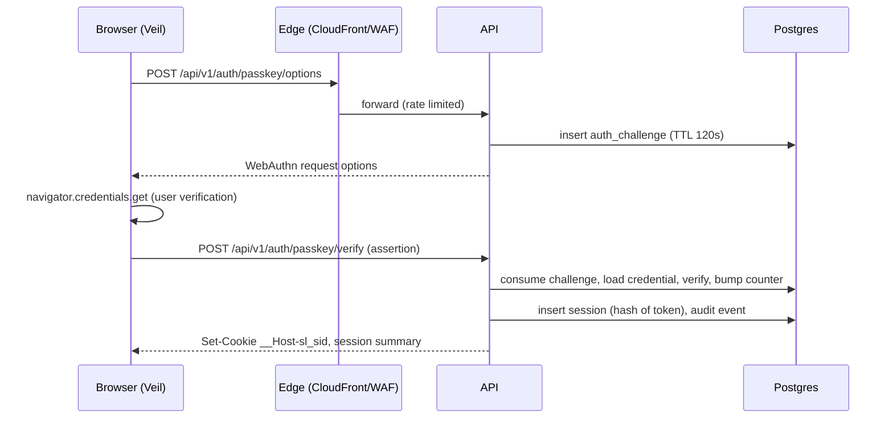
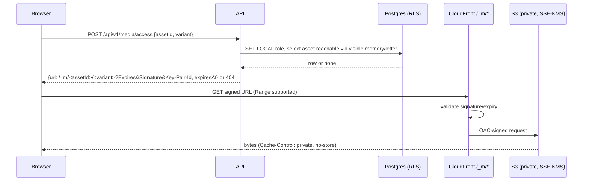
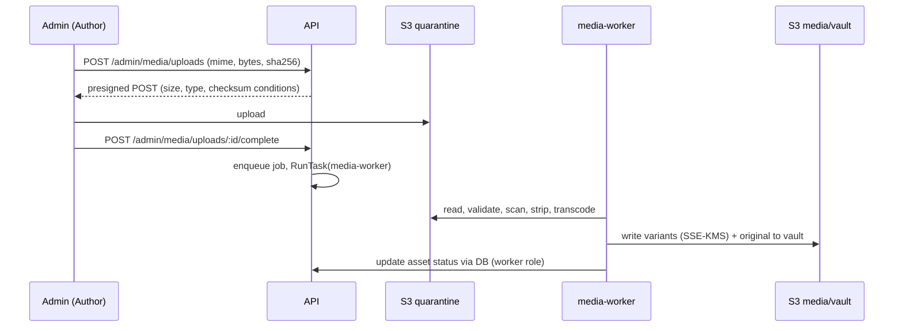

# 09 — SYSTEM ARCHITECTURE

## 9.1 Components
| Component | Runtime | Responsibility |
|---|---|---|
| `web` | Static SPA on S3 via CloudFront | Veil, world engine, panels, Logbook, letters, settings |
| `admin` | Second SPA entry on a separate hostname | Authoring console |
| `api` | Fastify on ECS Fargate (1–2 tasks) | Auth, authorization, content, media access, audit, cron |
| `media-worker` | Fargate task launched on demand by `api` (`ecs:RunTask`) | Validation, sanitization, transcoding, thumbnails |
| PostgreSQL | RDS, private subnets | Content, sessions, audit, job queue (pg-boss) |
| S3 buckets | `spa`, `quarantine`, `media`, `vault`, `backups` (other account), `logs` | See Doc 14 |
| KMS | CMKs: `sealed`, `media`, `vault`, `backup` | See Doc 10 §10.6 |
| CloudFront + WAF | Edge | TLS, geo allow-list, rate rules, signed-URL validation, headers |

## 9.2 Trust boundaries
TB1 Internet ↔ edge · TB2 edge ↔ internal ALB (CloudFront VPC origin only) · TB3 API ↔ DB (IAM-auth TLS, RLS) · TB4 API ↔ AWS APIs (task role) · TB5 worker ↔ untrusted files (sandboxed, own role) · TB6 browser ↔ everything (never trusted for authorization) · TB7 Author's device ↔ admin (Admin Door + passkey).

## 9.3 Key flows
**Login**

**Media access**

**Upload and processing**

## 9.4 State ownership (§21)
| State | Owner | Rule |
|---|---|---|
| Server state | TanStack Query cache | Never mirrored into stores; `gcTime` 10 min; never persisted |
| Authentication state | Server session; client holds only `authenticated` boolean from `GET /session` | No tokens in JS-readable storage |
| Experience/narrative state | XState machine (Doc 18) | Single source for "where she is" |
| 3D scene state | Engine internals | Read via events only |
| UI state | Component state / small Zustand store | Preferences (audio, tier) in `localStorage`, non-sensitive |
| Audio state | AudioBridge | Driven by machine events |
| Media state | Viewer component + object-URL LRU | URLs revoked on close/logout |

## 9.5 Module boundaries (enforced by dependency-cruiser in CI)
`shared` imports nothing app-specific. `web` may import `shared`, `tokens`. `api` may import `shared`. `web` **must not** import `api`. In `api`: `routes → services → repositories → db`; only `repositories` may touch SQL; only `crypto` may touch KMS/keys; only `authz` may decide permissions; only `media` may touch S3.

## 9.6 Environments
Local (Docker: Postgres, MinIO, `LocalKeyService` — production build refuses to start with it) · Staging (Terraform workspace, scaled-down, on demand) · Production. No production data ever in lower environments.

## 9.7 Failure domains
Edge outage → static "resting" page from S3 replica behavior not required; API task failure → ECS restarts, ALB health-checks; DB failure → PITR/Multi-AZ option; KMS unavailable → sealed reads return 503 `SEALED_UNAVAILABLE` (auth and non-sealed fields keep working); worker failure → jobs retry (max 3) then `failed` with Author notification; S3 issues → media placeholders, text still loads.
