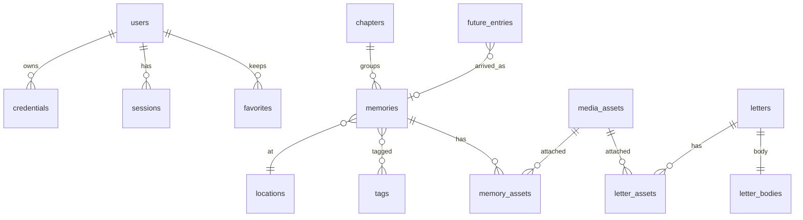

# 13 — DATABASE ARCHITECTURE

## 13.1 Decisions
PostgreSQL (RDS, latest major RDS supports; validated here on 16). One schema `app`. Roles: `sl_owner` (migrations only, never used at runtime), `sl_app` (API; non-owner, no `BYPASSRLS`), `sl_worker` (media worker; media rows + audit insert only). Runtime logins are IAM-authenticated users granted these roles (no passwords). TLS enforced (`rds.force_ssl=1`). Every table has RLS **enabled and forced**; deny-by-default; the API sets `SET LOCAL app.role` and `app.user_id` at the start of every transaction (`system` only inside the auth module and scheduler). Connection: `pg` pool max 10, statement timeout 5 s (30 s for admin/search), idle-in-transaction timeout 10 s.
Conventions: UUIDv4 primary keys (unguessable; authorization never relies on this), `timestamptz` everywhere, `version` integer for optimistic concurrency (`If-Match`), soft-delete via `deleted_at` (30-day trash, then purge job), CHECK constraints instead of enum types (cheap to evolve), columns ending `_sealed` hold `v1.<kid>.<nonce>.<ct>` strings (Doc 10 §10.6), no free-text fields in `audit_events.details` beyond an allow-list.
Migrations: SQL files reviewed by a human; expand → migrate → contract for zero-downtime; run as a one-off ECS task before service update; never auto-run destructive migrations.

## 13.2 Entity catalogue
| Entity (table) | Purpose | Notable constraints / indexes | Privacy notes |
|---|---|---|---|
| `users` | The two humans | Unique partial indexes: one author, one recipient (A-01) | Display name and email sealed; recipient has no email |
| `enrollment_invites` | Single-use device enrollment | `token_hash` unique; attempts ≤ 5; expiry | Token never stored raw; phrase hashed (Argon2id) |
| `credentials` (**Device**) | One passkey each | `credential_id` unique; partial index on active | Public key only; label user-chosen; no IP stored |
| `sessions` | Server-side sessions | `token_hash` unique; idle/absolute expiry; `elevated_until`; `knock_state` | IP stored only as /24 or /48 prefix + country |
| `knock_codes`, `auth_challenges`, `recovery_codes`, `rate_limits`, `idempotency_keys` | Auth and abuse support | TTL cleanup by scheduler | Short-lived |
| `key_registry` | Wrapped DEKs (sealed fields) | One active per purpose | KMS ciphertext only |
| `site_texts` | Personal strings (greeting, closing) | Key regex; sealed value | Never hard-coded in UI |
| `user_state` | `last_seen_world_at` for "new since last visit" | 1 row/user | Own-row RLS; never exposed to Author |
| `chapters` | Constellations | unique slug; status | Titles unsealed (metadata), intro sealed |
| `memories` (Light, milestone via `kind`) | Core content | timeline index; chapter index; visible index; `scheduled ⇒ publish_at` | Story sealed; title/date/tags visible on DB leak |
| `memory_tags`, `tags` | Filtering | PK pair | Tags are metadata |
| `locations` | Place labels | precision enum, default `city` | Label and coordinates sealed; no map by default |
| `media_assets` | Photo/video/audio records | status machine; `variants` jsonb; `vault_key` | `captured_at` admin-only; alt text sealed |
| `memory_assets` / `letter_assets` | Ordered attachments | unique position (deferrable); one cover | Captions sealed |
| `letters` + `letter_bodies` | Letters; **body split so RLS enforces the time lock** | `timed ⇒ unlock_at` | `opened_at` visible to recipient only |
| `future_entries` | The Unlit | kind/status enums; `arrived_memory_id` | Note sealed |
| `favorites` | "Kept" memories/letters | exactly one target; partial unique indexes | Own-row RLS |
| `audit_events` | Append-only audit | INSERT-only grant for app role; hash chain columns | Allow-listed details; 'content' rows unreadable via app |
A `Milestone` is a memory with `kind='milestone'` (and optional `recurrence='yearly'`); a `Message` is a letter or a memory story; `Emotion` and `Tag` are attributes, so no separate tables.

## 13.3 Authorization in the database (verified)
The schema below was executed on PostgreSQL 16 and tested as three principals: **no role** sees nothing; **recipient** sees only published (or past-scheduled) memories, sees a timed/held letter's row but **not its body** until unlocked, reaches only media attached to visible parents, cannot write content, cannot read audit; **author** sees everything, may INSERT audit, and `UPDATE audit_events` is denied at the privilege level.

## 13.4 SQL (source of truth)
<!-- extract: db/migrations/0001_init.sql -->
```sql
-- Slow Light schema v1 (PostgreSQL 16+). Run as the migration owner role.
CREATE SCHEMA IF NOT EXISTS app;
SET search_path = app, public;

DO $$ BEGIN
  IF NOT EXISTS (SELECT 1 FROM pg_roles WHERE rolname = 'sl_app') THEN CREATE ROLE sl_app NOLOGIN; END IF;
  IF NOT EXISTS (SELECT 1 FROM pg_roles WHERE rolname = 'sl_worker') THEN CREATE ROLE sl_worker NOLOGIN; END IF;
END $$;
-- In RDS: CREATE USER sl_api LOGIN; GRANT rds_iam TO sl_api; GRANT sl_app TO sl_api; (same for sl_worker)

CREATE FUNCTION app.actor_role() RETURNS text LANGUAGE sql STABLE AS $$ SELECT current_setting('app.role', true) $$;
CREATE FUNCTION app.actor_id() RETURNS uuid LANGUAGE sql STABLE AS
$$ SELECT NULLIF(current_setting('app.user_id', true), '')::uuid $$;

-- ===== Identity =====
CREATE TABLE users (
  id uuid PRIMARY KEY DEFAULT gen_random_uuid(),
  role text NOT NULL CHECK (role IN ('author','recipient')),
  display_name_sealed text NOT NULL,
  email_sealed text,                       -- author only, for alerts
  status text NOT NULL DEFAULT 'active' CHECK (status IN ('pending','active','disabled')),
  created_at timestamptz NOT NULL DEFAULT now(),
  disabled_at timestamptz
);
CREATE UNIQUE INDEX users_one_recipient ON users (role) WHERE role = 'recipient';  -- A-01
CREATE UNIQUE INDEX users_one_author ON users (role) WHERE role = 'author';

CREATE TABLE enrollment_invites (
  id uuid PRIMARY KEY DEFAULT gen_random_uuid(),
  user_id uuid NOT NULL REFERENCES users(id) ON DELETE CASCADE,
  token_hash bytea NOT NULL UNIQUE,        -- SHA-256 of 256-bit token
  phrase_hash text NOT NULL,               -- argon2id of out-of-band phrase
  expires_at timestamptz NOT NULL,
  consumed_at timestamptz,
  attempts smallint NOT NULL DEFAULT 0 CHECK (attempts BETWEEN 0 AND 5),
  created_by uuid REFERENCES users(id),
  created_at timestamptz NOT NULL DEFAULT now()
);

CREATE TABLE credentials (                 -- "Device": one row per passkey
  id uuid PRIMARY KEY DEFAULT gen_random_uuid(),
  user_id uuid NOT NULL REFERENCES users(id) ON DELETE CASCADE,
  credential_id bytea NOT NULL UNIQUE,
  public_key bytea NOT NULL,
  sign_count bigint NOT NULL DEFAULT 0,
  transports text[] NOT NULL DEFAULT '{}',
  aaguid uuid,
  backed_up boolean NOT NULL DEFAULT false,
  label text NOT NULL DEFAULT 'Passkey' CHECK (char_length(label) <= 60),
  created_at timestamptz NOT NULL DEFAULT now(),
  last_used_at timestamptz,
  revoked_at timestamptz,
  revoked_reason text
);
CREATE INDEX credentials_user_idx ON credentials (user_id) WHERE revoked_at IS NULL;

CREATE TABLE sessions (
  id uuid PRIMARY KEY DEFAULT gen_random_uuid(),
  user_id uuid NOT NULL REFERENCES users(id) ON DELETE CASCADE,
  credential_id uuid REFERENCES credentials(id) ON DELETE SET NULL,
  token_hash bytea NOT NULL UNIQUE,
  kind text NOT NULL DEFAULT 'standard' CHECK (kind IN ('standard','ephemeral')),
  created_at timestamptz NOT NULL DEFAULT now(),
  last_seen_at timestamptz NOT NULL DEFAULT now(),
  idle_expires_at timestamptz NOT NULL,
  absolute_expires_at timestamptz NOT NULL,
  rotated_at timestamptz NOT NULL DEFAULT now(),
  elevated_until timestamptz,
  knock_state text NOT NULL DEFAULT 'none' CHECK (knock_state IN ('none','pending','passed')),
  ua_summary text,                         -- e.g. "Safari 18 / iOS"
  ip_prefix text,                          -- /24 or /48 only, never a full address
  country char(2),
  revoked_at timestamptz,
  revoked_reason text
);
CREATE INDEX sessions_user_active_idx ON sessions (user_id) WHERE revoked_at IS NULL;

CREATE TABLE knock_codes (
  session_id uuid PRIMARY KEY REFERENCES sessions(id) ON DELETE CASCADE,
  code_hash bytea NOT NULL,
  expires_at timestamptz NOT NULL,
  attempts smallint NOT NULL DEFAULT 0 CHECK (attempts BETWEEN 0 AND 5)
);
CREATE TABLE auth_challenges (
  id uuid PRIMARY KEY DEFAULT gen_random_uuid(),
  purpose text NOT NULL CHECK (purpose IN ('login','enroll','add_credential','step_up')),
  user_id uuid REFERENCES users(id) ON DELETE CASCADE,
  challenge bytea NOT NULL UNIQUE,
  expires_at timestamptz NOT NULL,
  consumed_at timestamptz,
  created_at timestamptz NOT NULL DEFAULT now()
);
CREATE INDEX auth_challenges_expiry_idx ON auth_challenges (expires_at);
CREATE TABLE recovery_codes (
  id uuid PRIMARY KEY DEFAULT gen_random_uuid(),
  user_id uuid NOT NULL REFERENCES users(id) ON DELETE CASCADE,
  code_hash text NOT NULL,
  used_at timestamptz
);
CREATE TABLE rate_limits (
  key text NOT NULL,
  window_start timestamptz NOT NULL,
  count integer NOT NULL DEFAULT 0,
  PRIMARY KEY (key, window_start)
);
CREATE TABLE idempotency_keys (
  key text PRIMARY KEY,
  user_id uuid NOT NULL REFERENCES users(id) ON DELETE CASCADE,
  request_hash bytea NOT NULL,
  response jsonb,
  created_at timestamptz NOT NULL DEFAULT now()
);
CREATE TABLE key_registry (
  kid text PRIMARY KEY,
  purpose text NOT NULL DEFAULT 'sealed',
  wrapped_dek bytea NOT NULL,              -- KMS ciphertext blob
  kms_key_id text NOT NULL,
  status text NOT NULL DEFAULT 'active' CHECK (status IN ('active','retired')),
  created_at timestamptz NOT NULL DEFAULT now(),
  retired_at timestamptz
);
CREATE UNIQUE INDEX key_registry_one_active ON key_registry (purpose) WHERE status = 'active';
CREATE TABLE site_texts (
  key text PRIMARY KEY CHECK (key ~ '^[a-z0-9_.]+$'),
  value_sealed text NOT NULL,
  updated_at timestamptz NOT NULL DEFAULT now()
);
CREATE TABLE user_state (
  user_id uuid PRIMARY KEY REFERENCES users(id) ON DELETE CASCADE,
  last_seen_world_at timestamptz
);

-- ===== Content =====
CREATE TABLE chapters (
  id uuid PRIMARY KEY DEFAULT gen_random_uuid(),
  slug text NOT NULL UNIQUE CHECK (slug ~ '^[a-z0-9-]{1,60}$'),
  title text NOT NULL CHECK (char_length(title) BETWEEN 1 AND 120),
  subtitle text CHECK (char_length(subtitle) <= 200),
  intro_sealed text,
  ambience_key text,
  sort_order integer NOT NULL DEFAULT 0,
  status text NOT NULL DEFAULT 'draft' CHECK (status IN ('draft','published','archived')),
  version integer NOT NULL DEFAULT 1,
  created_at timestamptz NOT NULL DEFAULT now(),
  updated_at timestamptz NOT NULL DEFAULT now()
);
CREATE TABLE locations (
  id uuid PRIMARY KEY DEFAULT gen_random_uuid(),
  label_sealed text NOT NULL,
  coords_sealed text,                      -- JSON {lat,lng} rounded per precision, sealed
  precision text NOT NULL DEFAULT 'city' CHECK (precision IN ('exact','area','city','country','hidden')),
  created_at timestamptz NOT NULL DEFAULT now()
);
CREATE TABLE tags (
  id uuid PRIMARY KEY DEFAULT gen_random_uuid(),
  slug text NOT NULL UNIQUE CHECK (slug ~ '^[a-z0-9-]{1,40}$'),
  label text NOT NULL CHECK (char_length(label) <= 60)
);
CREATE TABLE memories (
  id uuid PRIMARY KEY DEFAULT gen_random_uuid(),
  chapter_id uuid REFERENCES chapters(id) ON DELETE RESTRICT,
  title text NOT NULL CHECK (char_length(title) BETWEEN 1 AND 160),
  subtitle text CHECK (char_length(subtitle) <= 240),
  story_sealed text,
  kind text NOT NULL DEFAULT 'moment' CHECK (kind IN ('moment','milestone','trip','conversation','ritual','gift')),
  significance smallint NOT NULL DEFAULT 2 CHECK (significance BETWEEN 1 AND 5),
  emotion text CHECK (emotion IN ('tender','joyful','quiet','bittersweet','awe','playful')),
  occurred_on date NOT NULL,
  date_precision text NOT NULL DEFAULT 'day' CHECK (date_precision IN ('day','month','year','approx')),
  recurrence text NOT NULL DEFAULT 'none' CHECK (recurrence IN ('none','yearly')),
  location_id uuid REFERENCES locations(id) ON DELETE SET NULL,
  layout_hint jsonb,
  status text NOT NULL DEFAULT 'draft' CHECK (status IN ('draft','scheduled','published','archived')),
  publish_at timestamptz,
  version integer NOT NULL DEFAULT 1,
  created_by uuid REFERENCES users(id),
  created_at timestamptz NOT NULL DEFAULT now(),
  updated_at timestamptz NOT NULL DEFAULT now(),
  deleted_at timestamptz,
  CHECK (status <> 'scheduled' OR publish_at IS NOT NULL)
);
CREATE INDEX memories_timeline_idx ON memories (occurred_on, id) WHERE deleted_at IS NULL;
CREATE INDEX memories_chapter_idx ON memories (chapter_id) WHERE deleted_at IS NULL;
CREATE INDEX memories_visible_idx ON memories (status, publish_at) WHERE deleted_at IS NULL;
CREATE TABLE memory_tags (
  memory_id uuid NOT NULL REFERENCES memories(id) ON DELETE CASCADE,
  tag_id uuid NOT NULL REFERENCES tags(id) ON DELETE CASCADE,
  PRIMARY KEY (memory_id, tag_id)
);
CREATE INDEX memory_tags_tag_idx ON memory_tags (tag_id);

CREATE TABLE media_assets (
  id uuid PRIMARY KEY DEFAULT gen_random_uuid(),
  kind text NOT NULL CHECK (kind IN ('image','video','audio')),
  status text NOT NULL DEFAULT 'uploading' CHECK (status IN ('uploading','processing','ready','failed','quarantined')),
  mime_detected text,
  bytes bigint CHECK (bytes >= 0),
  checksum_sha256 bytea,
  width integer, height integer, duration_ms integer,
  lqip text CHECK (char_length(lqip) <= 2048),   -- tiny inline placeholder
  alt_sealed text,
  variants jsonb NOT NULL DEFAULT '[]',          -- [{label,key,mime,bytes,width,height}]
  vault_key text,                                -- original in the vault bucket (never served)
  captured_at timestamptz,                       -- from source metadata; admin-only, never sent to recipient
  error_code text,
  uploader_id uuid REFERENCES users(id),
  created_at timestamptz NOT NULL DEFAULT now(),
  deleted_at timestamptz
);
CREATE INDEX media_assets_status_idx ON media_assets (status) WHERE deleted_at IS NULL;
CREATE TABLE memory_assets (
  memory_id uuid NOT NULL REFERENCES memories(id) ON DELETE CASCADE,
  asset_id uuid NOT NULL REFERENCES media_assets(id) ON DELETE RESTRICT,
  position integer NOT NULL,
  caption_sealed text,
  is_cover boolean NOT NULL DEFAULT false,
  PRIMARY KEY (memory_id, asset_id),
  UNIQUE (memory_id, position) DEFERRABLE INITIALLY DEFERRED
);
CREATE UNIQUE INDEX memory_assets_one_cover ON memory_assets (memory_id) WHERE is_cover;
CREATE INDEX memory_assets_asset_idx ON memory_assets (asset_id);

CREATE TABLE letters (
  id uuid PRIMARY KEY DEFAULT gen_random_uuid(),
  chapter_id uuid REFERENCES chapters(id) ON DELETE SET NULL,
  title text NOT NULL CHECK (char_length(title) BETWEEN 1 AND 160),
  unlock_mode text NOT NULL DEFAULT 'open' CHECK (unlock_mode IN ('open','timed','held')),
  unlock_at timestamptz,
  released_at timestamptz,
  seal_ceremony boolean NOT NULL DEFAULT false,
  opened_at timestamptz,                         -- visible to recipient only (policy-level)
  status text NOT NULL DEFAULT 'draft' CHECK (status IN ('draft','published','archived')),
  sort_order integer NOT NULL DEFAULT 0,
  version integer NOT NULL DEFAULT 1,
  created_at timestamptz NOT NULL DEFAULT now(),
  updated_at timestamptz NOT NULL DEFAULT now(),
  deleted_at timestamptz,
  CHECK (unlock_mode <> 'timed' OR unlock_at IS NOT NULL)
);
CREATE TABLE letter_bodies (                     -- split so RLS enforces the time lock on the text itself
  letter_id uuid PRIMARY KEY REFERENCES letters(id) ON DELETE CASCADE,
  body_sealed text NOT NULL
);
CREATE TABLE letter_assets (
  letter_id uuid NOT NULL REFERENCES letters(id) ON DELETE CASCADE,
  asset_id uuid NOT NULL REFERENCES media_assets(id) ON DELETE RESTRICT,
  position integer NOT NULL,
  PRIMARY KEY (letter_id, asset_id)
);
CREATE TABLE future_entries (
  id uuid PRIMARY KEY DEFAULT gen_random_uuid(),
  kind text NOT NULL CHECK (kind IN ('promise','place','plan','dream','blank')),
  title text NOT NULL CHECK (char_length(title) BETWEEN 1 AND 160),
  note_sealed text,
  target_date date,
  target_precision text NOT NULL DEFAULT 'year' CHECK (target_precision IN ('day','month','year','approx')),
  status text NOT NULL DEFAULT 'draft' CHECK (status IN ('draft','unlit','arrived','archived')),
  arrived_memory_id uuid REFERENCES memories(id) ON DELETE SET NULL,
  sort_order integer NOT NULL DEFAULT 0,
  version integer NOT NULL DEFAULT 1,
  created_at timestamptz NOT NULL DEFAULT now(),
  updated_at timestamptz NOT NULL DEFAULT now()
);
CREATE TABLE favorites (
  user_id uuid NOT NULL REFERENCES users(id) ON DELETE CASCADE,
  memory_id uuid REFERENCES memories(id) ON DELETE CASCADE,
  letter_id uuid REFERENCES letters(id) ON DELETE CASCADE,
  created_at timestamptz NOT NULL DEFAULT now(),
  CHECK (num_nonnulls(memory_id, letter_id) = 1)
);
CREATE UNIQUE INDEX favorites_memory_uq ON favorites (user_id, memory_id) WHERE memory_id IS NOT NULL;
CREATE UNIQUE INDEX favorites_letter_uq ON favorites (user_id, letter_id) WHERE letter_id IS NOT NULL;

CREATE TABLE audit_events (
  id bigserial PRIMARY KEY,
  at timestamptz NOT NULL DEFAULT now(),
  actor_user_id uuid,
  actor_role text,
  session_id uuid,
  category text NOT NULL CHECK (category IN ('auth','admin','security','system','content')),
  action text NOT NULL,
  subject_type text,
  subject_id text,
  outcome text NOT NULL CHECK (outcome IN ('success','denied','error')),
  request_id text,
  ip_prefix text,
  ua_family text,
  details jsonb NOT NULL DEFAULT '{}',           -- allow-listed keys only; never content
  prev_hash bytea,
  hash bytea
);
CREATE INDEX audit_events_at_idx ON audit_events (at DESC);
CREATE INDEX audit_events_action_idx ON audit_events (category, action, at DESC);

-- ===== Privileges =====
REVOKE ALL ON ALL TABLES IN SCHEMA app FROM PUBLIC;
GRANT USAGE ON SCHEMA app TO sl_app, sl_worker;
GRANT SELECT, INSERT, UPDATE, DELETE ON ALL TABLES IN SCHEMA app TO sl_app;
REVOKE UPDATE, DELETE, TRUNCATE ON audit_events FROM sl_app;   -- append-only
GRANT USAGE, SELECT ON ALL SEQUENCES IN SCHEMA app TO sl_app;
GRANT SELECT, UPDATE ON media_assets TO sl_worker;
GRANT SELECT ON memory_assets, letter_assets TO sl_worker;
GRANT INSERT ON audit_events TO sl_worker;
GRANT USAGE, SELECT ON SEQUENCE audit_events_id_seq TO sl_worker;
GRANT EXECUTE ON FUNCTION app.actor_role(), app.actor_id() TO sl_app, sl_worker;

-- ===== Row-Level Security (FORCE: applies even to table owner) =====
-- API sets per transaction: SET LOCAL app.role = 'author'|'recipient'|'system'; SET LOCAL app.user_id = '<uuid>';
-- 'system' is set ONLY by the auth module and the scheduler.
DO $$
DECLARE t text;
BEGIN
  FOREACH t IN ARRAY ARRAY['users','enrollment_invites','credentials','sessions','knock_codes','auth_challenges',
    'recovery_codes','rate_limits','idempotency_keys','key_registry','site_texts','user_state','chapters','locations',
    'tags','memories','memory_tags','media_assets','memory_assets','letters','letter_bodies','letter_assets',
    'future_entries','favorites','audit_events'] LOOP
    EXECUTE format('ALTER TABLE app.%I ENABLE ROW LEVEL SECURITY', t);
    EXECUTE format('ALTER TABLE app.%I FORCE ROW LEVEL SECURITY', t);
    EXECUTE format('CREATE POLICY %I ON app.%I FOR ALL TO sl_app USING (app.actor_role() = ''system'') WITH CHECK (app.actor_role() = ''system'')', t || '_system', t);
  END LOOP;
  -- Author: full access to content tables and identity management
  FOREACH t IN ARRAY ARRAY['users','enrollment_invites','credentials','sessions','recovery_codes','site_texts',
    'chapters','locations','tags','memories','memory_tags','media_assets','memory_assets','letters','letter_bodies',
    'letter_assets','future_entries'] LOOP
    EXECUTE format('CREATE POLICY %I ON app.%I FOR ALL TO sl_app USING (app.actor_role() = ''author'') WITH CHECK (app.actor_role() = ''author'')', t || '_author', t);
  END LOOP;
END $$;

CREATE FUNCTION app.memory_visible(m app.memories) RETURNS boolean LANGUAGE sql STABLE AS $$
  SELECT m.deleted_at IS NULL AND m.status IN ('published','scheduled') AND COALESCE(m.publish_at, '-infinity') <= now() $$;
CREATE FUNCTION app.letter_visible(l app.letters) RETURNS boolean LANGUAGE sql STABLE AS $$
  SELECT l.deleted_at IS NULL AND l.status = 'published' $$;
CREATE FUNCTION app.letter_unlocked(l app.letters) RETURNS boolean LANGUAGE sql STABLE AS $$
  SELECT l.deleted_at IS NULL AND l.status = 'published' AND (
    l.unlock_mode = 'open'
    OR (l.unlock_mode = 'timed' AND l.unlock_at <= now())
    OR (l.unlock_mode = 'held' AND l.released_at IS NOT NULL AND l.released_at <= now())) $$;

-- Recipient (read paths)
CREATE POLICY chapters_recipient ON chapters FOR SELECT TO sl_app USING (app.actor_role() = 'recipient' AND status = 'published');
CREATE POLICY tags_recipient ON tags FOR SELECT TO sl_app USING (app.actor_role() = 'recipient');
CREATE POLICY memories_recipient ON memories FOR SELECT TO sl_app USING (app.actor_role() = 'recipient' AND app.memory_visible(memories));
CREATE POLICY memory_tags_recipient ON memory_tags FOR SELECT TO sl_app USING (app.actor_role() = 'recipient'
  AND EXISTS (SELECT 1 FROM memories m WHERE m.id = memory_id));
CREATE POLICY memory_assets_recipient ON memory_assets FOR SELECT TO sl_app USING (app.actor_role() = 'recipient'
  AND EXISTS (SELECT 1 FROM memories m WHERE m.id = memory_id));
CREATE POLICY locations_recipient ON locations FOR SELECT TO sl_app USING (app.actor_role() = 'recipient'
  AND EXISTS (SELECT 1 FROM memories m WHERE m.location_id = locations.id));
CREATE POLICY letters_recipient ON letters FOR SELECT TO sl_app USING (app.actor_role() = 'recipient' AND app.letter_visible(letters));
CREATE POLICY letters_recipient_open ON letters FOR UPDATE TO sl_app
  USING (app.actor_role() = 'recipient' AND app.letter_unlocked(letters)) WITH CHECK (app.actor_role() = 'recipient');
CREATE POLICY letter_bodies_recipient ON letter_bodies FOR SELECT TO sl_app USING (app.actor_role() = 'recipient'
  AND EXISTS (SELECT 1 FROM letters l WHERE l.id = letter_id AND app.letter_unlocked(l)));
CREATE POLICY letter_assets_recipient ON letter_assets FOR SELECT TO sl_app USING (app.actor_role() = 'recipient'
  AND EXISTS (SELECT 1 FROM letters l WHERE l.id = letter_id AND app.letter_unlocked(l)));
CREATE POLICY media_recipient ON media_assets FOR SELECT TO sl_app USING (app.actor_role() = 'recipient' AND status = 'ready' AND deleted_at IS NULL
  AND (EXISTS (SELECT 1 FROM memory_assets ma WHERE ma.asset_id = media_assets.id)
    OR EXISTS (SELECT 1 FROM letter_assets la WHERE la.asset_id = media_assets.id)));
CREATE POLICY future_recipient ON future_entries FOR SELECT TO sl_app USING (app.actor_role() = 'recipient' AND status IN ('unlit','arrived'));
CREATE POLICY site_texts_recipient ON site_texts FOR SELECT TO sl_app USING (app.actor_role() = 'recipient');
-- Own rows
CREATE POLICY favorites_own ON favorites FOR ALL TO sl_app USING (user_id = app.actor_id() AND app.actor_role() IN ('recipient','author'))
  WITH CHECK (user_id = app.actor_id());
CREATE POLICY user_state_own ON user_state FOR ALL TO sl_app USING (user_id = app.actor_id()) WITH CHECK (user_id = app.actor_id());
CREATE POLICY credentials_own ON credentials FOR SELECT TO sl_app USING (user_id = app.actor_id());
CREATE POLICY sessions_own ON sessions FOR ALL TO sl_app USING (user_id = app.actor_id()) WITH CHECK (user_id = app.actor_id());
CREATE POLICY users_self ON users FOR SELECT TO sl_app USING (id = app.actor_id());
-- Audit: anyone authenticated may append; only the author may read
CREATE POLICY audit_insert ON audit_events FOR INSERT TO sl_app WITH CHECK (app.actor_role() IN ('recipient','author','system'));
CREATE POLICY audit_author_read ON audit_events FOR SELECT TO sl_app USING (app.actor_role() = 'author'
  AND category IN ('auth','admin','security','system'));   -- 'content' access rows are never readable via the app
-- Worker role: media rows only (grants above) plus audit insert
CREATE POLICY media_worker ON media_assets FOR ALL TO sl_worker USING (true) WITH CHECK (true);
CREATE POLICY audit_worker ON audit_events FOR INSERT TO sl_worker WITH CHECK (true);
```

## 13.5 Entity relationship overview


## 13.6 Schema as JSON (generated by introspecting the validated database)
<!-- extract: db/schema.descriptor.json -->
```json
{"schema":"app","postgres":"16+","conventions":["uuid v4 primary keys","timestamptz everywhere","columns ending _sealed hold AES-256-GCM sealed text (Doc 10)","RLS ENABLED and FORCED on every table"],"tables":{"audit_events":{"columns":[{"name":"id","null":false,"type":"bigint"},{"name":"at","null":false,"type":"timestamp with time zone"},{"name":"actor_user_id","null":true,"type":"uuid"},{"name":"actor_role","null":true,"type":"text"},{"name":"session_id","null":true,"type":"uuid"},{"name":"category","null":false,"type":"text"},{"name":"action","null":false,"type":"text"},{"name":"subject_type","null":true,"type":"text"},{"name":"subject_id","null":true,"type":"text"},{"name":"outcome","null":false,"type":"text"},{"name":"request_id","null":true,"type":"text"},{"name":"ip_prefix","null":true,"type":"text"},{"name":"ua_family","null":true,"type":"text"},{"name":"details","null":false,"type":"jsonb"},{"name":"prev_hash","null":true,"type":"bytea"},{"name":"hash","null":true,"type":"bytea"}],"primaryKey":["id"],"foreignKeys":[],"indexes":["audit_events_at_idx","audit_events_action_idx"],"policies":["audit_events_system","audit_insert","audit_author_read","audit_worker"]},"auth_challenges":{"columns":[{"name":"id","null":false,"type":"uuid"},{"name":"purpose","null":false,"type":"text"},{"name":"user_id","null":true,"type":"uuid"},{"name":"challenge","null":false,"type":"bytea"},{"name":"expires_at","null":false,"type":"timestamp with time zone"},{"name":"consumed_at","null":true,"type":"timestamp with time zone"},{"name":"created_at","null":false,"type":"timestamp with time zone"}],"primaryKey":["id"],"foreignKeys":["FOREIGN KEY (user_id) REFERENCES app.users(id) ON DELETE CASCADE"],"indexes":["auth_challenges_challenge_key","auth_challenges_expiry_idx"],"policies":["auth_challenges_system"]},"chapters":{"columns":[{"name":"id","null":false,"type":"uuid"},{"name":"slug","null":false,"type":"text"},{"name":"title","null":false,"type":"text"},{"name":"subtitle","null":true,"type":"text"},{"name":"intro_sealed","null":true,"type":"text","sealed":true},{"name":"ambience_key","null":true,"type":"text"},{"name":"sort_order","null":false,"type":"integer"},{"name":"status","null":false,"type":"text"},{"name":"version","null":false,"type":"integer"},{"name":"created_at","null":false,"type":"timestamp with time zone"},{"name":"updated_at","null":false,"type":"timestamp with time zone"}],"primaryKey":["id"],"foreignKeys":[],"indexes":["chapters_slug_key"],"policies":["chapters_system","chapters_author","chapters_recipient"]},"credentials":{"columns":[{"name":"id","null":false,"type":"uuid"},{"name":"user_id","null":false,"type":"uuid"},{"name":"credential_id","null":false,"type":"bytea"},{"name":"public_key","null":false,"type":"bytea"},{"name":"sign_count","null":false,"type":"bigint"},{"name":"transports","null":false,"type":"text[]"},{"name":"aaguid","null":true,"type":"uuid"},{"name":"backed_up","null":false,"type":"boolean"},{"name":"label","null":false,"type":"text"},{"name":"created_at","null":false,"type":"timestamp with time zone"},{"name":"last_used_at","null":true,"type":"timestamp with time zone"},{"name":"revoked_at","null":true,"type":"timestamp with time zone"},{"name":"revoked_reason","null":true,"type":"text"}],"primaryKey":["id"],"foreignKeys":["FOREIGN KEY (user_id) REFERENCES app.users(id) ON DELETE CASCADE"],"indexes":["credentials_credential_id_key","credentials_user_idx"],"policies":["credentials_system","credentials_author","credentials_own"]},"enrollment_invites":{"columns":[{"name":"id","null":false,"type":"uuid"},{"name":"user_id","null":false,"type":"uuid"},{"name":"token_hash","null":false,"type":"bytea"},{"name":"phrase_hash","null":false,"type":"text"},{"name":"expires_at","null":false,"type":"timestamp with time zone"},{"name":"consumed_at","null":true,"type":"timestamp with time zone"},{"name":"attempts","null":false,"type":"smallint"},{"name":"created_by","null":true,"type":"uuid"},{"name":"created_at","null":false,"type":"timestamp with time zone"}],"primaryKey":["id"],"foreignKeys":["FOREIGN KEY (user_id) REFERENCES app.users(id) ON DELETE CASCADE","FOREIGN KEY (created_by) REFERENCES app.users(id)"],"indexes":["enrollment_invites_token_hash_key"],"policies":["enrollment_invites_system","enrollment_invites_author"]},"favorites":{"columns":[{"name":"user_id","null":false,"type":"uuid"},{"name":"memory_id","null":true,"type":"uuid"},{"name":"letter_id","null":true,"type":"uuid"},{"name":"created_at","null":false,"type":"timestamp with time zone"}],"primaryKey":null,"foreignKeys":["FOREIGN KEY (user_id) REFERENCES app.users(id) ON DELETE CASCADE","FOREIGN KEY (memory_id) REFERENCES app.memories(id) ON DELETE CASCADE","FOREIGN KEY (letter_id) REFERENCES app.letters(id) ON DELETE CASCADE"],"indexes":["favorites_memory_uq","favorites_letter_uq"],"policies":["favorites_system","favorites_own"]},"future_entries":{"columns":[{"name":"id","null":false,"type":"uuid"},{"name":"kind","null":false,"type":"text"},{"name":"title","null":false,"type":"text"},{"name":"note_sealed","null":true,"type":"text","sealed":true},{"name":"target_date","null":true,"type":"date"},{"name":"target_precision","null":false,"type":"text"},{"name":"status","null":false,"type":"text"},{"name":"arrived_memory_id","null":true,"type":"uuid"},{"name":"sort_order","null":false,"type":"integer"},{"name":"version","null":false,"type":"integer"},{"name":"created_at","null":false,"type":"timestamp with time zone"},{"name":"updated_at","null":false,"type":"timestamp with time zone"}],"primaryKey":["id"],"foreignKeys":["FOREIGN KEY (arrived_memory_id) REFERENCES app.memories(id) ON DELETE SET NULL"],"indexes":[],"policies":["future_entries_system","future_entries_author","future_recipient"]},"idempotency_keys":{"columns":[{"name":"key","null":false,"type":"text"},{"name":"user_id","null":false,"type":"uuid"},{"name":"request_hash","null":false,"type":"bytea"},{"name":"response","null":true,"type":"jsonb"},{"name":"created_at","null":false,"type":"timestamp with time zone"}],"primaryKey":["key"],"foreignKeys":["FOREIGN KEY (user_id) REFERENCES app.users(id) ON DELETE CASCADE"],"indexes":[],"policies":["idempotency_keys_system"]},"key_registry":{"columns":[{"name":"kid","null":false,"type":"text"},{"name":"purpose","null":false,"type":"text"},{"name":"wrapped_dek","null":false,"type":"bytea"},{"name":"kms_key_id","null":false,"type":"text"},{"name":"status","null":false,"type":"text"},{"name":"created_at","null":false,"type":"timestamp with time zone"},{"name":"retired_at","null":true,"type":"timestamp with time zone"}],"primaryKey":["kid"],"foreignKeys":[],"indexes":["key_registry_one_active"],"policies":["key_registry_system"]},"knock_codes":{"columns":[{"name":"session_id","null":false,"type":"uuid"},{"name":"code_hash","null":false,"type":"bytea"},{"name":"expires_at","null":false,"type":"timestamp with time zone"},{"name":"attempts","null":false,"type":"smallint"}],"primaryKey":["session_id"],"foreignKeys":["FOREIGN KEY (session_id) REFERENCES app.sessions(id) ON DELETE CASCADE"],"indexes":[],"policies":["knock_codes_system"]},"letter_assets":{"columns":[{"name":"letter_id","null":false,"type":"uuid"},{"name":"asset_id","null":false,"type":"uuid"},{"name":"position","null":false,"type":"integer"}],"primaryKey":["letter_id","asset_id"],"foreignKeys":["FOREIGN KEY (letter_id) REFERENCES app.letters(id) ON DELETE CASCADE","FOREIGN KEY (asset_id) REFERENCES app.media_assets(id) ON DELETE RESTRICT"],"indexes":[],"policies":["letter_assets_system","letter_assets_author","letter_assets_recipient"]},"letter_bodies":{"columns":[{"name":"letter_id","null":false,"type":"uuid"},{"name":"body_sealed","null":false,"type":"text","sealed":true}],"primaryKey":["letter_id"],"foreignKeys":["FOREIGN KEY (letter_id) REFERENCES app.letters(id) ON DELETE CASCADE"],"indexes":[],"policies":["letter_bodies_system","letter_bodies_author","letter_bodies_recipient"]},"letters":{"columns":[{"name":"id","null":false,"type":"uuid"},{"name":"chapter_id","null":true,"type":"uuid"},{"name":"title","null":false,"type":"text"},{"name":"unlock_mode","null":false,"type":"text"},{"name":"unlock_at","null":true,"type":"timestamp with time zone"},{"name":"released_at","null":true,"type":"timestamp with time zone"},{"name":"seal_ceremony","null":false,"type":"boolean"},{"name":"opened_at","null":true,"type":"timestamp with time zone"},{"name":"status","null":false,"type":"text"},{"name":"sort_order","null":false,"type":"integer"},{"name":"version","null":false,"type":"integer"},{"name":"created_at","null":false,"type":"timestamp with time zone"},{"name":"updated_at","null":false,"type":"timestamp with time zone"},{"name":"deleted_at","null":true,"type":"timestamp with time zone"}],"primaryKey":["id"],"foreignKeys":["FOREIGN KEY (chapter_id) REFERENCES app.chapters(id) ON DELETE SET NULL"],"indexes":[],"policies":["letters_system","letters_author","letters_recipient","letters_recipient_open"]},"locations":{"columns":[{"name":"id","null":false,"type":"uuid"},{"name":"label_sealed","null":false,"type":"text","sealed":true},{"name":"coords_sealed","null":true,"type":"text","sealed":true},{"name":"precision","null":false,"type":"text"},{"name":"created_at","null":false,"type":"timestamp with time zone"}],"primaryKey":["id"],"foreignKeys":[],"indexes":[],"policies":["locations_system","locations_author","locations_recipient"]},"media_assets":{"columns":[{"name":"id","null":false,"type":"uuid"},{"name":"kind","null":false,"type":"text"},{"name":"status","null":false,"type":"text"},{"name":"mime_detected","null":true,"type":"text"},{"name":"bytes","null":true,"type":"bigint"},{"name":"checksum_sha256","null":true,"type":"bytea"},{"name":"width","null":true,"type":"integer"},{"name":"height","null":true,"type":"integer"},{"name":"duration_ms","null":true,"type":"integer"},{"name":"lqip","null":true,"type":"text"},{"name":"alt_sealed","null":true,"type":"text","sealed":true},{"name":"variants","null":false,"type":"jsonb"},{"name":"vault_key","null":true,"type":"text"},{"name":"captured_at","null":true,"type":"timestamp with time zone"},{"name":"error_code","null":true,"type":"text"},{"name":"uploader_id","null":true,"type":"uuid"},{"name":"created_at","null":false,"type":"timestamp with time zone"},{"name":"deleted_at","null":true,"type":"timestamp with time zone"}],"primaryKey":["id"],"foreignKeys":["FOREIGN KEY (uploader_id) REFERENCES app.users(id)"],"indexes":["media_assets_status_idx"],"policies":["media_assets_system","media_assets_author","media_recipient","media_worker"]},"memories":{"columns":[{"name":"id","null":false,"type":"uuid"},{"name":"chapter_id","null":true,"type":"uuid"},{"name":"title","null":false,"type":"text"},{"name":"subtitle","null":true,"type":"text"},{"name":"story_sealed","null":true,"type":"text","sealed":true},{"name":"kind","null":false,"type":"text"},{"name":"significance","null":false,"type":"smallint"},{"name":"emotion","null":true,"type":"text"},{"name":"occurred_on","null":false,"type":"date"},{"name":"date_precision","null":false,"type":"text"},{"name":"recurrence","null":false,"type":"text"},{"name":"location_id","null":true,"type":"uuid"},{"name":"layout_hint","null":true,"type":"jsonb"},{"name":"status","null":false,"type":"text"},{"name":"publish_at","null":true,"type":"timestamp with time zone"},{"name":"version","null":false,"type":"integer"},{"name":"created_by","null":true,"type":"uuid"},{"name":"created_at","null":false,"type":"timestamp with time zone"},{"name":"updated_at","null":false,"type":"timestamp with time zone"},{"name":"deleted_at","null":true,"type":"timestamp with time zone"}],"primaryKey":["id"],"foreignKeys":["FOREIGN KEY (chapter_id) REFERENCES app.chapters(id) ON DELETE RESTRICT","FOREIGN KEY (location_id) REFERENCES app.locations(id) ON DELETE SET NULL","FOREIGN KEY (created_by) REFERENCES app.users(id)"],"indexes":["memories_timeline_idx","memories_chapter_idx","memories_visible_idx"],"policies":["memories_system","memories_author","memories_recipient"]},"memory_assets":{"columns":[{"name":"memory_id","null":false,"type":"uuid"},{"name":"asset_id","null":false,"type":"uuid"},{"name":"position","null":false,"type":"integer"},{"name":"caption_sealed","null":true,"type":"text","sealed":true},{"name":"is_cover","null":false,"type":"boolean"}],"primaryKey":["memory_id","asset_id"],"foreignKeys":["FOREIGN KEY (memory_id) REFERENCES app.memories(id) ON DELETE CASCADE","FOREIGN KEY (asset_id) REFERENCES app.media_assets(id) ON DELETE RESTRICT"],"indexes":["memory_assets_memory_id_position_key","memory_assets_one_cover","memory_assets_asset_idx"],"policies":["memory_assets_system","memory_assets_author","memory_assets_recipient"]},"memory_tags":{"columns":[{"name":"memory_id","null":false,"type":"uuid"},{"name":"tag_id","null":false,"type":"uuid"}],"primaryKey":["memory_id","tag_id"],"foreignKeys":["FOREIGN KEY (memory_id) REFERENCES app.memories(id) ON DELETE CASCADE","FOREIGN KEY (tag_id) REFERENCES app.tags(id) ON DELETE CASCADE"],"indexes":["memory_tags_tag_idx"],"policies":["memory_tags_system","memory_tags_author","memory_tags_recipient"]},"rate_limits":{"columns":[{"name":"key","null":false,"type":"text"},{"name":"window_start","null":false,"type":"timestamp with time zone"},{"name":"count","null":false,"type":"integer"}],"primaryKey":["key","window_start"],"foreignKeys":[],"indexes":[],"policies":["rate_limits_system"]},"recovery_codes":{"columns":[{"name":"id","null":false,"type":"uuid"},{"name":"user_id","null":false,"type":"uuid"},{"name":"code_hash","null":false,"type":"text"},{"name":"used_at","null":true,"type":"timestamp with time zone"}],"primaryKey":["id"],"foreignKeys":["FOREIGN KEY (user_id) REFERENCES app.users(id) ON DELETE CASCADE"],"indexes":[],"policies":["recovery_codes_system","recovery_codes_author"]},"sessions":{"columns":[{"name":"id","null":false,"type":"uuid"},{"name":"user_id","null":false,"type":"uuid"},{"name":"credential_id","null":true,"type":"uuid"},{"name":"token_hash","null":false,"type":"bytea"},{"name":"kind","null":false,"type":"text"},{"name":"created_at","null":false,"type":"timestamp with time zone"},{"name":"last_seen_at","null":false,"type":"timestamp with time zone"},{"name":"idle_expires_at","null":false,"type":"timestamp with time zone"},{"name":"absolute_expires_at","null":false,"type":"timestamp with time zone"},{"name":"rotated_at","null":false,"type":"timestamp with time zone"},{"name":"elevated_until","null":true,"type":"timestamp with time zone"},{"name":"knock_state","null":false,"type":"text"},{"name":"ua_summary","null":true,"type":"text"},{"name":"ip_prefix","null":true,"type":"text"},{"name":"country","null":true,"type":"character(2)"},{"name":"revoked_at","null":true,"type":"timestamp with time zone"},{"name":"revoked_reason","null":true,"type":"text"}],"primaryKey":["id"],"foreignKeys":["FOREIGN KEY (user_id) REFERENCES app.users(id) ON DELETE CASCADE","FOREIGN KEY (credential_id) REFERENCES app.credentials(id) ON DELETE SET NULL"],"indexes":["sessions_token_hash_key","sessions_user_active_idx"],"policies":["sessions_system","sessions_author","sessions_own"]},"site_texts":{"columns":[{"name":"key","null":false,"type":"text"},{"name":"value_sealed","null":false,"type":"text","sealed":true},{"name":"updated_at","null":false,"type":"timestamp with time zone"}],"primaryKey":["key"],"foreignKeys":[],"indexes":[],"policies":["site_texts_system","site_texts_author","site_texts_recipient"]},"tags":{"columns":[{"name":"id","null":false,"type":"uuid"},{"name":"slug","null":false,"type":"text"},{"name":"label","null":false,"type":"text"}],"primaryKey":["id"],"foreignKeys":[],"indexes":["tags_slug_key"],"policies":["tags_system","tags_author","tags_recipient"]},"user_state":{"columns":[{"name":"user_id","null":false,"type":"uuid"},{"name":"last_seen_world_at","null":true,"type":"timestamp with time zone"}],"primaryKey":["user_id"],"foreignKeys":["FOREIGN KEY (user_id) REFERENCES app.users(id) ON DELETE CASCADE"],"indexes":[],"policies":["user_state_system","user_state_own"]},"users":{"columns":[{"name":"id","null":false,"type":"uuid"},{"name":"role","null":false,"type":"text"},{"name":"display_name_sealed","null":false,"type":"text","sealed":true},{"name":"email_sealed","null":true,"type":"text","sealed":true},{"name":"status","null":false,"type":"text"},{"name":"created_at","null":false,"type":"timestamp with time zone"},{"name":"disabled_at","null":true,"type":"timestamp with time zone"}],"primaryKey":["id"],"foreignKeys":[],"indexes":["users_one_recipient","users_one_author"],"policies":["users_system","users_author","users_self"]}}}
```

## 13.7 Operational notes
Scheduler (pg-boss cron): purge expired sessions/challenges (hourly), purge trash > 30 days (daily, also deletes S3 versions), rotate rate-limit windows, verify audit hash chain (daily), publish scheduled memories (per-minute check is unnecessary because visibility is computed from `publish_at` at read time). Growth is tiny (A-02): no partitioning; `VACUUM` defaults; storage autoscaling on.
