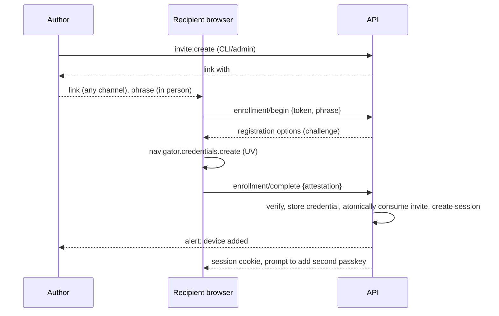

# 16 — AUTHENTICATION SPECIFICATION

## 16.1 Options considered (optimize: maximum privacy + low friction)
| Option | Verdict | Reason |
|---|---|---|
| Password/passphrase | Rejected as sole factor | Guessable, phishable, needs storage; a shared "secret word" may exist as UX only |
| TOTP/SMS | Rejected | Friction; SMS is weak; phishable |
| Email magic link | Rejected | Email account becomes the weakest link; link scanners and referrers leak tokens; no email for the Recipient |
| Third-party IdP (Auth0, Cognito…) | Rejected | Adds a processor that sees logins; overkill for two accounts |
| **Passkeys (WebAuthn, discoverable, UV required)** | **Chosen** | Phishing-resistant, no shared secret to leak, one touch, syncs across her devices, hybrid QR works on borrowed computers |
| Face recognition as login | Rejected | Not authentication; (the platform biometric only unlocks the passkey locally) |

## 16.2 Parameters
`rpId` = apex domain, `origin` = `https://<host>`; `residentKey: required`; `userVerification: required`; `attestation: none`; timeout 60 s; algorithms ES256, EdDSA, RS256; challenge 32 random bytes, single-use, TTL 120 s, stored in `auth_challenges`. Verification uses `@simplewebauthn/server` with `expectedChallenge`, `expectedOrigin`, `expectedRPID`, `requireUserVerification: true`; additionally the server checks: credential not revoked, `signCount` increases when non-zero (else log anomaly, don't lock), user active, challenge unconsumed and purpose-matched.

## 16.3 Ceremonies
**Enrollment (first device, and every recovery).** The Author runs `pnpm cli invite:create --role recipient` (or the admin UI) → outputs a link `https://<host>/enroll#t=<256-bit token>` and a separate **phrase** (5 Diceware words). The link is delivered by any channel; the phrase **only out-of-band** (in person/voice). Browser reads the fragment (never sent to servers/logs), user enters the phrase; `POST enrollment/begin` verifies `token_hash` + Argon2id phrase (constant time), increments `attempts` (dies at 5), issues registration options; `complete` verifies attestation, stores the credential, atomically consumes the invite (`UPDATE … SET consumed_at=now() WHERE consumed_at IS NULL AND expires_at>now() RETURNING`), creates a session, alerts the Author ("A device was added"), and prompts to add a **second** passkey. Invite expiry 24 h.
**Login.** Veil press → `options` (no username; discoverable credentials) → browser prompt → `verify` → session. Optional conditional UI is not used (no form fields).
**Step-up.** For device changes, sign-out-everywhere, all destructive admin actions, admin elevation: fresh assertion (`purpose=step_up`) sets `elevated_until = now()+15 min` (author) or authorizes one action (recipient).
**Add device.** Authenticated + step-up → registration options for the same user.
**Revoke.** Recipient may revoke her own devices (never the last); Author may revoke any credential/session for either user. Revocation deletes sessions bound to the credential immediately. If supported, call `PublicKeyCredential.signalUnknownCredential` client-side so the passkey manager drops it (feature-detected, optional).

## 16.4 Recovery
- **Recipient loses all devices:** asks the Author (a human she knows) → new invite (link + phrase) → enroll → old credentials revoked. No email/SMS recovery exists to attack.
- **Author loses devices:** (1) second registered passkey (hardware key recommended); (2) one of 10 single-use **recovery codes** (Argon2id-hashed, printed and stored offline) allows enrolling a new passkey; (3) break-glass `pnpm cli auth:reset-author` requiring MFA'd AWS credentials with DB/IAM access (the cloud account is the trust root; the action is logged in CloudTrail and audit).
- Bootstrapping: `pnpm cli bootstrap` creates the Author with a one-time invite; run once during Phase 2.

## 16.5 Sessions
Token: 32 random bytes (base64url), cookie `__Host-sl_sid`, DB stores SHA-256. Kinds and lifetimes (config `security.session`): **standard** idle 72 h / absolute 30 d, rotated every 24 h of activity; **ephemeral** ("This isn't my device") idle 30 min / absolute 2 h, `Cache-Control: no-store` enforced, no offline data; **author** idle 30 min / absolute 8 h, elevation 15 min. Fixation: a new token is issued at login and at elevation. Logout revokes server-side and emits `Clear-Site-Data`. Every request updates `last_seen_at` (throttled to 1/min). Optional DBSC (Device Bound Session Credentials) binding for author sessions when the browser offers it (Chrome on Windows as of 2026; never required; verify status at build time).

## 16.6 Suspicious login handling and the Knock
Signals: new country (never seen for this user), impossible travel (< 2 h between distant countries), unusual burst of failures, new credential use from a country not seen. Responses (no auto-lockout): (a) **Knock** on new country for the Recipient: session created in `knock_state=pending` with **no content access**; a 6-digit code is emailed/notified to the Author and shown in admin; she enters it (5 attempts, 10 min); on pass `knock_state=passed` and the country is remembered. If notification fails, fail closed and let her ask the Author. (b) all other signals → audit `security.anomaly` + alert to Author. Device trust = the credential itself; an unknown credential cannot log in.

## 16.7 Throttling and enumeration
No usernames exist, so nothing to enumerate; error messages are uniform ("That didn't work. Try again."); timing of enrollment verification is constant (Argon2id always run). Rate limits: Doc 10 §10.5.

## 16.8 Sequence (enrollment)

## 16.9 Requirements checklist
Single module `apps/api/src/auth/` (≤ 1,500 LOC), 100% branch coverage, virtual-authenticator e2e (Chromium CDP `WebAuthn.addVirtualAuthenticator`), replay/tamper/origin/RP-ID/counter tests (Doc 27), and human review on every change (A-14).
