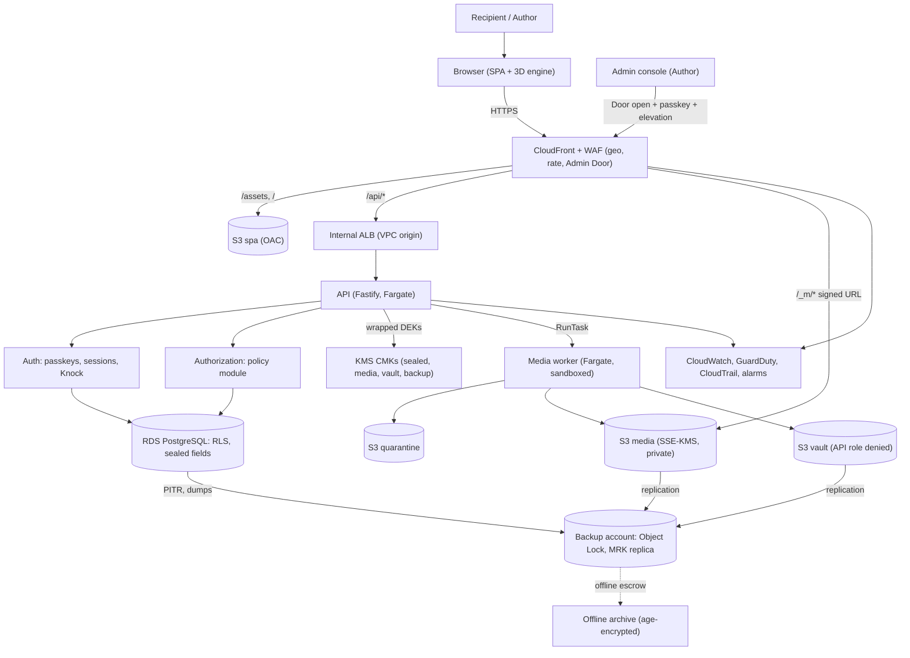
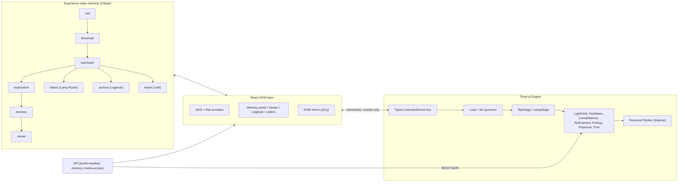

# Appendix A — FINAL DIAGRAMS (§61)

## A.1 System architecture

```mermaid
flowchart TB
  U["Recipient / Author"] --> B["Browser (SPA + 3D engine)"]
  B -->|HTTPS| CF["CloudFront + WAF (geo, rate, Admin Door)"]
  CF -->|/assets, /| SPA[("S3 spa (OAC)")]
  CF -->|"/api/*"| ALB["Internal ALB (VPC origin)"]
  CF -->|"/_m/* signed URL"| MEDIA[("S3 media (SSE-KMS, private)")]
  ALB --> API["API (Fastify, Fargate)"]
  API --> AUTH["Auth: passkeys, sessions, Knock"]
  API --> AUTHZ["Authorization: policy module"]
  AUTH --> DB[("RDS PostgreSQL: RLS, sealed fields")]
  AUTHZ --> DB
  API -->|"wrapped DEKs"| KMS["KMS CMKs (sealed, media, vault, backup)"]
  API -->|"RunTask"| WK["Media worker (Fargate, sandboxed)"]
  WK --> Q[("S3 quarantine")]
  WK --> MEDIA
  WK --> VAULT[("S3 vault (API role denied)")]
  ADM["Admin console (Author)"] -->|"Door open + passkey + elevation"| CF
  DB -->|"PITR, dumps"| BK[("Backup account: Object Lock, MRK replica")]
  MEDIA -->|replication| BK
  VAULT -->|replication| BK
  API --> MON["CloudWatch, GuardDuty, CloudTrail, alarms"]
  CF --> MON
  BK -.->|"offline escrow"| OFF["Offline archive (age-encrypted)"]
```

## A.2 Experience and 3D scene architecture

```mermaid
flowchart LR
  subgraph Machine["Experience state machine (XState)"]
    V["veil"] --> T["threshold"] --> S["sanctuary"]
    S --> E["exploration"] --> M["memory"] --> W["viewer"]
    S --> L["letters (Lamp Room)"]
    S --> A["archive (Logbook)"]
    S --> F["future (Unlit)"]
  end
  subgraph React["React DOM layer"]
    HUD["HUD + Rail scrubber"]
    PANEL["Memory panel / Viewer / Logbook / Letters"]
    MIRROR["DOM mirror (a11y)"]
  end
  subgraph Engine["Three.js Engine"]
    BUS["Typed command/event bus"]
    LOOP["Loop + tier governor"]
    STAGE["SkyStage / LampStage"]
    SYS["LightField, FieldStars, Constellations, RailCamera, Picking, Exposure, Post"]
    RES["ResourceTracker (dispose)"]
  end
  Machine <--> React
  React <-->|"commands / events only"| BUS
  BUS --> LOOP --> STAGE --> SYS
  SYS --> RES
  API2["API (world manifest, memory, media access)"] --> React
  API2 -->|"layout inputs"| SYS
```
